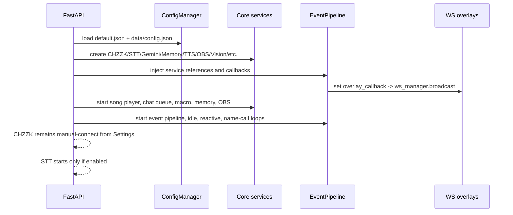
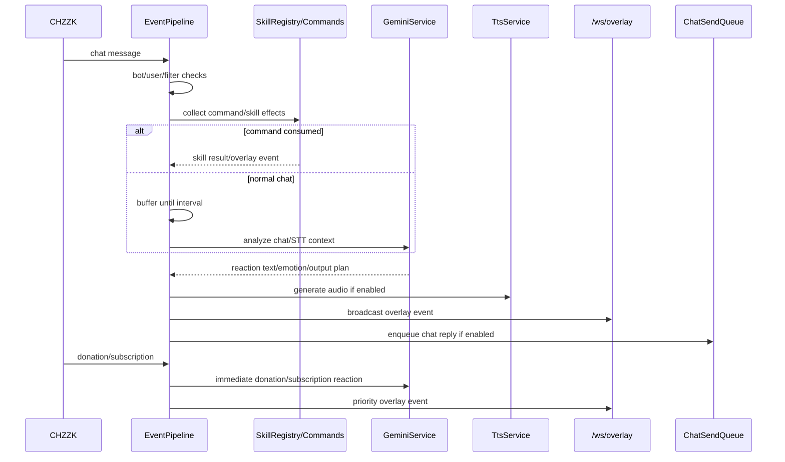
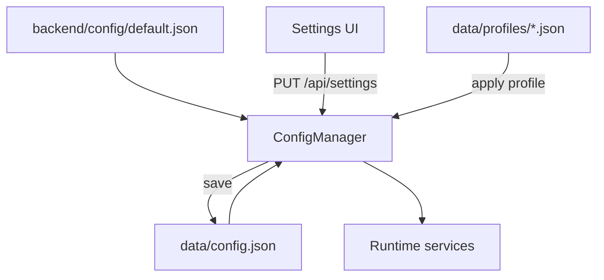

# AmyayaBot Technical Docs

> Current maintainer guide for the Phase 24 public-doc rewrite.
> User-facing docs live in `README.md` and `docs/`; legacy v1 user docs remain in `docs-legacy/v1`; retired v2 phase notes are intentionally not mixed into this guide.

## 0. Scope and source of truth

This document explains the **current codebase shape**, not the historical phase plan. It is written for a future maintainer who needs to run, debug, extend, or safely document AmyayaBot.

| Area | Current source of truth |
| --- | --- |
| Public project overview | `README.md` |
| Streamer/user guide | `docs/` GitHub Pages content |
| Maintainer technical guide | `TECHNICAL_DOCS.md` |
| Old user reference | `docs-legacy/v1` only |
| Runtime configuration | `backend/config/default.json` + `data/config.json` |
| Backend entry point | `backend/main.py` |
| Frontend entry point | `frontend/src/App.tsx` |

## 1. System overview

AmyayaBot is a local streaming companion for CHZZK/OBS broadcasts. The backend receives chat, donation, microphone, OBS, and manual-test events; enriches them with Gemini, memory, search, TTS, and skill services; then broadcasts overlay events to the React frontend through WebSocket.

```mermaid
flowchart LR
    subgraph Inputs[Inputs]
        Chzzk[CHZZK chat/donation]
        Mic[Streamer mic/STT]
        OBS[OBS scenes/sources]
        Settings[Settings UI]
        Commands[Chat commands]
    end

    subgraph Backend[FastAPI backend]
        Config[ConfigManager]
        Pipeline[EventPipeline]
        Skills[SkillRegistry]
        Gemini[GeminiService]
        Memory[MemoryService]
        Search[WebSearchService]
        TTS[TtsService]
        Vision[VisionService]
        Queue[ChatSendQueue]
    end

    subgraph Frontend[React/Vite frontend]
        SettingsPage[/settings]
        Overlay[/overlay]
        Interactive[/overlay/interactive]
        Music[/overlay/music]
    end

    Chzzk --> Pipeline
    Mic --> Pipeline
    OBS --> Vision
    Commands --> Skills --> Pipeline
    Settings --> Config
    Config --> Backend
    Pipeline --> Gemini
    Gemini --> Memory
    Gemini --> Search
    Pipeline --> TTS
    Pipeline --> Queue --> Chzzk
    Pipeline -->|/ws/overlay| Overlay
    Skills -->|/ws/overlay| Interactive
    TTS -->|base64 audio| Overlay
    Vision --> Pipeline
    Music <-->|song_request WS events| Pipeline
    SettingsPage -->|REST APIs| Backend
```

### Runtime ports

| Port | Purpose | Notes |
| --- | --- | --- |
| `18300` | FastAPI app and production SPA | `/settings`, `/overlay`, `/ws/overlay` |
| `18200` | Vite dev server | CORS allowlist in `backend/main.py` |
| `18301` | CHZZK OAuth local callback | Used by local authorization helper flow |
| `4455` | OBS WebSocket default | OBS-side setting; can be changed in AmyayaBot settings |

## 2. Tech stack

| Layer | Main packages | Role |
| --- | --- | --- |
| Backend web | FastAPI, Uvicorn, Pydantic | REST/WebSocket API and service lifecycle |
| AI model | `google-genai`, `google-adk` | Gemini reaction generation and tool/skill integration |
| CHZZK | `chzzkpy`, custom `ChzzkApi` | OAuth, chat/donation receive, chat/send, broadcast control |
| STT | faster-whisper, sherpa-onnx SenseVoice, sounddevice, silero-vad | Streamer microphone transcription |
| TTS | edge-tts, Supertone API, Fish Audio SDK, optional Supertonic | Voice generation for overlay/audio output |
| Memory | aiosqlite | Long-term memory and broadcast-log processing |
| OBS/Vision | obsws-python, OpenCV, ONNX Runtime | OBS scene/source access, screenshot capture, ROI/scene analysis |
| Frontend | React 19, Vite 7, TypeScript, Tailwind 4 | Settings app and overlays |
| Live2D | pixi.js, pixi-live2d-display | Optional Live2D avatar rendering |
| Song request | yt-dlp + local JS runtime helper | YouTube search/streaming and overlay queue |

## 3. Repository map

```text
amyayabot/
├── backend/
│   ├── main.py                    # FastAPI app, lifespan wiring, SPA serving
│   ├── api/                       # REST router modules: settings, vision, OBS, debug, stream, interaction
│   ├── config/                    # ConfigManager, default config, timing presets
│   ├── models/schemas.py          # Pydantic event/config schema models
│   ├── services/                  # Chzzk, Gemini, event pipeline, memory, TTS, STT, OBS, Vision, song request
│   └── skills/                    # Skill registry and chat/manual skills
├── frontend/
│   ├── src/App.tsx                # Routes: /settings, /overlay, /overlay/interactive, /overlay/music
│   ├── src/pages/                 # Settings and overlay pages
│   ├── src/components/            # Avatar, Live2D, speech bubble, settings sections, overlays
│   ├── src/hooks/                 # useSettings, useWebSocket
│   └── src/types/index.ts         # Frontend config/event types
├── data/
│   ├── config.json                # Local mutable config; may contain secrets
│   ├── memory.db                  # Long-term memory database
│   └── profiles/                  # Saved profiles
├── docs/                          # GitHub Pages user docs
├── docs-legacy/v1/                # Preserved old user docs
├── README.md                      # Public repo landing page
└── TECHNICAL_DOCS.md              # This maintainer guide
```

## 4. Backend lifecycle and service wiring

`backend/main.py` owns the application lifecycle. It creates all long-lived services inside FastAPI `lifespan`, wires callbacks, starts async loops, and stops them in reverse order on shutdown.



### Important startup decisions

| Decision | Where | Why it matters |
| --- | --- | --- |
| CHZZK does **not** auto-connect | `backend/main.py` | User connects manually from Settings to avoid surprise OAuth/session behavior. |
| STT auto-starts only if enabled | `backend/main.py` | Prevents unwanted microphone use and model load. |
| OBS service starts during backend startup | `backend/main.py` | Enables catalog/status helpers and Vision capture when configured. |
| Memory starts before pipeline recovery | `backend/main.py` | Allows unprocessed broadcast logs to be recovered automatically. |
| SPA fallback serves frontend build | `backend/main.py` | Production docs should point users to `localhost:18300/settings`. |

## 5. Core services and responsibilities

| Service | File | Trigger/input | Output/effect | Maintenance notes |
| --- | --- | --- | --- | --- |
| `ConfigManager` | `backend/config/manager.py` | REST updates, profile apply, default load | Deep-merged runtime config saved to `data/config.json` | Preserve secret masking; do not overwrite real secrets with masked placeholders. |
| `ChzzkService` | `backend/services/chzzk_service.py` | OAuth connect, chat/donation stream | Chat/donation callbacks, send_chat, status | OAuth callback/credential behavior is a public setup pain point. |
| `EventPipeline` | `backend/services/event_pipeline.py` | Chat, donation, STT, skills, idle/reactive | Gemini reaction, TTS, chat send, overlay event | Central orchestration boundary; test side effects before changing ordering. |
| `GeminiService` | `backend/services/gemini_service.py` | Pipeline/skill reaction requests | Text/emotion/intent decisions | Coupled to memory/search/skill registry; watch model/API drift. |
| `MemoryService` | `backend/services/memory_service.py` | Gemini/context logging, broadcast-log recovery, API clear | SQLite memory and summaries | `DELETE /api/memory` is destructive; backup before operator use. |
| `WebSearchService` | `backend/services/web_search_service.py` | Gemini/tool/search features | Naver/Search snippets and fan-cafe scoped results | Numeric fan-cafe `clubid` uses a non-contract boardlist API + local filtering/ranking and does not require Naver keys. Official Naver Search still needs Client ID/Secret for web/cafearticle search and URL/name post-filtering. |
| `SttService` | `backend/services/stt_service.py` | Microphone audio | Streamer speech events | Optional `sounddevice`; keep imports lazy/defensive for CI. |
| `TtsService` | `backend/services/tts_service.py` | Overlay event delivery | MP3 bytes/base64 audio | Engine-specific keys and voice IDs differ; preview endpoint is key debug tool. |
| `IdleService` | `backend/services/idle_service.py` | Chat/STT silence | Idle reactions | Receives memory and Vision references; avoid feedback loops. |
| `ReactiveService` | `backend/services/reactive_service.py` | Chat activity windows | Reactive chat/scene responses | Uses mood/reaction tracker and optional Vision context. |
| `ObsService` | `backend/services/obs_service.py` | OBS WebSocket | Scene/source catalog, current scene callbacks | Phase 25 improved lifecycle/catalog behavior; UI depends on `/api/obs/catalog`. |
| `VisionService` | `backend/services/vision_service.py` | OBS screenshots, manual tests, idle triggers | Scene/ROI analysis, overlay status | Experimental; requires OBS identity, profiles, and conservative cadence. |
| `SongPlayerService` | `backend/services/song_player.py` | Song request skill/API/WS events | Queue state, playback events | Overlay and backend coordinate through `/ws/overlay` song_request messages. |
| `SkillRegistry` | `backend/skills/registry.py` | Chat commands, manual API, Gemini tools | Vote/raffle/roulette/song/search/control behavior | Register only skills that have explicit user value and safe side effects. |

## 6. Event and output mechanics

### Chat and donation flow



### Overlay event delivery

All overlay pages connect to `WebSocket /ws/overlay`. On initial connection, the backend sends song request state and Vision runtime status when those services exist. The overlay then receives JSON messages such as:

| Event type | Typical consumer | Purpose |
| --- | --- | --- |
| `reaction`, `donation_reaction`, `heartbeat_reaction`, `idle_reaction` | `/overlay` | Character speech, emotion, TTS audio, donation effect |
| `song_request` | `/overlay/music` | Queue/init/playback state |
| `vision_runtime_status` | Settings/overlay helpers | Vision status visibility |
| interaction-specific events | `/overlay/interactive` | Vote, raffle, roulette, donation vote |
| `settings_changed`, `service_status_changed` | Settings/diagnostics | UI refresh and operator feedback |

## 7. Frontend structure

`frontend/src/App.tsx` defines four user-visible routes:

| Route | Page | Purpose |
| --- | --- | --- |
| `/settings` | `Settings.tsx` | Operator console for all configuration and runtime controls |
| `/overlay` | `Overlay.tsx` | Main OBS Browser Source: avatar, speech bubble, TTS, effects |
| `/overlay/interactive` | `InteractiveOverlay.tsx` | Vote/raffle/roulette/donation-vote overlays |
| `/overlay/music` | `MusicOverlay.tsx` | Song request player/queue overlay |

Key frontend contracts:

- `frontend/src/types/index.ts` should stay aligned with backend `default.json` and API payloads.
- `useSettings` owns GET/PUT settings round-trips; masked secrets must not be written back as real values.
- `useWebSocket` owns overlay reconnect behavior; new overlay event types should be added there and in relevant page components.
- Settings pages are grouped by user task, not backend module name. If a new service is added, expose it where a streamer would expect it.

## 8. Configuration model

Configuration starts from `backend/config/default.json` and is persisted to `data/config.json`. Runtime settings are mutable from `/api/settings`.



### High-impact config sections

| Section | User-facing area | Effect |
| --- | --- | --- |
| `gemini` | 연결/API | Model, API key, output budget, embedding key |
| `chzzk` | 연결/API | OAuth app credentials and channel identity |
| `web_search` / search-related fields | 연결 설정 → 웹/팬카페 검색 | Web/Naver Cafe context for search tools; numeric fan-cafe ID is keyless but non-contract, official Naver/Brave search uses provider keys |
| `persona` | 페르소나 | Character identity, streamer info, relationship, prompt |
| `chat_reaction`, `idle`, `reactive`, `conversation` | 반응 설정 | When and how the bot reacts |
| `stt` | STT | Engine, model path/size, VAD, microphone |
| `tts`, `bubble`, `avatar` | 출력/TTS/오버레이 | Voice, speech bubble, avatar/Live2D behavior |
| `obs`, `vision` | OBS/Vision | OBS connection, source capture, ROI/profile analysis |
| `song_request`, `macro`, skill sections | 상호작용 | Commands, queue, automation |
| `moderation`, `output_policies`, `output_safety` | 안전/운영 | Block topics, output length, hard caps |

## 9. External integrations

| Integration | Config/API surface | Trigger | Failure mode to document |
| --- | --- | --- | --- |
| CHZZK Client API/OAuth | `/api/chzzk/auth-url`, `/api/chzzk/auth-complete`, `/api/chzzk/status`, `ChzzkService` | Operator clicks connect; chat/donation stream starts after approval | Redirect URI mismatch, stale token, missing manual connect, wrong channel identity |
| Gemini API | `gemini.api_key`, `GeminiService` | Reactions, summaries, search/tool calls, warmup | No key, quota/rate limits, model name drift, long output latency |
| Naver Search / Cafe APIs | `WebSearchService`, web search credentials, fan-cafe `cafeId` scope in settings | Gemini/tool-assisted search requests | Official search credentials missing, unofficial boardlist endpoint drift, boardlist only covers recent public posts, external result quality variance |
| OBS WebSocket | `/api/obs/catalog`, `ObsService`, `ScreenshotCaptureService` | Settings catalog, scene callback, Vision capture | OBS closed, wrong port/password, scene/source rename, lifecycle reconnect bugs |
| STT models | `/api/stt/model-*`, `SttService` | Operator enables STT or test transcription | Model not downloaded, optional audio backend missing, CPU too slow, VAD threshold too strict |
| TTS engines | `/api/tts/preview`, voice search/status endpoints | Overlay delivery or preview | Missing API key/voice ID, browser audio muted, provider latency |
| YouTube/yt-dlp | `/api/song-request/*`, `/api/stream/{video_id}` | Song request skill/API and music overlay | Search failure, stream extraction failure, runtime helper not installed |
| Live2D/Pixi | `/api/live2d-models`, frontend avatar components | Overlay render | Missing model files, path mismatch, heavy GPU/CPU load |

## 10. API surfaces

This table lists the endpoints maintainers most often need. It is not a replacement for reading the router files before making changes.

### Settings and runtime

| Method/path | Owner | Purpose |
| --- | --- | --- |
| `GET /api/settings` | `backend/api/settings.py` | Full masked config for UI |
| `PUT /api/settings` | `backend/api/settings.py` | Partial config update; strips masked secrets |
| `GET /api/settings/status` | `backend/api/settings.py` | Summary service status for UI |
| `POST /api/settings/services/control` | `backend/api/settings.py` | Start/stop/pause/resume selected services |
| `GET /api/settings/services/status` | `backend/api/settings.py` | Per-service runtime status |
| `GET/POST /api/settings/presets*` | `backend/api/settings.py` | Timing preset list/apply |
| `GET/POST/PUT/DELETE /api/settings/profiles*` | `backend/api/settings.py` | Profile save/apply/delete/reset |

### Connections and external services

| Method/path | Owner | Purpose |
| --- | --- | --- |
| `GET /api/chzzk/auth-url` | `backend/api/settings.py` | Generate CHZZK OAuth URL |
| `POST /api/chzzk/auth-complete` | `backend/api/settings.py` | Complete OAuth with code/state |
| `GET /api/chzzk/status` | `backend/api/settings.py` | CHZZK detailed status |
| `GET /api/chzzk/live-info` | `backend/api/settings.py` | Broadcast title/category/tags via CHZZK API |
| `GET /api/obs/catalog` | `backend/api/obs.py` | OBS scene/source helper catalog |
| `GET /api/vision/status` | `backend/api/vision.py` | Vision runtime status |
| `POST /api/vision/test` | `backend/api/vision.py` | Manual Vision test with draft overrides |
| `POST /api/vision/idle-test` | `backend/api/vision.py` | Manual idle+Vision reaction test |
| `GET/POST/PUT /api/vision/profile/manual-roi*` | `backend/api/vision.py` | Manual ROI editor state/reference/recommend/test |

### Overlay, memory, STT, TTS, song request

| Method/path | Owner | Purpose |
| --- | --- | --- |
| `WS /ws/overlay` | `backend/main.py` | Overlay event bus and song playback callbacks |
| `WS /ws/stt-monitor` | `backend/main.py` | STT monitor stream |
| `GET /api/memory/stats` | `backend/main.py` | Memory DB stats |
| `DELETE /api/memory` | `backend/main.py` | Clear memory DB contents |
| `GET/POST/DELETE /api/stt/model-*` | `backend/api/settings.py` | STT model status/download/delete |
| `POST /api/stt/test` | `backend/main.py` | Test STT transcription |
| `POST /api/tts/preview` | `backend/main.py` | Generate preview audio |
| `GET /api/tts/supertone/voices` | `backend/main.py` | Supertone voice search proxy |
| `GET /api/tts/fish/voices` | `backend/main.py` | Fish voice search proxy |
| `GET/POST /api/song-request/*` | `backend/api/settings.py` | Queue, search, runtime install, playback controls |
| `GET /api/stream/{video_id}` | `backend/api/stream.py` | Audio stream proxy for music overlay |

### Interactive skills and debug

| Method/path | Owner | Purpose |
| --- | --- | --- |
| `GET/POST /api/interaction/*` | `backend/api/interaction.py` | Vote, raffle, roulette, donation-vote status/manual controls |
| `GET/POST /api/skills/*` | `backend/main.py` | Legacy/shortcut skill controls |
| `GET/POST /api/broadcast/*` | `backend/main.py` | Broadcast control through CHZZK API |
| `POST /api/debug/inject-*` | `backend/api/debug.py` | Inject chat/speech/donation/subscription for local testing |
| `GET /api/debug/pipeline-state` | `backend/api/debug.py` | Inspect pipeline state |

## 11. Maintainer workflows

### Add a new setting

1. Add default value to `backend/config/default.json`.
2. Update backend services to read it through `ConfigManager`.
3. Update frontend type in `frontend/src/types/index.ts`.
4. Add or update the appropriate Settings component.
5. If it affects runtime services, update `/api/settings/services/status` or relevant status endpoint.
6. Add/adjust tests for masking, persistence, and UI build type alignment.
7. Update `docs/settings/*.md` if the setting is user-facing.

### Add a new overlay event

1. Define/extend backend payload shape near `backend/models/schemas.py` or service-specific event builder.
2. Broadcast through `ws_manager.broadcast` or pipeline `overlay_callback`.
3. Update `frontend/src/hooks/useWebSocket.ts` and target overlay page.
4. Add a debug injection endpoint or manual trigger if possible.
5. Verify with browser/OBS Browser Source and `npm run build`.

### Add or change an external API integration

1. Keep credentials out of committed configs.
2. Add masking behavior if a new key name is sensitive.
3. Separate provider API wrapper from user-facing skill/service logic.
4. Document setup steps and failure modes in `docs/settings/external-integrations.md` and `docs/settings/settings-reference.md`.
5. Add a health/status endpoint if operators need to debug it live.

## 12. Known risks and improvement priorities

| Priority | Area | Risk | Recommended next step |
| --- | --- | --- | --- |
| High before public push | Secrets hygiene | `data/config.json` and local test files can contain real keys; CHZZK built-in secret policy must be reviewed before public mirroring. | Run a secret scan and replace public defaults with placeholders before merging to public repo. |
| High | Docs/runtime parity | Screenshots can drift as Settings UI changes. | Refresh screenshots after UI changes and link-check GitHub Pages output. |
| High | Full backend tests | Full pytest collection has historically been sensitive to optional provider stubs and Gemini warmup assumptions. | Keep optional imports lazy and add collection-only CI smoke before broad refactors. |
| Medium | OBS lifecycle | OBS can be launched/closed/reconfigured while backend is running. | Continue hardening reconnect/catalog invalidation and expose operator-friendly status. |
| Medium | Vision complexity | Vision depends on OBS source names, profiles, ROI, resolution, model cadence. | Keep Vision opt-in, document profile reset, and add focused regression tests for binding/profile selection. |
| Medium | Search quality | Naver Search is external and can return noisy/current web results. | Surface search source snippets and keep prompt instructions conservative. |
| Medium | Frontend/backend schema drift | Settings types and backend defaults are maintained separately. | Add a schema alignment test or generated type check for high-impact config sections. |
| Low | Legacy API overlap | Some skill endpoints exist in both `/api/interaction/*` and `/api/skills/*`. | Preserve compatibility but prefer one documented operator surface per feature. |

## 13. Verification commands

Run these after code changes. For docs-only changes, at least run the docs link/check commands and a frontend build to catch broken local links imported by public pages.

```bash
# Markdown/path sanity
git diff --check
python3 scripts/check_docs_links.py  # create/run equivalent local checker if script is absent

# Frontend
cd frontend
npm run lint
npm run build

# Focused backend tests used by recent docs-readiness fixes
uv run --python 3.12 \
  --with pytest --with numpy --with aiosqlite --with fastapi \
  --with google-genai --with google-adk --with pydantic \
  python -m pytest \
  backend/tests/test_stt_service_optional_sounddevice.py \
  backend/tests/test_memory_service_clear.py \
  backend/tests/test_obs_service_catalog.py \
  backend/tests/test_settings_service_control.py \
  backend/tests/test_tts_config_alignment.py -q
```

If the full backend suite fails during collection, inspect the first collection error before changing production code. Do not delete tests to make the suite green.

## 14. Public documentation maintenance

The public repository sync workflow publishes `README.md`, `TECHNICAL_DOCS.md`, and `docs/**` to `hsool/amyayabot-alpha`. Keep these rules:

- Write streamer-facing docs in `docs/` with concrete setup steps, screenshots, effects, and cautions.
- Keep maintainer internals in `TECHNICAL_DOCS.md`; do not scatter new phase notes under `docs-dev/` or `docs-legacy/v2`.
- Preserve `docs-legacy/v1` only as historical reference.
- Before public push, remove local secrets and avoid screenshots that expose channel/private data.
- Whenever Settings UI labels change, update both the relevant `docs/settings/*.md` page and any quick-start screenshots.
