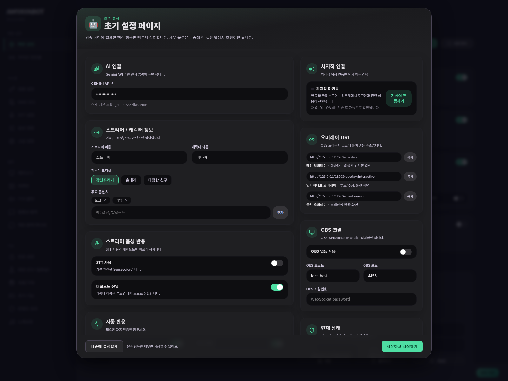
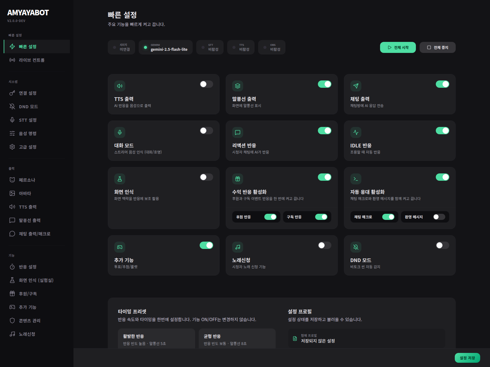

# 퀵세팅 / 온보딩



이 페이지의 목표는 **가장 단순하게 AmyayaBot을 켜서 OBS 화면에 캐릭터와 말풍선을 띄우는 것**입니다. 치지직 채팅 전송, STT, Vision, Fish/Supertone TTS 같은 고급 기능은 첫 성공 이후에 붙이세요.

---

## 0. 처음 추천 구성

| 항목 | 추천값 | 이유 |
| --- | --- | --- |
| Gemini API 키 | 입력 | AI 문장을 만들기 위한 필수값입니다. |
| 출력 | 말풍선 ON, TTS 선택, 채팅 출력 OFF | 방송 화면에서 안전하게 확인한 뒤 채팅 출력을 켜는 편이 좋습니다. |
| TTS 엔진 | 처음엔 Edge TTS 또는 TTS OFF | 별도 API 키 없이 테스트하기 쉽습니다. |
| OBS | `/overlay` 브라우저 소스만 추가 | 메인 캐릭터와 말풍선이 보이는지 먼저 확인합니다. |
| 치지직 OAuth | 첫 화면 확인 후 연결 | 채팅/후원/구독/방송 제어를 쓰기 전 단계에서 연결합니다. |
| STT/Vision/노래신청 | OFF | 마이크, OBS WebSocket, 외부 검색/재생 등 변수가 많아 나중에 켜는 것이 안전합니다. |

---

## 1. 실행 후 설정 화면 열기

```bash
# Linux / macOS
chmod +x start.sh
./start.sh

# Windows
start.bat
```

브라우저에서 다음 주소를 엽니다.

- 설정 화면: `http://localhost:18300/settings`
- 개발 모드라면 터미널에 `http://localhost:18200/settings`가 표시될 수 있습니다.

---

## 2. 온보딩에서 꼭 채울 값

| 입력값 | 무엇에 쓰이나요? | 비워두면 |
| --- | --- | --- |
| Gemini API 키 | AI 문장 생성, 장기 기억 embedding 기본 키 fallback | AI 반응 생성이 실패합니다. |
| 스트리머 이름 | 캐릭터가 “누구의 방송”인지 판단 | 문장이 일반적이고 맥락이 약해집니다. |
| 캐릭터 이름 | STT 호명, 페르소나 말투 기준 | 대화모드 호출이 애매해집니다. |
| 주요 콘텐츠 | 게임/토크/노래 등 방송 성격 | 반응 소재가 방송과 덜 맞을 수 있습니다. |
| 캐릭터 프리셋 | 말투와 기본 성격 | 캐릭터성이 약해집니다. |

저장 후 **빠른 설정** 탭으로 이동합니다.

---

## 3. 빠른 설정에서 최소 기능만 켜기



처음에는 아래처럼 둡니다.

| 카드 | 추천 | 켰을 때 효과 | 주의 |
| --- | --- | --- | --- |
| TTS 출력 | 선택 | AI 반응이 음성으로 재생됩니다. | 브라우저 소스의 오디오 모니터링/출력 설정이 필요할 수 있습니다. |
| 말풍선 출력 | ON | OBS 오버레이에 텍스트 말풍선이 보입니다. | 가장 안전한 첫 출력입니다. |
| 채팅 출력 | OFF | AI 반응을 치지직 채팅방에 보냅니다. | 테스트 중 잘못 켜면 실제 채팅에 봇 메시지가 나갑니다. |
| 대화 모드 | OFF | 마이크/STT로 캐릭터와 대화합니다. | 마이크 장치, STT 모델, 호명 이름 설정 후 켜세요. |
| 리액션 반응 | 선택 | 채팅이 활발할 때 AI가 분위기에 반응합니다. | 채팅 출력과 함께 켜면 봇 말이 많아질 수 있습니다. |
| IDLE 반응 | 선택 | 조용할 때 캐릭터가 혼잣말을 합니다. | 방송 분위기에 따라 너무 잦을 수 있어 빈도를 낮추세요. |
| 화면 인식 | OFF | OBS 화면을 분석해 반응 보조로 씁니다. | OBS WebSocket + Gemini + Vision 설정이 필요합니다. |
| 후원/구독 | OFF 또는 구독만 ON | 이벤트에 캐릭터가 반응합니다. | 실제 후원/구독 이벤트 출력이므로 테스트 후 켜세요. |
| 자동 응대/매크로 | OFF | `!명령어`, 환영 메시지를 처리합니다. | 채팅으로 직접 나가는 기능이라 문구를 먼저 확인하세요. |
| 추가 기능/노래신청 | OFF | 투표/추첨/룰렛/노래신청을 씁니다. | 별도 오버레이와 명령어 충돌 확인이 필요합니다. |
| DND 모드 | OFF | 게임/비토크 씬에서 출력을 줄입니다. | OBS 씬 정책을 잡은 뒤 켜는 편이 좋습니다. |

---

## 4. OBS 브라우저 소스 추가

1. OBS에서 **소스 → + → 브라우저**를 추가합니다.
2. URL에 `http://localhost:18300/overlay`를 입력합니다.
3. 크기는 처음에 `1920 × 1080` 또는 방송 캔버스 크기로 둡니다.
4. 캐릭터/말풍선이 보이면 위치와 크기는 **아바타** / **말풍선 출력** 탭에서 조정합니다.

추가 기능은 나중에 별도 브라우저 소스로 붙입니다.

| 오버레이 | URL | 언제 쓰나 |
| --- | --- | --- |
| 메인 | `http://localhost:18300/overlay` | 캐릭터, 말풍선, TTS, 일반 반응 |
| 인터랙티브 | `http://localhost:18300/overlay/interactive` | 투표, 추첨, 룰렛, 후원 투표 |
| 음악 | `http://localhost:18300/overlay/music` | 노래신청 플레이어/큐 |

---

## 5. 첫 테스트 순서

1. **말풍선 출력**이 켜진 상태에서 테스트 반응 또는 디버그 주입으로 문장이 보이는지 확인합니다.
2. TTS를 켰다면 오디오가 OBS/방송 출력에 잡히는지 확인합니다.
3. 치지직 OAuth를 연결한 뒤에만 채팅 출력, 매크로, 환영 메시지를 테스트합니다.
4. OBS WebSocket을 연결한 뒤에만 DND 자동 감지와 Vision을 테스트합니다.
5. Fish/Supertone 같은 유료/외부 TTS는 API 키와 voice ID를 넣은 뒤 **TTS 출력 → 미리듣기**로 먼저 확인합니다.

---

## 다음 문서

- 각 설정 탭의 상세 의미: [설정 탭별 상세 레퍼런스](../settings/settings-reference.md)
- 외부 API 발급/OBS 연결: [외부 연동 설정](../settings/external-integrations.md)
- 안 될 때 확인: [Troubleshooting](../wiki/troubleshooting.md)
