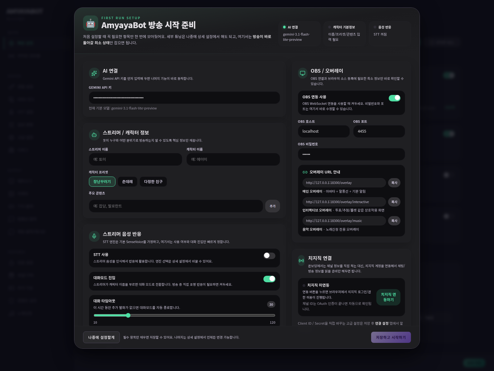

# Streamer Detailed Setup

이 문서는 **설정을 왜 하는지까지 같이 이해하고 싶은 사람을 위한 상세 가이드**야.
Quick Start보다 길지만, 대신 “이건 왜 켜야 하지?” 같은 막힘을 줄이는 데 초점을 두고 있어.

---

## 1. AmyayaBot은 어떻게 생각하면 쉬운가?

처음엔 이 프로젝트를 세 덩어리로 생각하면 쉬워.

1. **AI 두뇌**
   - Gemini
2. **입력**
   - 스트리머 음성(STT)
   - 시청자 채팅
   - 후원/구독
   - 필요하면 방송 화면(vision)
3. **출력**
   - TTS
   - 말풍선
   - 채팅
   - OBS 오버레이

즉,
**듣고 / 읽고 / 필요하면 보고 → AI가 반응을 만들고 → 화면이나 음성으로 내보낸다**
이 흐름으로 보면 돼.

---

## 2. 첫 설정 순서

### STEP 1. Gemini 연결
먼저 Gemini API 키를 넣어.

왜 먼저 하냐면,
이게 없으면 대부분의 AI 반응이 멈추기 때문이야.

### STEP 2. 캐릭터 기본 정보
다음은 캐릭터의 뼈대를 잡아.

- 스트리머 이름
- 캐릭터 이름
- 프리셋
- 주요 콘텐츠

이 부분은 “돌아가느냐”보다
**어떤 캐릭터처럼 말하느냐**를 크게 좌우해.

### STEP 3. 출력 방식 선택
처음에는 아래 중 1~2개만 먼저 켜는 걸 추천해.

- 말풍선
- TTS
- 채팅 출력

처음부터 전부 다 켜면 오히려 방송이 정신없어질 수 있어.

### STEP 4. STT / 대화 진입
스트리머가 말을 걸었을 때 반응하게 하려면
- STT
- namecall(호명)
쪽을 같이 봐야 해.

### STEP 5. OBS / 치지직 연결
필수는 아니지만,
방송용으로 제대로 쓰려면 결국 여기까지 보게 돼.

---

## 3. 온보딩 화면은 왜 있나?

온보딩은 “모든 설정을 다 끝내라”는 화면이 아니야.
오히려 **지금 비어 있어서 먼저 채워야 하는 것만 빨리 보여주는 시작 화면**에 가까워.

즉,
- 지금 꼭 필요한 것
- 나중에 해도 되는 것
을 먼저 나눠주는 역할을 해.

---

## 4. 치지직 연결은 지금 어떤 흐름인가?

이번 버전에서는 치지직 연결을 이렇게 이해하면 쉬워.

### 기본 흐름
1. **치지직 연동하기** 버튼을 누른다
2. 브라우저에서 로그인 / 권한 허용을 진행한다
3. 연결이 끝나면 **채널 정보는 자동으로 확인**된다

즉,
대부분의 사용자는 먼저 **OAuth 연동**만 하면 돼.

### 고급 흐름
연결 설정 탭에는
- Client ID
- Client Secret
을 직접 바꿀 수 있는 고급 경로도 있어.

이건 주로:
- 배포 환경에서 별도 앱 자격 증명을 쓸 때
- 운영자가 기본 앱 대신 다른 자격 증명을 써야 할 때
보는 편이 좋아.

처음 쓰는 사람이라면,
**먼저 연동 버튼으로 연결이 되는지 확인한 뒤** 나중에 필요할 때만 만지면 충분해.

---

## 5. 추천 시작 조합

가장 무난한 시작 조합은 보통 이거야.

- reactive: 켬
- idle: 켬
- STT: 켬
- namecall: 켬
- 말풍선: 켬
- TTS: 켬
- 채팅 출력: 필요하면 켬
- 채팅 명령어/매크로: 다른 봇이 있으면 처음엔 끔

이렇게 하면:
- 캐릭터가 가끔 먼저 말도 걸고
- 채팅/음성에도 반응하고
- 화면에도 결과가 보여서
가장 “살아 있는 느낌”을 보기 쉬워.

---

## 6. 언제 세부 설정을 만지면 되나?

아래 상황이 오면 그때 detailed settings를 보면 돼.

- 마이크 인식이 잘 안 됨
- TTS가 너무 빠르거나 어색함
- 반응이 너무 잦거나 너무 적음
- 다른 봇이랑 `!명령어`가 충돌함
- 치지직/OBS/vision을 더 세밀하게 맞추고 싶음

그때는 [Settings Guide](../settings/index.md)를 열고,
필요한 탭만 골라서 보는 방식이 제일 편해.

---

## 7. 마지막 체크

방송 시작 전에는 이 정도만 다시 보면 좋아.

- Gemini 연결 OK
- 캐릭터 기본 정보 있음
- 출력 채널 있음
- STT/namecall 쓸지 결정 완료
- 다른 봇과 명령어 충돌 없음
- OBS overlay 필요 시 연결 확인
- 치지직 필요 시 OAuth 연결 확인

---

## 8. 다음 읽을 문서
- [First-Run Onboarding](first-run-onboarding.md)
- [Settings Guide](../settings/index.md)
- [FAQ](../wiki/faq.md)
- [Troubleshooting](../wiki/troubleshooting.md)
