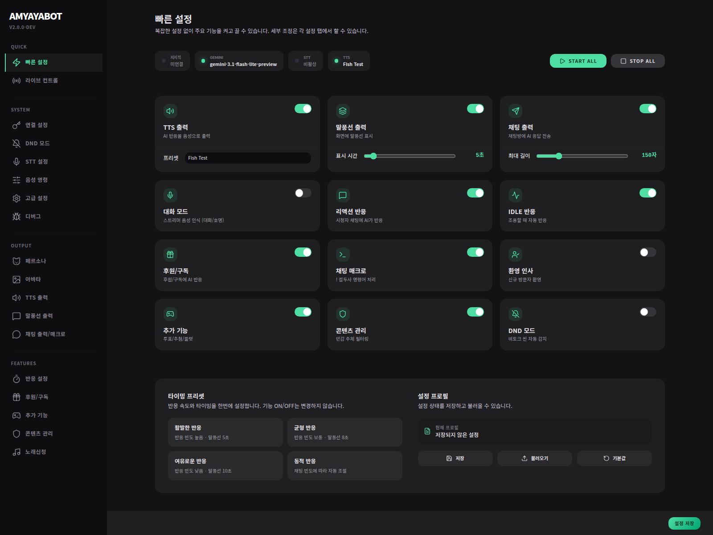

# Streamer Quickstart

이 문서는 **길게 읽지 않고도 방송 가능한 상태까지 빨리 가는 요약 가이드**야.
처음엔 세부 설명보다 **“무엇부터 하면 되나”**만 잡아도 충분해.



---

## 정말 먼저 할 것 5가지

### 1) 봇 실행
```bash
./start.sh
```
또는 Windows에서는 `start.bat`

### 2) 설정 페이지 열기
- 보통: `http://localhost:18300/settings`

### 3) Gemini API 키 넣기
이게 없으면 AI 반응이 거의 안 돌아가.

### 4) 캐릭터 기본 정보 넣기
- 스트리머 이름
- 캐릭터 이름
- 캐릭터 프리셋
- 주요 콘텐츠

### 5) 출력 채널 하나 이상 켜기
최소 하나는 켜야 실제 반응이 보여.
- TTS
- 말풍선
- 채팅 출력

---

## 치지직은 이렇게 생각하면 쉬워

치지직을 쓸 거라면,
처음엔 **채널 ID를 직접 찾는 것보다 연동 버튼으로 먼저 로그인하는 흐름**으로 생각하면 돼.

- 기본 사용: **치지직 연동하기**
- 연결이 되면: **채널 정보 자동 확인**
- Client ID / Secret 직접 변경: 나중에 **연결 설정**에서 필요할 때만

즉,
처음부터 고급 자격 증명 화면처럼 생각하지 않아도 괜찮아.

---

## OBS를 쓴다면

처음에는 이것만 보면 충분해.

- 메인 오버레이: `/overlay`
- 필요하면 OBS WebSocket도 연결

처음부터 모든 오버레이를 다 붙이기보다,
**메인 오버레이 + 기본 반응 확인**부터 시작하는 게 가장 쉬워.

---

## 다른 봇이 이미 있다면

이미 다른 봇이 `!명령어`를 처리하고 있다면,
처음엔 **채팅 명령어/매크로 기능을 꺼두는 편**이 안전해.

안 그러면:
- 명령어가 겹치거나
- 채팅이 어수선해질 수 있어.

---

## 여기까지 되면 일단 시작 가능

아래 체크만 통과하면 돼.

- [ ] settings 페이지가 열린다
- [ ] Gemini API 키가 들어가 있다
- [ ] 캐릭터 기본 정보가 들어가 있다
- [ ] 출력 채널이 하나 이상 켜져 있다
- [ ] (필요 시) OBS overlay가 열린다
- [ ] (필요 시) 치지직 연동이 된다

---

## 다음 문서
- 더 자세히: [Streamer Detailed Setup](streamer-detailed-setup.md)
- 온보딩 설명: [First-Run Onboarding](first-run-onboarding.md)
- 설정별 설명: [Settings Guide](../settings/index.md)
