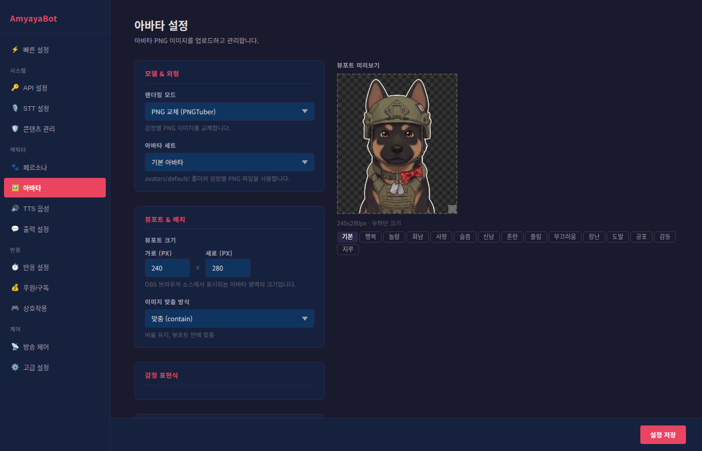

# 🚀 설치 및 시작 가이드

AmyayaBot을 처음부터 끝까지 설정하는 방법을 알려드립니다. 걱정하지 마세요 — 이 가이드는 컴퓨터에 익숙하지 않은 분도 따라할 수 있도록 만들어졌어요!

---

## ✅ 사전 요구사항

AmyayaBot을 실행하기 전에 다음이 필요합니다:

### 1. Python 3.10 이상
Python은 AmyayaBot의 핵심 엔진입니다 (뒤에서 AI를 돌리는 프로그램이에요).

- **설치 방법**: https://www.python.org/downloads/ 에서 "Download Python 3.12" 또는 "3.13" 클릭
- **⚠️ 중요!** 설치 화면에서 **"Add Python to PATH"** 반드시 체크하기

### 2. Chzzk 개발자 인증정보
치지직 방송 채팅과 후원 정보를 받기 위해 필요합니다.

- **취득 방법**: https://developers.chzzk.naver.com/ 에서 애플리케이션 등록 후 Client ID, Client Secret, Channel ID 확인
- **리디렉션 URL**: `http://localhost:8080/` 입력

### 4. Google Gemini API 키
AI 채팅 분석을 위해 필요합니다 (무료 사용 가능).

- **취득 방법**: https://aistudio.google.com/apikey 에서 "Create API Key" 클릭
- **주의**: 이 키는 절대 타인과 공유하면 안 됩니다

---

## 📥 설치 방법

### Step 1: 프로젝트 다운로드

AmyayaBot 프로젝트를 컴퓨터에 다운로드합니다. GitHub에서 받거나, 제공받은 폴더를 압축 해제하세요.

다운로드 후 폴더 구조가 다음과 같으면 정상입니다:

```
amyayabot/
├── start.sh (Mac/Linux용)
├── start.bat (Windows용)
├── backend/
├── frontend/
└── docs/
```

### Step 2: 시작 스크립트 실행

**Windows 사용자:**
1. `start.bat` 파일을 **더블클릭**합니다
2. 검은색 명령 프롬프트 창 2~3개가 열립니다 (정상입니다!)
3. 자동으로 Python 가상환경 생성, 의존성 설치, 서버 시작이 모두 진행됩니다
4. 약 2~3분 후 준비 완료

**Mac/Linux 사용자:**
1. 터미널을 열고 프로젝트 폴더로 이동합니다
2. 다음 명령어를 입력합니다:
```bash
chmod +x start.sh
./start.sh
```
3. 약 2~3분 후 준비 완료

### Step 3: 준비 확인

명령 프롬프트 또는 터미널에 다음과 같은 메시지가 나타나면 성공입니다:

```
[4/4] Starting services...

  Backend  → http://localhost:18300
  Frontend → http://localhost:18300
  Overlay  → http://localhost:18300/overlay
  Settings → http://localhost:18300/settings
```

---

## 🌐 접속하기

시작 스크립트가 성공적으로 실행되었다면, 아래 주소로 접속하세요.

### 설정 페이지 (가장 중요!)
**http://localhost:18300/settings**

여기서 모든 설정을 관리합니다. 웹 브라우저 (Chrome, Edge, Safari 등)에서 열면 됩니다.

### 오버레이 (OBS에 추가할 주소)
**http://localhost:18300/overlay**

이 주소를 OBS 브라우저 소스에 입력합니다 (아래 "OBS 연결" 섹션 참고).

---

## ⚙️ 초기 설정 순서

설정 페이지에 접속했으면 아래 순서대로 따라하세요. 각 단계마다 설정 페이지 상단의 탭을 클릭합니다.

### 1단계: Chzzk API 인증 (필수)

설정 페이지 → **API 설정** 탭


1. Client ID 입력
2. Client Secret 입력
3. Channel ID 입력
4. "인증하기" 버튼 클릭
5. 브라우저에서 네이버 로그인 페이지가 열립니다 (정상입니다!)
6. 네이버 계정으로 로그인하면 자동 완료

> 💡 **처음 인증 시**: 로그인 후 자동으로 `localhost:8080` 포트를 짧은 시간 동시에 사용합니다. 다른 프로그램이 8080 포트를 사용하고 있으면 충돌할 수 있으니 확인하세요.

### 2단계: Gemini API 키 입력 (필수)

설정 페이지 → **API 설정** 탭 (같은 탭 아래쪽)


1. [Google AI Studio](https://aistudio.google.com/apikey)에서 API 키 복사
2. "Gemini API 키" 필드에 붙여넣기
3. "저장" 클릭

### 3단계: 아바타 설정 (선택사항이지만 권장)

설정 페이지 → **아바타 설정** 탭



1. 렌더링 모드 선택:
   - **PNG (PNGTuber)**: 가장 간단. 감정별 이미지를 교체
   - **SVG (파츠 분리)**: 더 생동감 있음. 눈, 입 따로 움직임
   - **Live2D**: 가장 정교함. 3D 아바타 지원

2. 기본 제공 아바타를 사용하거나, 자신의 이미지 업로드

> 💡 **처음이라면**: PNG 모드로 시작하는 것을 추천합니다. 나중에 바꿀 수 있어요.

### 4단계: OBS 연결 (선택사항)

설정이 완료되면 OBS에 오버레이를 추가합니다. 이 단계에서 방송에 AI 캐릭터가 나타납니다.

---

## 📺 OBS 브라우저 소스 연결 방법

### OBS 설정 (한 번만 하면 됩니다)

1. OBS를 열고, 원하는 씬(Scene)을 선택합니다
2. **소스(Sources)** 창 아래 **+** 버튼 클릭
3. **브라우저(Browser)** 선택
4. 이름은 "AmyayaBot 오버레이" 같이 입력 (자유롭게)
5. **확인** 클릭


### 브라우저 소스 설정

6. **URL** 필드에 다음을 입력:
   ```
   http://localhost:18300/overlay
   ```

7. **너비**: 방송 해상도의 너비 (예: 1920)
8. **높이**: 방송 해상도의 높이 (예: 1080)
9. **확인** 클릭

이제 오버레이가 OBS 미리보기에 표시됩니다!

### 위치와 투명성 조정

- **투명 배경**: 기본으로 적용됩니다 (별도 설정 불필요)
- **아바타 위치**: 설정 페이지 → **아바타 설정** 탭에서 X, Y 좌표 조정
- **말풍선 위치**: 설정 페이지 → **말풍선 설정** 탭에서 조정

> 💡 **팁**: 오버레이 크기가 너무 크거나 작으면, OBS에서 브라우저 소스를 선택한 후 모서리를 드래그해 크기를 조정할 수 있습니다.

---

## ✨ 시작했습니다!

이제 AmyayaBot 설정이 완료되었습니다!

### 다음 단계

**더 자세한 설정이 필요하신가요?**

- **[페르소나 설정](settings/persona.md)**: AI 캐릭터의 성격 정하기
- **[반응 설정](settings/reaction.md)**: AI가 어떻게 반응할지 설정
- **[음성 설정](settings/tts.md)**: AI 목소리와 톤 바꾸기
- **[후원 설정](settings/donation.md)**: 후원 반응 커스터마이징

**문제가 생겼나요?**

- **[문제 해결](troubleshooting.md)**: 자주 나는 오류와 해결 방법

---

## 🎉 첫 방송 팁

1. **작은 것부터 시작**: 반응이 너무 많으면 시청자가 짜증낼 수 있습니다. 설정 페이지에서 반응 빈도를 낮추고 천천히 늘려보세요.

2. **프로필 저장하기**: 게임별로 다른 성격의 AI를 운영하고 싶다면 프로필을 여러 개 만들어 저장하세요.

3. **필터 활성화**: 콘텐츠 관리 탭에서 부적절한 주제 필터를 켜두면 방송이 더 깔끔합니다.

4. **정기적인 테스트**: 방송 전에 AI가 잘 반응하는지 몇 가지 채팅을 쳐보세요.

---

**✅ 준비 완료! 멋진 방송을 시작하세요!**
