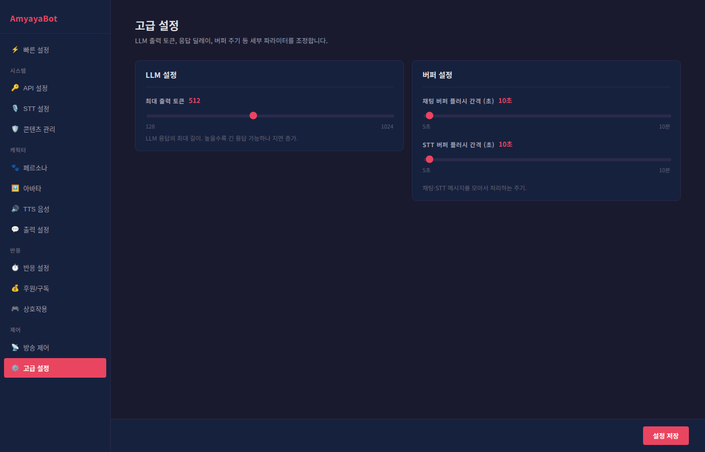

# 고급 설정 가이드



고급 설정은 AmyayaBot의 성능과 처리 방식을 세밀하게 조정하는 영역입니다. 일반적으로는 기본값을 사용해도 문제없지만, 특정 상황에서 최적화가 필요한 경우 이 설정을 조정할 수 있습니다.

## LLM 설정

AI의 응답 생성 방식을 제어합니다.

### 최대 출력 토큰
AI가 한 번에 생성할 수 있는 최대 응답 길이입니다 (128 ~ 1024 토큰).

**토큰이란**: 글자를 작은 단위로 쪼갠 것. 대략 한글 3글자 = 1토큰

#### 기본값: 512 토큰
- 약 1,500글자의 응답 가능
- 대부분의 상황에서 충분함

#### 낮은 값 (128 ~ 256)
- **장점**: 응답이 빠름, 서버 부하 적음
- **단점**: 짧은 답변만 가능
- **추천 상황**: 서버 성능이 낮거나 실시간 반응 중시

#### 높은 값 (768 ~ 1024)
- **장점**: 긴 설명, 상세한 답변 가능
- **단점**: 응답 속도 느림, 서버 부하 증가
- **추천 상황**: 심화된 토론, 스토리텔링 등 긴 답변 필요

#### 권장 설정
| 상황 | 값 | 이유 |
|------|-----|------|
| 가벼운 반응 (채팅 게임) | 256 | 빠른 응답 |
| 일반 방송 (기본) | 512 | 균형잡힌 성능 |
| 상세한 토론 | 768 | 긴 답변 가능 |
| 스토리텔링 | 1024 | 최대 길이 활용 |

**팁**: 방송 중에 반응이 느리다면 이 값을 낮춰 보세요.

## 버퍼 설정

메시지들을 모아서 한 번에 처리하는 방식을 제어합니다.

### 채팅 버퍼 플러시 간격
채팅 메시지를 모았다가 한 번에 처리하는 주기입니다 (5 ~ 600초).

**버퍼 개념**: 여러 메시지를 모아서 한 번에 처리하면 효율성이 높아집니다.

#### 예시 (기본값 10초)
```
시간대       메시지              동작
10:00:00    "안녕하세요"         (버퍼에 저장)
10:00:03    "뭐 하세요?"        (버퍼에 저장)
10:00:07    "날씨 좋네요"       (버퍼에 저장)
10:00:10    [플러시]            -> 3개 메시지를 한 번에 처리
10:00:20    [플러시]            -> 새로운 배치 처리
```

#### 낮은 값 (5 ~ 10초)
- **장점**: 실시간 반응이 빠름
- **단점**: 서버가 자주 깨어남, 전력 소비 증가
- **추천 상황**: 빠른 반응이 중요한 방송

#### 높은 값 (30 ~ 60초)
- **장점**: 서버 부하 줄임, 효율적 처리
- **단점**: 반응 지연 증가
- **추천 상황**: 동시 접속자 매우 많거나 서버 리소스 부족

### STT 버퍼 플러시 간격
음성 입력 메시지를 모았다가 처리하는 주기입니다 (5 ~ 600초).

기본값: 10초

**음성 기반 상호작용이 많으면 이 값을 낮추세요.**

## 버퍼 튜닝 가이드

### 상황별 권장값

| 상황 | 채팅 버퍼 | STT 버퍼 | 이유 |
|------|---------|--------|------|
| 소규모 방송 (시청자 < 100) | 20초 | 15초 | 실시간성 우선 |
| 일반 규모 (100 ~ 1000) | 10초 | 10초 | 균형잡힌 설정 |
| 대규모 방송 (1000+) | 5초 | 5초 | 빠른 반응 필요 |
| 저성능 서버 | 30초 | 30초 | 서버 부하 분산 |

### 성능 문제 진단

**문제**: 응답이 너무 느림
- → 채팅 버퍼를 5 ~ 10초로 낮추기

**문제**: 반응은 빠르지만 서버 CPU가 항상 높음
- → 채팅 버퍼를 20 ~ 30초로 높이기

**문제**: 음성 명령이 자주 무시됨
- → STT 버퍼를 5초로 낮추기

## 기본값 사용

처음부터 다시 시작하고 싶으면:

### 채팅 버퍼: 10초
### STT 버퍼: 10초
### LLM 최대 출력: 512 토큰

이 값들로 대부분의 상황이 잘 작동합니다.

## 성능 최적화 체크리스트

### 반응이 느린 경우
- [ ] LLM 최대 출력 토큰을 256 ~ 384로 낮춤
- [ ] 채팅 버퍼를 5 ~ 10초로 낮춤
- [ ] 불필요한 상호작용 기능 비활성화
- [ ] 콘텐츠 필터 규칙 수 줄임

### 서버 부하가 높은 경우
- [ ] LLM 최대 출력 토큰을 512 이상으로 설정하지 않기
- [ ] 채팅 버퍼를 20 ~ 30초로 높임
- [ ] STT 버퍼를 15초 이상으로 높임

### 실시간 상호작용이 중요한 경우
- [ ] LLM 최대 출력을 256 ~ 384로 낮춤
- [ ] 채팅 버퍼를 5초로 설정
- [ ] STT 버퍼를 5 ~ 10초로 설정

## 주의사항

### 토큰 설정 시
- **너무 낮으면**: 긴 질문에 답변 불완전
- **너무 높으면**: 응답 속도 크게 저하

### 버퍼 간격 설정 시
- **너무 짧으면**: 서버 과부하 위험
- **너무 길면**: 사용자 경험 악화 (반응 느림)

## 실험적 조정

효과를 보려면 **한 번에 하나씩** 값을 변경하고 5분 정도 방송하며 지켜봅니다.

예:
1. 기본값으로 5분 테스트
2. LLM만 변경해서 5분 테스트
3. 효과 평가 후 다음 설정 시도

## 자주 묻는 질문

**Q: 어떤 값이 가장 좋아요?**
A: 기본값(LLM 512, 채팅 버퍼 10초, STT 10초)이 대부분의 방송에 최적입니다.

**Q: 높은 값이 항상 좋지 않나요?**
A: 아니요. 높은 값은 부하를 늘리고 응답을 느리게 합니다. 필요한 만큼만 설정하세요.

**Q: 방송 중에 바꿀 수 있나요?**
A: 네, 언제든지 변경 가능하지만 적용에 몇 초 걸릴 수 있습니다.

**Q: 최고 성능은?**
A: 모든 값을 최대로 설정하면 느려집니다. 필요한 기능에 맞춰 설정하세요.
