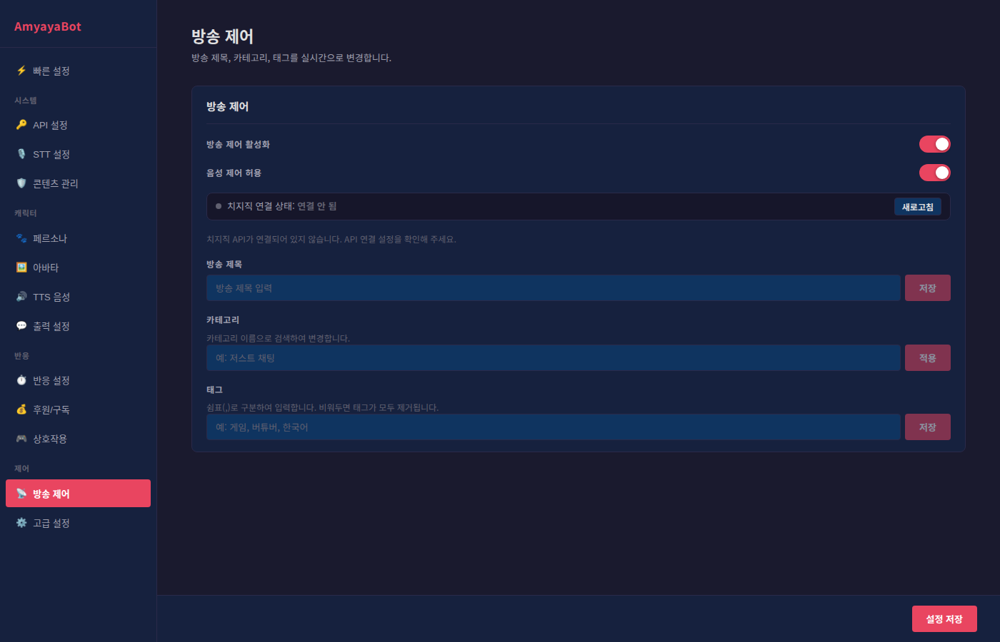

# 방송 제어 가이드

방송 제어 설정으로 방송 제목, 카테고리, 태그를 실시간으로 변경할 수 있습니다. 치지직 API와 연동되어 있어야 합니다.

## 기본 설정

### 방송 제어 활성화
방송 제어 기능을 켜거나 끕니다.
- **ON**: 모든 방송 제어 기능 활성화
- **OFF**: 모든 기능 비활성화

### 음성 제어 허용
AI 음성 명령으로 방송 정보를 변경할 수 있도록 허용합니다.
- **ON**: "제목을 게임 스트림으로 바꿔줘" 같은 음성 명령 가능
- **OFF**: 수동으로만 제어 가능

## 연결 상태 확인

설정 상단의 상태 표시기를 확인합니다.

- **초록색 (연결됨)**: 치지직 API가 정상 연결
- **회색 (연결 안 됨)**: API 연결 실패

**문제 해결**: 연결 안 될 때는 "새로고침" 버튼을 클릭하거나 API 설정을 다시 확인합니다.

## 방송 제목

실시간으로 방송 제목을 변경합니다.

### 제목 변경 방법
1. 입력란에 새로운 제목을 입력
2. "저장" 버튼을 클릭하거나 Enter 키 누르기
3. 저장 완료 메시지 확인

### 제목 정하는 팁
- **짧고 명확하게**: 15자 이내 권장
- **주제 포함**: 게임 제목, 주제, 시간 등
- **시청자 클릭 유도**: 흥미로운 요소 추가

**예시**:
- "오버워치2 래더 도전"
- "로스트 아크 카오스 던전"
- "추억의 게임 함께 즐기기"
- "구독자 감사 특집"

### 음성 명령
방송 중에 "제목을 ~으로 바꿔줘" 같은 음성 명령으로도 변경 가능합니다.

## 카테고리

방송의 카테고리를 변경합니다.

### 카테고리 변경 방법
1. 입력란에 원하는 카테고리 이름 입력
2. "적용" 버튼 클릭
3. 시스템이 입력한 이름으로 카테고리 검색

### 카테고리 팁
- **정확한 이름 입력**: 치지직에 등록된 정확한 카테고리 이름 필요
- **부분 일치 검색**: 비슷한 이름은 시스템이 자동으로 찾음

**주요 카테고리 예시**:
- 저스트 채팅
- 리그 오브 레전드
- 오버워치 2
- 마인크래프트
- 던전앤파이터
- 메이플스토리

### 음성 명령
"카테고리를 RPG로 바꿔줘" 같은 음성 명령으로도 변경 가능합니다.

## 태그

방송에 대한 검색 태그를 설정합니다.

### 태그 추가 방법
1. 입력란에 태그들을 **쉼표(,)로 구분**해서 입력
2. "저장" 버튼 클릭
3. 저장 완료 메시지 확인

### 태그 작성 팁
- **쉼표로 구분**: "게임, 버튜버, 한국어"
- **최대 5개 추천**: 너무 많으면 검색 효과 낮음
- **검색 가능한 단어**: 시청자가 검색할 만한 키워드

**예시 태그**:
- "로스트아크, 카오스, 래더"
- "게임, 버튜버, 라이브"
- "추천, 재미있음, 한국어"
- "먹방, ASMR, 일상"

### 태그 제거
입력란을 비우고 "저장"을 누르면 모든 태그가 제거됩니다.

## 현재 방송 정보 확인

API가 연결되면 아래에 현재 방송 정보가 표시됩니다.
- **제목**: 현재 설정된 방송 제목
- **카테고리**: 현재 선택된 카테고리
- **태그**: 현재 설정된 태그 목록

방송 중에 수동으로 변경한 내용이 즉시 반영됩니다.

## 빠른 사용 시나리오

### 시나리오 1: 방송 주제 변경
**상황**: 처음엔 "저스트 채팅"으로 시작했는데 게임을 하기로 변경

1. 제목: "오버워치2 래더 도전"으로 변경
2. 카테고리: "오버워치 2"로 검색·적용
3. 태그: "게임, 오버워치, 재미" 추가

### 시나리오 2: 특별 방송 공지
**상황**: 정기 방송이 아닌 특별 기획 방송

1. 제목: "[특집] 구독자 감사 추첨 라이브"
2. 카테고리: "저스트 채팅" 유지
3. 태그: "특집, 추첨, 구독자감사" 추가

### 시나리오 3: 음성 명령 활용
**상황**: 방송 중 주제를 자주 바꿈

**음성 명령 예시**:
- "제목을 '게임 토크' 로 바꿔줘"
- "카테고리를 저스트 채팅으로 설정해"
- "태그에 '한국어' 추가해줘"

## 주의사항

### API 연결 실패 시
- 새로고침 버튼을 클릭해서 재연결 시도
- 백엔드 서버와 치지직 API 연결 확인
- 필요시 AmyayaBot 재시작

### 변경 불가 상황
- **API 미연결**: 연결 상태를 확인하고 새로고침
- **권한 부족**: OAuth 인증 계정에 "방송 정보 수정" 권한 필요
- **네트워크 오류**: 인터넷 연결 확인

## 팁과 권장사항

### SEO 최적화
- **제목**: 시청자가 검색할 만한 인기 키워드 포함
- **카테고리**: 정확한 카테고리 선택로 관련 시청자 유입
- **태그**: 3 ~ 5개의 구체적인 태그

### 시청자 참여 유도
- **제목에 감정 표현**: "[특집]", "[초대]", "[이벤트]" 등
- **시간 정보**: "오후 7시 게임스트림" 같이 구체적인 시간
- **흥미 유발**: "첫 플레이", "도전", "협력" 등 행동 동사

### 음성 명령 활용
- "제목 다시 정해줘" (자동 생성)
- "카테고리 뭐로 할까?" (추천)
- "인기 태그 뭐 있을까?" (조언)
