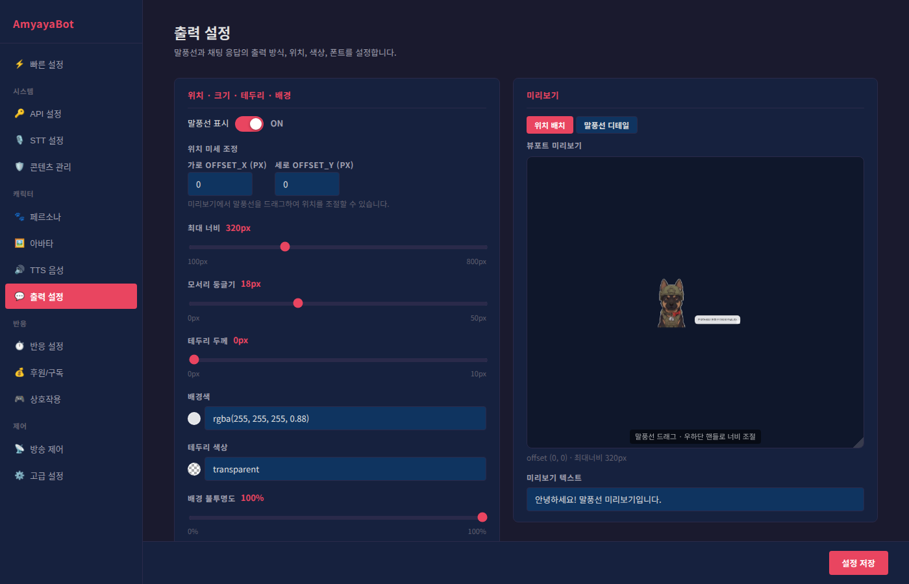

# 출력 설정 가이드

출력 설정에서는 AI가 대사를 말할 때 화면에 표시되는 말풍선의 모양, 위치, 폰트를 조정합니다.

## 기본 설정

### 말풍선 표시 여부
**말풍선 표시** 토글로 말풍선을 켜거나 끕니다.
- **ON**: 방송 화면에 말풍선이 나타남
- **OFF**: 말풍선이 표시되지 않음 (채팅 응답만 사용하는 경우)

## 위치 · 크기 · 테두리 · 배경

### 위치 미세 조정
미리보기에서 말풍선을 드래그해서 위치를 조절할 수 있으며, 세부 조정값을 입력해서 정확하게 맞출 수 있습니다.

- **가로 offset_x**: 좌우 위치 미세 조정 (-500 ~ 500px)
- **세로 offset_y**: 상하 위치 미세 조정 (-500 ~ 500px)

**팁**: 미리보기 패널의 말풍선을 마우스로 드래그하면 자동으로 offset이 업데이트됩니다.

### 최대 너비
말풍선의 최대 가로 길이를 설정합니다 (100 ~ 800px).
- 작게 설정하면 텍스트가 여러 줄로 나뉨
- 크게 설정하면 한 줄에 더 많은 텍스트가 들어감

**추천값**: 320px (기본값)

### 모서리 둥글기
말풍선의 모서리를 얼마나 둥글게 할지 설정합니다 (0 ~ 50px).
- 0px: 모서리가 각지게
- 18px: 약간 둥글게 (기본값, 보기 좋은 수준)
- 50px: 동그란 캡슐 모양

### 테두리 두께
말풍선 가장자리의 테두리 두께입니다 (0 ~ 10px).
- 0px: 테두리 없음
- 1 ~ 3px: 얇은 테두리 (세련된 느낌)
- 4px 이상: 굵은 테두리 (두드러지는 느낌)

### 배경색
말풍선 배경의 색상을 선택합니다.
- 색상 버튼을 클릭하면 컬러 피커가 열림
- RGBA 형식으로 정확한 색상값 입력 가능

**추천값**: rgba(255, 255, 255, 0.88) (약간 투명한 흰색)

### 테두리 색상
말풍선 가장자리의 색상을 설정합니다.
- 배경색과 다른 색으로 하면 말풍선이 더 돋보임
- "투명"을 선택하면 테두리가 표시되지 않음

### 배경 불투명도
말풍선의 투명도를 조절합니다 (0% ~ 100%).
- 0%: 완전 투명
- 50%: 반투명 (배경이 약간 비쳐 보임)
- 100%: 완전 불투명

**팁**: 게임 화면을 완전히 가리고 싶으면 100%, 배경을 살짝 볼 수 있게 하려면 70 ~ 90%로 설정합니다.

### 꼬리 자동
ON으로 설정하면 말풍선이 아바타를 향해 꼬리가 표시됩니다.
- 말풍선의 위치에 따라 꼬리 방향이 자동 조정

## 대사 폰트 · 텍스트 효과

### 글자 크기
말풍선 안의 텍스트 크기입니다 (10 ~ 32px).

**추천값**: 15 ~ 18px (일반적인 크기)

### 글꼴 (font-family)

**경고**: 방송에 사용하는 폰트의 저작권을 반드시 확인하세요. 상업 방송에서 라이선스 없이 폰트를 사용하면 법적 문제가 될 수 있습니다.

#### 시스템 폰트 (OS에 설치되어 있어야 함)
- **기본 시스템 폰트**: 컴퓨터의 기본 글꼴
- **맑은 고딕** (Windows): 윈도우 기본 폰트, 한글 가독성 좋음
- **Apple SD Gothic Neo** (macOS): 맥 기본 폰트
- **나눔고딕**: 무료 오픈소스 폰트

#### 번들 폰트 (포함됨, 무료 라이선스)
다음 폰트들은 AmyayaBot에 포함되어 있어 따로 설치할 필요 없습니다.
- **Noto Sans KR**: 깔끔한 산세리프 폰트
- **배민 도현체**: 둥글둥글한 귀여운 폰트
- **배민 연성체**: 부드러운 느낌
- **여기어때 잘난체 2**: 동적이고 재미있는 분위기
- **여기어때 잘난 고딕**: 캐주얼한 분위기
- **에스코어드림**: 세련된 느낌
- **티몬 몬소리체**: 독특한 개성
- **티몬 티움체**: 기하학적 스타일
- **tvN 즐거운이야기**: 부드럽고 친근함
- **배스킨라빈스**: 재미있고 동적

**추천값**: "Noto Sans KR" (무료이고 가독성이 좋음)

#### 직접 입력
프리셋에 없는 폰트를 사용하고 싶으면 "직접 입력..."을 선택해서 폰트 이름을 입력합니다.
예: 'Pretendard', 'D2Coding', 'IBM Plex Sans KR'

### 글꼴 두께 (font-weight)
텍스트의 굵기입니다.
- **보통 (normal)**: 일반적인 굵기 (추천)
- **굵게 (bold)**: 진하고 도드라지게
- **100 ~ 900**: 세밀한 조절 (폰트가 지원하는 경우만)

### 글자색
말풍선 안의 텍스트 색상을 선택합니다.

**추천값**: #222222 (진한 회색, 흰색 배경에 잘 띔)

### 텍스트 외곽선 두께
글자 주위에 테두리를 입혀서 글자를 더 도드라지게 만듭니다 (0 ~ 5px).
- 0px: 외곽선 없음
- 1 ~ 2px: 미세한 외곽선 (글자 명도 향상)
- 3px 이상: 굵은 외곽선 (만화풍 효과)

**팁**: 밝은 배경에서 검은색 텍스트를 사용할 때는 0으로, 어두운 배경에서 밝은 텍스트를 사용할 때는 1 ~ 2로 설정하면 가독성이 좋습니다.

### 텍스트 외곽선 색상
글자 주위 테두리의 색상입니다.

**추천값**: #000000 (검은색)

## 채팅 응답

AI의 말을 방송 채팅창에도 텍스트로 전송합니다.

### 채팅 응답 전송
- **ON**: AI 반응이 방송 채팅으로도 전송됨 (OAuth 인증 계정의 닉네임으로)
- **OFF**: 말풍선으로만 표시

**필수 조건**: 치지직 OAuth 설정에서 "채팅 메시지 전송" 권한이 필요합니다.

### 최대 길이
채팅으로 전송할 때의 최대 글자수입니다 (30 ~ 300자).

**팁**: 너무 길면 채팅이 보기 어려우므로 100 ~ 150자 정도가 적당합니다.

### DND 모드 시 채팅 응답으로 자동 전환
DND(방해 금지) 모드가 활성화되면 말풍선 대신 채팅 응답으로만 전송합니다.
- 스트리머가 잠시 자리를 비웠을 때 유용합니다.

### 스킬 활성화 시 채팅 공지로 안내
음성 명령으로 투표/추첨 같은 상호작용 기능을 켤 때, 채팅에 자동으로 공지 메시지를 보냅니다.
- "투표를 시작했습니다!" 같은 안내 메시지

### AI가 음성 명령으로 공지 등록 허용
AI가 음성 명령으로 새로운 공지사항을 방송 채팅으로 등록할 수 있도록 허용합니다.

## 패시브 반응 출력 모드

채팅 반응, 하트비트 등 자동으로 일어나는 반응들을 어디에 표시할지 정합니다.

- **말풍선만**: 화면에만 표시
- **채팅 응답만**: 채팅창에만 전송
- **말풍선 + 채팅 응답**: 둘 다 표시
- **랜덤**: 매번 말풍선 또는 채팅 응답 중 하나를 무작위로 선택

**추천값**: "말풍선만" (화면에만 표시해서 자연스러움)

## 미리보기

### 두 가지 미리보기 모드

#### 위치 배치 모드
아바타와 말풍선의 배치를 확인합니다.
- 말풍선을 드래그해서 위치 조절
- 우하단 핸들로 너비 조절

#### 말풍선 디테일 모드
말풍선의 폰트, 색상, 테두리 등 세부 디자인을 1.5배 확대해서 확인합니다.

### 미리보기 텍스트 수정
기본값은 "안녕하세요! 말풍선 미리보기입니다."이지만, 원하는 텍스트를 입력해서 실제 방송처럼 어떻게 보일지 확인할 수 있습니다.

## 빠른 설정 팁

### 깔끔한 흰색 스타일
- 배경색: rgba(255, 255, 255, 0.95)
- 글자색: #222222
- 테두리: 1px, rgba(200, 200, 200, 0.5)
- 모서리: 18px
- 폰트: Noto Sans KR

### 다크 모드
- 배경색: rgba(50, 50, 50, 0.9)
- 글자색: #ffffff
- 테두리: 1px, rgba(100, 100, 100, 0.5)
- 외곽선: 1px, 검은색

### 귀여운 톤
- 배경색: rgba(255, 200, 220, 0.85)
- 글자색: #8B0040
- 모서리: 25px
- 폰트: 배민 도현체
- 글꼴 두께: bold
