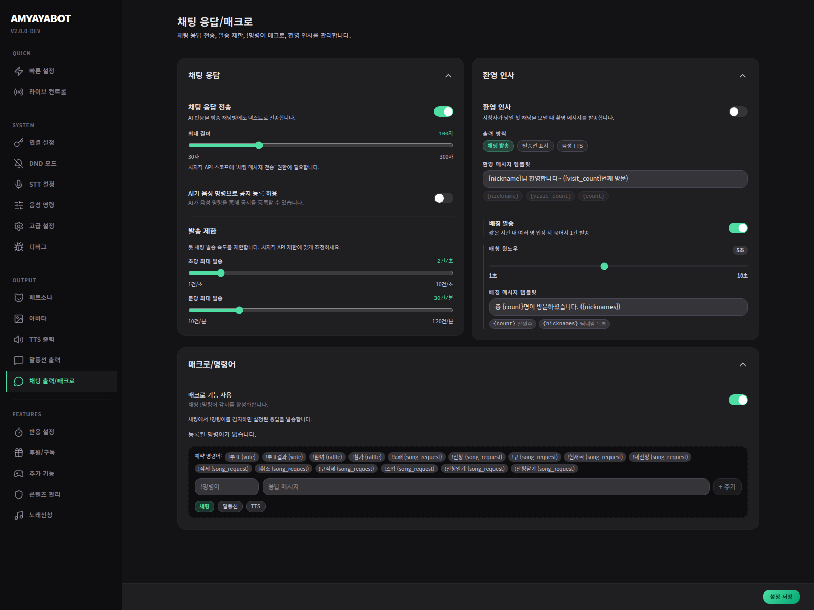

# Chat & Interaction

이 페이지는 **채팅 출력 / 명령어 / 상호작용 기능**을 다루는 곳이야.

## 여기서 하는 일
- 채팅 응답 on/off
- `!` 명령어 사용
- 투표 / 추첨 / 룰렛 / 노래신청 같은 상호작용 기능

## 가장 먼저 볼 것
- 다른 봇이 이미 `!명령어`를 쓰는지
- AmyayaBot이 채팅에 얼마나 자주 직접 말하게 할지

## 중요한 점
`chat_commands.enabled`는 단순 매크로가 아니라,
**AmyayaBot의 `!` command handling 전반**에 영향을 줘.

## 추천
- 다른 봇이 있으면 처음엔 꺼두기
- interaction 기능은 필요한 것만 켜기
