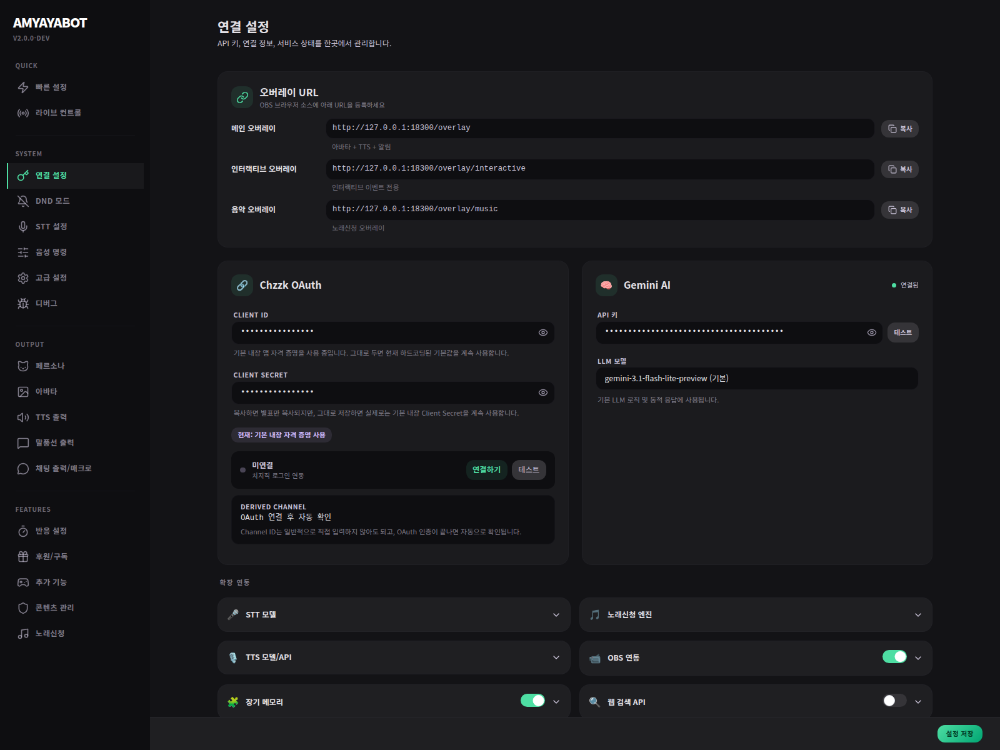

# Connections & Credentials

이 페이지는 **봇이 실제로 외부 서비스와 연결될 준비가 되어 있는지 확인하는 곳**이야.
처음에는 겁먹을 필요 없어. 여기서 제일 먼저 보는 건 보통 **Gemini**, **치지직**, **OBS** 세 가지면 충분해.

---

## 여기서 하는 일

이 페이지에서는 보통 아래를 확인해.

- Gemini API 키
- 치지직 OAuth 연결 상태
- 필요하면 치지직 Client ID / Client Secret 고급 설정
- OBS 연결 정보
- 일부 외부 provider key

즉,
**“값이 들어 있는가?”보다 “실제로 연결해서 쓸 수 있는가?”**를 보는 페이지라고 생각하면 쉬워.

---

## 처음엔 이것만 먼저 보면 된다

### 1) Gemini API 키
제일 먼저 확인해.
이게 없으면 대부분의 AI 반응이 멈춰.

### 2) 치지직 연결
지금 버전에서는 보통:
- 먼저 **연결하기** 버튼으로 로그인/OAuth를 진행하고
- 연결이 끝나면 **Derived Channel**로 채널 정보가 자동 확인되는 흐름이야.

즉,
처음부터 Channel ID를 직접 찾는 페이지라고 생각하지 않아도 돼.

### 3) OBS 연결
오버레이나 OBS 연동 기능을 쓸 예정이면,
호스트 / 포트 / 비밀번호가 맞는지 확인해야 해.

---

## 치지직은 어떻게 구분해서 보면 쉬운가?

### 기본 사용자 흐름
대부분은 여기까지만 보면 돼.

1. 치지직 상태가 미연결인지 본다
2. **연결하기** 버튼을 누른다
3. 브라우저 로그인 / 권한 허용을 진행한다
4. 연결 완료 후 Derived Channel이 잡히는지 본다

이 흐름만 되면,
보통 방송 채팅/채널 정보 연동은 시작할 수 있어.

### 고급 사용자 흐름
아래 Client ID / Client Secret 입력칸은 **운영/배포용 고급 설정**에 더 가까워.

이건 주로:
- 기본 내장 자격 증명 대신 별도 앱 자격 증명을 쓰고 싶을 때
- 배포 환경에서 운영자가 직접 OAuth 앱을 관리할 때
쓰는 경로야.

보통 처음 쓰는 사람은 **그대로 두고 연동부터 확인하는 편이 더 쉬워.**

---

## 실수하기 쉬운 점

### 값이 보인다고 바로 연결된 건 아님
예를 들어,
- Gemini API 키가 들어 있어도 실제 호출이 막힐 수 있고
- OBS host/port/password가 안 맞으면 연결이 안 되고
- 치지직도 실제 OAuth 연결이 안 끝나면 아직 미연결 상태일 수 있어.

### 치지직 고급 자격 증명은 둘 다 함께 봐야 함
Client ID만 바꾸고 Secret을 안 넣거나,
Secret만 넣는 식으로 반만 바꾸면 연결이 안 될 수 있어.

그래서 커스텀 자격 증명을 쓰려면 **둘 다 같이 입력**하는 게 중요해.

---

## 처음엔 이렇게 하면 안전하다

- Gemini: 먼저 연결
- 치지직: 먼저 OAuth 연결부터 확인
- OBS: 오버레이를 실제로 쓸 때 연결
- 고급 Client ID / Secret override: 정말 필요할 때만 사용

이 순서로 보면,
필요 없는 고급 설정에 먼저 시간을 쓰지 않게 돼.

---

## 체크포인트

- [ ] Gemini API 키가 들어가 있다
- [ ] 치지직이 연결되었거나, 최소한 연결 흐름을 확인했다
- [ ] Derived Channel이 정상적으로 보인다
- [ ] OBS를 쓸 거면 host / port / password가 맞다
- [ ] 고급 Client ID / Secret override는 필요할 때만 건드렸다
