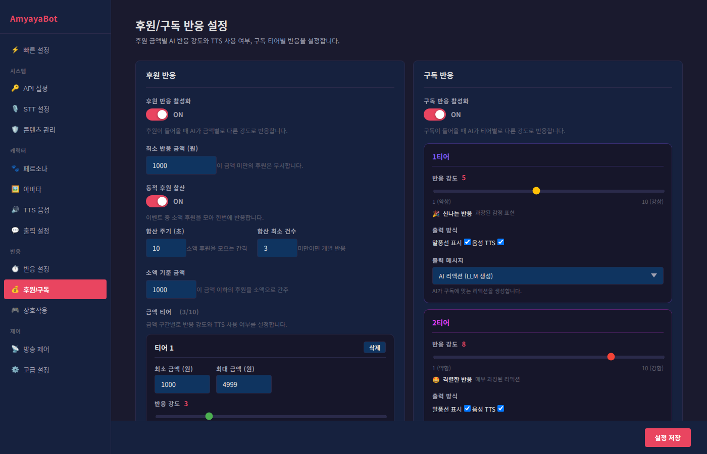

# 후원/구독 반응 설정 가이드



이 페이지에서는 시청자의 후원과 구독에 대한 캐릭터의 반응을 설정합니다. 방송 후원 시스템과의 연동을 통해 깊이 있는 상호작용을 만들어보세요.

---

## 후원 반응 (좌측)

### 후원 반응 활성화
- **ON**: 후원이 들어올 때 캐릭터가 반응합니다
- **OFF**: 후원 반응을 비활성화합니다

### 최소 반응 금액 (원)
- **설정값**: 기본값 1,000원
- **의미**: 이 금액 미만의 후원은 무시합니다
- **예시**: 1,000원 설정 시, 999원 후원은 반응 안 함
- **팁**: 너무 낮으면 모든 후원에 반응하므로, 적절한 선에서 설정하세요

### 동적 후원 합산

여러 건의 소액 후원을 모아서 한 번에 반응하는 기능입니다.

#### 동적 후원 합산 활성화
- **ON**: 설정된 조건에 따라 후원을 모아서 반응합니다
- **OFF**: 각 후원마다 즉시 반응합니다
- **추천**: 이벤트나 많은 후원이 들어올 때 ON으로 설정하여 반응이 과도하지 않게 합니다

#### 합산 주기 (3초 ~ 60초)
- **설정값**: 기본값 10초
- **의미**: 이 시간 동안 들어온 소액 후원들을 모아둡니다
- **짧게 설정하면**: 빠르게 반응합니다 (5~10초 권장)
- **길게 설정하면**: 더 많이 모아서 반응합니다 (이벤트 중 과도한 반응 방지)

#### 합산 최소 건수
- **설정값**: 기본값 3건
- **의미**: 이 건수 이상이 되어야 합산된 반응이 나옵니다
- **예시**: 3건 설정 시, 1~2건 후원은 개별 반응, 3건 이상은 합산 반응
- **짧게 설정하면**: 자주 합산됩니다
- **길게 설정하면**: 많이 모아서 한 번에 반응합니다

#### 소액 기준 금액 (원)
- **설정값**: 기본값 1,000원
- **의미**: 이 금액 이하의 후원을 소액으로 간주합니다
- **예시**: 1,000원 설정 시, 1,000원 이하 후원은 합산, 1,001원 이상은 즉시 반응
- **팁**: 동적 합산 대상을 명확히 하기 위해 설정하세요

---

## 금액 티어 설정

후원 금액별로 다른 강도의 반응을 설정합니다. 최대 10개 티어 생성 가능합니다.

### 티어 추가
- **+ 티어 추가** 버튼으로 새로운 금액 구간을 만듭니다
- 각 티어는 독립적으로 설정됩니다

### 각 티어의 설정항목

#### 최소/최대 금액 (원)
- **최소 금액**: 이 금액 이상의 후원에 적용됩니다
- **최대 금액**: 이 금액 이하의 후원에 적용됩니다 (공백이면 무제한)
- **예시**: 최소 10,000원, 최대 50,000원 → 10,000~50,000원 후원에 적용

#### 반응 강도 (1 ~ 10)
- **1~2**: 차분한 반응 (짧은 감사 인사) 😊
- **3~4**: 밝은 반응 (활발한 감사 표현) 😄
- **5~6**: 신나는 반응 (과장된 감정 표현) 🎉
- **7~8**: 격렬한 반응 (매우 과장된 리액션) 🤩
- **9~10**: 폭발적 반응 (최대 강도 리액션, 큰 모션) 🔥
- **팁**: 금액이 클수록 높은 강도 설정하면 자연스럽습니다

#### 출력 방식
- **말풍선 표시**: ON/OFF (텍스트가 화면에 나타날지)
- **음성 TTS**: ON/OFF (목소리로 반응할지)
- **조합 예시**:
  - 말풍선만 ON: 시각적 반응만
  - TTS만 ON: 목소리 반응만 (텍스트 없음)
  - 둘 다 ON: 풀 반응 (추천)
  - 둘 다 OFF: 애니메이션만 (아바타 모션만)

#### 출력 메시지

##### AI 리액션 (LLM 생성)
- AI가 후원 금액과 후원자 상황을 고려하여 자동으로 반응문을 생성합니다
- 더 자연스럽고 다양한 반응이 나옵니다
- **추천**: 시각적 임팩트가 중요한 경우

##### 패턴 메시지 (고정)
- 미리 입력한 메시지 목록에서 랜덤하게 선택하여 반응합니다
- 일관된 톤을 유지할 수 있습니다
- **메시지 변수**: {nickname}은 후원자 닉네임으로 자동 치환됩니다
- **예시**: "{nickname}님 감사합니다!" → "철수님 감사합니다!"
- **추천**: 캐릭터의 정해진 대사가 있는 경우

---

## 구독 반응 (우측)

유튜브/트위치 구독에 대한 반응을 설정합니다.

### 구독 반응 활성화
- **ON**: 구독이 들어올 때 캐릭터가 반응합니다
- **OFF**: 구독 반응을 비활성화합니다

### 구독 티어별 설정

플랫폼의 구독 티어(일반적으로 1~3티어)별로 반응을 설정합니다.

#### 티어별 구성 요소

##### 반응 강도 (1 ~ 10)
- 후원과 동일한 강도 시스템입니다
- **예시**: 1티어(낮음) 3강도, 2티어(중간) 6강도, 3티어(높음) 9강도

##### 출력 방식
- **말풍선 표시**: 텍스트 표시 여부
- **음성 TTS**: 목소리 반응 여부

##### 출력 메시지
- **AI 리액션**: 구독 수준을 고려한 자동 생성 반응
- **패턴 메시지**: 미리 등록한 메시지 중 랜덤 선택
- **변수**: {nickname}은 구독자 닉네임으로 자동 치환됩니다

---

## 반응 강도별 효과 정리

| 강도 | 레이블 | 설명 | 추천 상황 |
|------|--------|------|---------|
| 1~2 | 차분한 반응 | 짧은 감사 인사 | 소액 후원, 일반 구독 |
| 3~4 | 밝은 반응 | 활발한 감사 표현 | 중소액 후원 |
| 5~6 | 신나는 반응 | 과장된 감정 표현 | 중액 후원, 프리미엄 구독 |
| 7~8 | 격렬한 반응 | 매우 과장된 리액션 | 대액 후원 |
| 9~10 | 폭발적 반응 | 최대 강도, 큰 모션 | 초대액 후원, 특별 이벤트 |

---

## 설정 예시

### 예시 1: 게임 방송용 활발한 후원 반응

```
최소 반응 금액: 1,000원
동적 후원 합산: ON (주기 10초, 최소 3건, 소액 5,000원)

티어 1: 1,000~4,999원 → 강도 2, 패턴 메시지
티어 2: 5,000~9,999원 → 강도 5, AI 리액션
티어 3: 10,000~49,999원 → 강도 7, AI 리액션
티어 4: 50,000원~ → 강도 9, AI 리액션
```

### 예시 2: 교육/진지한 방송용 절제된 반응

```
최소 반응 금액: 5,000원
동적 후원 합산: ON (주기 30초, 최소 5건, 소액 10,000원)

티어 1: 5,000~19,999원 → 강도 3, 말풍선만 ON
티어 2: 20,000~99,999원 → 강도 5, 말풍선 + TTS
티어 3: 100,000원~ → 강도 6, 말풍선 + TTS
```

### 예시 3: 소규모 방송용 간단한 설정

```
최소 반응 금액: 1,000원
동적 후원 합산: OFF (즉시 반응)

티어 1: 1,000~9,999원 → 강도 4, 패턴 메시지
티어 2: 10,000원~ → 강도 7, AI 리액션
```

---

## 메시지 템플릿

패턴 메시지 사용 시 참고할 템플릿입니다.

### 후원 메시지 예시
- "{nickname}님 감사합니다!"
- "{nickname}님 후원 고마워요~"
- "오, {nickname}님! 감사합니다!"
- "{nickname}님의 응원 감사드려요!"

### 구독 메시지 예시
- "{nickname}님 구독 감사합니다!"
- "{nickname}님 함께해주셔서 고마워요!"
- "오, {nickname}님 구독했어! 감사합니다!"

---

## 트러블슈팅

### 후원 반응이 너무 자주 나온다
- 최소 반응 금액을 높입니다
- 동적 후원 합산을 ON으로 설정하고 주기를 길게 설정합니다
- 반응 강도를 낮춥니다

### 후원 반응이 너무 약하다
- 각 티어의 반응 강도를 올립니다
- TTS와 말풍선을 모두 ON으로 설정합니다
- AI 리액션으로 변경합니다

### 메시지가 이상하게 나온다
- AI 리액션에서 패턴 메시지로 변경합니다
- 패턴 메시지가 비어있지 않은지 확인합니다
- {nickname} 변수가 올바르게 입력되었는지 확인합니다

---

## 빠른 체크리스트

- [ ] 최소 반응 금액이 적절한지 확인
- [ ] 각 티어의 금액 범위가 겹치지 않는지 확인
- [ ] 반응 강도가 금액순으로 증가하는지 확인 (선택사항)
- [ ] TTS와 말풍선 설정이 원하는 대로인지 확인
- [ ] 패턴 메시지 사용 시 {nickname} 변수 확인
- [ ] 동적 후원 합산 설정이 의도한 대로인지 테스트

설정 변경 후 실제 후원/구독으로 테스트하면서 미세 조정하면 됩니다!
