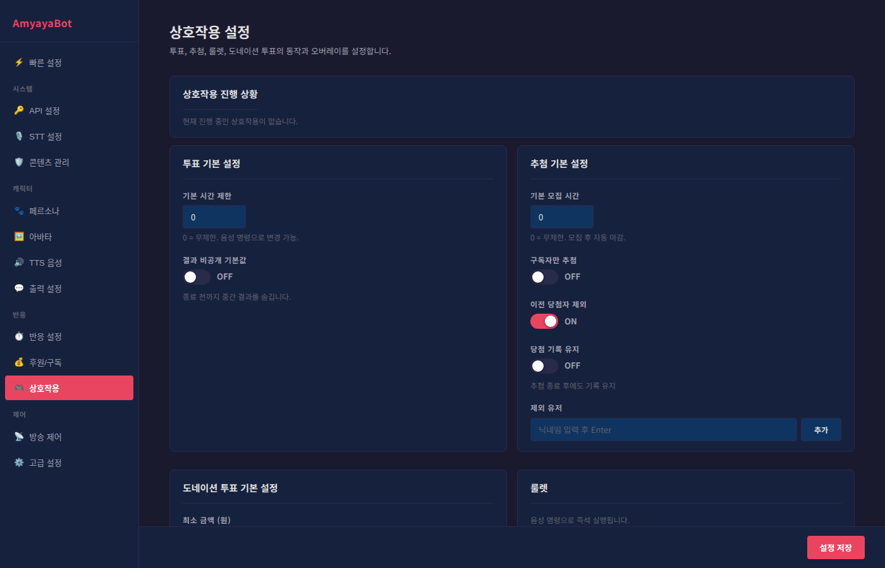

# 상호작용 설정 가이드

상호작용 설정으로 투표, 추첨, 도네이션 투표, 룰렛 같은 시청자 참여 기능을 관리합니다.

## 투표 기본 설정

시청자들이 A vs B 같은 선택지에 투표하는 기능입니다.

### 기본 시간 제한
투표가 자동으로 종료될 때까지의 시간을 설정합니다 (초 단위).
- **0**: 무제한 (수동으로 종료해야 함)
- **30**: 30초 후 자동 종료
- **60**: 1분 후 자동 종료

**추천값**: 30 ~ 60초

**팁**: 음성 명령으로 투표를 시작할 때 "투표 30초로 해줘" 같이 시간을 변경할 수 있습니다.

### 결과 비공개 기본값
ON으로 설정하면 투표가 진행 중일 때 중간 결과를 숨깁니다.
- **ON**: 투표 중에는 결과가 보이지 않음 (종료 후에만 공개)
- **OFF**: 실시간으로 투표 현황 공개

**언제 사용**: 결과를 모르는 상태에서 투표하게 하고 싶을 때 (조작 방지)

## 추첨 기본 설정

시청자들 중에서 당첨자를 무작위로 선택하는 기능입니다.

### 기본 모집 시간
추첨 모집 기간입니다 (초 단위).
- **0**: 무제한
- **60**: 1분

**팁**: "추첨 시작해줘 60초로" 같이 음성 명령으로 시간을 변경할 수 있습니다.

### 구독자만 추첨
ON으로 설정하면 유료 구독자만 추첨에 참여합니다.
- **ON**: 구독자 전용 추첨
- **OFF**: 모든 시청자 참여

**언제 사용**: 구독자 감사 추첨을 할 때

### 이전 당첨자 제외
ON으로 설정하면 최근에 이미 당첨된 사람은 다시 당첨되지 않습니다.
- **ON**: 같은 사람이 반복 당첨 방지
- **OFF**: 누구나 계속 당첨 가능

### 당첨 기록 유지
추첨 종료 후에도 당첨 기록을 유지합니다.
- **ON**: 다음 추첨까지 기록 유지 (이전 당첨자 제외 적용)
- **OFF**: 추첨 종료 시 기록 초기화

### 제외 유저
특정 유저를 추첨에서 제외합니다.

#### 추가하기
1. 닉네임을 입력란에 입력
2. Enter를 누르거나 "추가" 버튼 클릭
3. 태그 형식으로 목록에 추가

#### 제거하기
태그의 X 버튼을 클릭해서 삭제합니다.

**예시**: 방송국 직원, 개인정보 보호가 필요한 사람 등

## 도네이션 투표 기본 설정

시청자들이 후원금을 통해 투표하는 기능입니다. 후원 금액이 클수록 더 많은 표가 됩니다.

### 최소 금액 (원)
투표로 인정할 최소 후원 금액입니다 (단위: 원).

**예시**:
- 최소 금액 1,000원 설정
- 1,000원 후원: 1표
- 5,000원 후원: 5표

**추천값**: 1,000 ~ 5,000원

### 기본 제한 시간
도네이션 투표 진행 시간입니다 (초 단위).
- **0**: 무제한
- **60**: 1분

### 복수투표 허용
ON으로 설정하면 "금액 ÷ 최소금액 = 표수" 계산으로 여러 표를 인정합니다.
- **ON**: 5,000원 후원 시 5표
- **OFF**: 5,000원 후원도 1표

### 익명 도네 허용
ON으로 설정하면 익명 후원자도 투표에 참여합니다.
- **ON**: 익명 후원도 투표 인정
- **OFF**: 이름이 나타난 후원만 투표 인정

### 동적 합산
후원 반응 설정에서 글로벌 동적 합산이 활성화되어 있으면 여기서 오버라이드할 수 없습니다.

글로벌 동적 합산이 OFF인 경우:
- 토글을 ON으로 설정해서 도네이션 투표에만 합산 사용
- "소액 기준 금액": 이 금액 이하의 후원을 합산 처리

## 룰렛

음성 명령으로 즉석 실행되는 무작위 선택 게임입니다.

### 사용 방법
음성 명령으로 직접 호출합니다.

**예시**:
- "룰렛 돌려 치킨 피자 햄버거" → 3개 옵션 동등 확률
- "치킨은 확률 높게" → AI가 가중치 자동 조정

**특징**: 실시간으로 옵션을 정하므로 사전 설정이 필요 없습니다.

## 오버레이 미리보기

투표, 추첨, 도네이션 투표, 룰렛의 화면을 미리 확인할 수 있습니다.

### 미리보기 열기
각 기능의 "미리보기" 버튼을 클릭하면 새 창에 현재 설정이 반영된 오버레이가 열립니다.

### OBS 연동
- OBS 소스 추가: URL 입력
- 주소: `/overlay/interactive`
- 포트: 18300 (기본값)

예시 URL: `http://localhost:18300/overlay/interactive`

## 빠른 설정 가이드

### 친화적 설정 (모든 시청자 참여)
**투표**
- 기본 시간: 30초
- 결과 비공개: OFF (실시간 결과 공개)

**추첨**
- 기본 모집: 60초
- 구독자만: OFF
- 이전 당첨자 제외: OFF

**도네이션 투표**
- 최소 금액: 1,000원
- 복수투표: ON
- 익명 도네: ON

### 표준 설정 (추천)
**투표**
- 기본 시간: 60초
- 결과 비공개: OFF

**추첨**
- 기본 모집: 120초
- 구독자만: OFF
- 이전 당첨자 제외: ON (같은 사람 반복 방지)
- 당첨 기록 유지: ON

**도네이션 투표**
- 최소 금액: 5,000원
- 복수투표: ON
- 익명 도네: OFF

### 보상 중심 설정 (구독자/후원자 중심)
**추첨**
- 구독자만: ON
- 이전 당첨자 제외: ON

**도네이션 투표**
- 최소 금액: 10,000원
- 복수투표: ON

## 음성 명령 예시

### 투표 시작
- "투표 시작해" (기본 시간)
- "투표 30초로" (30초 설정)
- "투표 비공개로" (결과 숨김)

### 추첨 시작
- "추첨 시작" (기본 시간)
- "추첨 2분으로" (120초 설정)
- "구독자만 추첨" (구독자 전용)

### 도네이션 투표
- "도네 투표 시작" (기본 설정)
- "도네 투표 1분" (1분 설정)

### 룰렛
- "룰렛 돌려 A B C" (3개 옵션)
- "룰렛 A는 확률 높게" (가중치 설정)

## 참여 상황 모니터링

각 상호작용 기능을 사용 중일 때:
- **투표**: 실시간 투표 현황 표시
- **추첨**: 참여자 수, 모집 시간 표시
- **도네이션 투표**: 후원액 기반 투표 현황
- **룰렛**: 실시간 결과 표시

**팁**: 오버레이 미리보기로 실제 방송처럼 보일 모습을 사전에 확인할 수 있습니다.
