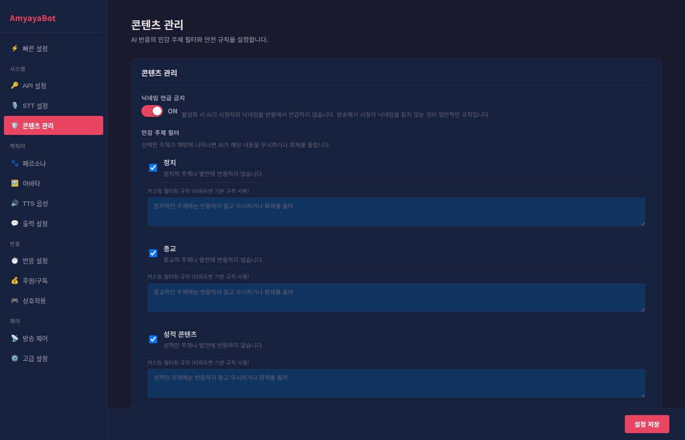

# 콘텐츠 관리 가이드

콘텐츠 관리 설정으로 AI가 반응하지 말아야 할 민감한 주제들을 필터링할 수 있습니다.

## 닉네임 언급 금지

이 옵션을 ON으로 설정하면 AI가 시청자의 닉네임을 반응에서 언급하지 않습니다.

**방송 규칙**: 일반적인 방송 에티켓으로, 시청자 닉네임을 읽으면 주의를 주기 때문에 많은 스트리머가 이 규칙을 적용합니다.

## 민감 주제 필터

AI가 특정 주제에 대해 자동으로 무시하거나 화제를 돌리도록 설정합니다.

### 필터 카테고리

각 카테고리 옆의 체크박스로 필터를 활성화합니다.

#### 정치
정치적인 주제나 발언에 반응하지 않습니다.
- 선거, 정책, 정당, 정치 인물 등
- **기본 규칙**: "정치적인 주제에는 반응하지 말고 무시하거나 화제를 돌려"

#### 종교
종교적인 주제나 발언에 반응하지 않습니다.
- 특정 종교, 신앙, 종교 경전 등
- **기본 규칙**: "종교적인 주제에는 반응하지 말고 무시하거나 화제를 돌려"

#### 성적 콘텐츠
성적인 주제나 발언에 반응하지 않습니다.
- 성인 콘텐츠, 은폐된 내용 등
- **기본 규칙**: "성적인 주제에는 반응하지 말고 무시하거나 화제를 돌려"

#### 욕설/비속어
욕설이나 비속어에 반응하지 않습니다.
- 모욕적인 표현, 저급한 언어 등
- **기본 규칙**: "욕설이나 비속어에는 반응하지 말고 무시하거나 화제를 돌려"

#### 차별/혐오
차별적이거나 혐오적인 표현에 반응하지 않습니다.
- 성차별, 인종차별, 지역차별, 종교 혐오 등
- **기본 규칙**: "차별이나 혐오 표현에는 반응하지 말고 무시하거나 화제를 돌려"

### 커스텀 필터링 규칙

필터를 활성화하면 커스텀 규칙을 입력할 수 있습니다.

**기본 규칙**: 입력 칸을 비워두면 각 카테고리의 기본 규칙이 자동으로 적용됩니다.

**커스텀 규칙**: AI에게 해당 주제에 대해 어떻게 반응해야 할지 특별히 지시합니다.

예시:
- 기본: "정치적인 주제에는 반응하지 말고 무시하거나 화제를 돌려"
- 커스텀: "정치 얘기가 나오면 '정치는 어려운 주제네요. 게임 얘기할까요?' 라고 돌린다"

## 사용자 지정 금지 주제

위의 카테고리에 없는 특정 주제들을 추가로 필터링합니다.

### 추가하기
1. 입력 칸에 금지할 주제를 입력합니다
2. Enter를 누르거나 "추가" 버튼을 클릭합니다
3. 태그 형식으로 목록에 추가됩니다

예시:
- "스포일러"
- "가상화폐"
- "음모론"
- "특정 연예인 이름"

### 제거하기
태그의 오른쪽 X 버튼을 클릭하면 삭제됩니다.

## 커스텀 필터링 규칙

더 정교한 필터링을 원할 때 사용합니다.

### 규칙 유형

각 규칙을 추가할 때 다음 중 하나를 선택합니다.

#### 키워드 일치
정확히 일치하는 단어만 필터링합니다.
- 입력: "장난감"
- 필터: "장난감"만 걸림 (장난감을 좋아한다 O, 장난이 심하다 O)

#### 포함
입력 단어가 포함된 모든 문장을 필터링합니다.
- 입력: "장난"
- 필터: "장난감", "장난 치다", "장난이 심하다" 등 모두 걸림

#### 정규식
정규식 패턴을 사용합니다 (고급 사용자용).
- 입력: `[0-9]{10,}` (10자리 이상의 숫자)
- 필터: 전화번호, 주민등록번호 같은 패턴 걸림

#### 카테고리
특정 카테고리로 분류합니다 (시스템용).

### 규칙 예시

**규칙 예시 1**: 특정 닉네임이 나올 때 반응 금지
- 유형: 포함
- 값: "특정닉네임"
- 설명: "그 사람 언급 필터"
- 활성화: ON

**규칙 예시 2**: 특정 단어 조합
- 유형: 포함
- 값: "~한테 돈"
- 설명: "금전 요구 필터"
- 활성화: ON

**규칙 예시 3**: 숫자 패턴 (정규식)
- 유형: 정규식
- 값: `\d{11}`
- 설명: "휴대폰번호 필터"
- 활성화: ON

### 규칙 관리

#### 규칙 추가
"+ 규칙 추가" 버튼을 클릭해서 새 규칙을 추가합니다.

#### 규칙 수정
각 열의 입력 칸을 수정해서 언제든지 변경할 수 있습니다.
- 유형, 값, 설명, 활성화 여부 모두 변경 가능

#### 규칙 비활성화
토글 스위치로 임시로 규칙을 끌 수 있습니다.
- 완전히 삭제하지 않고 나중에 다시 켤 때 유용

#### 규칙 삭제
오른쪽 X 버튼으로 규칙을 삭제합니다.

## 빠른 설정 가이드

### 최소 필터링 (친화적 방송)
- 닉네임 언급 금지: OFF
- 민감 주제 필터: 모두 OFF
- 커스텀 규칙: 없음

### 표준 필터링 (일반 방송)
추천 설정입니다.
- 닉네임 언급 금지: ON
- 민감 주제 필터: 정치, 종교, 성적 콘텐츠, 욕설, 차별 모두 ON
- 커스텀 규칙: 스포일러, 가상화폐 등 필요한 것 추가

### 엄격한 필터링 (가족 친화적 방송)
- 닉네임 언급 금지: ON
- 민감 주제 필터: 모두 ON
- 커스텀 규칙: 추가로 "폭력", "죽음" 같은 키워드 필터링

## 필터링 작동 방식

필터링이 활성화된 주제가 채팅에 나타나면:
1. AI가 해당 메시지를 감지합니다
2. 설정된 규칙에 따라 반응하지 않거나 화제를 돌립니다
3. 무시된 메시지로 처리되어 AI 응답이 생성되지 않습니다

**중요**: 필터는 영구적으로 메시지를 숨기지 않으며, 시스템 로그에는 모든 메시지가 기록됩니다.
