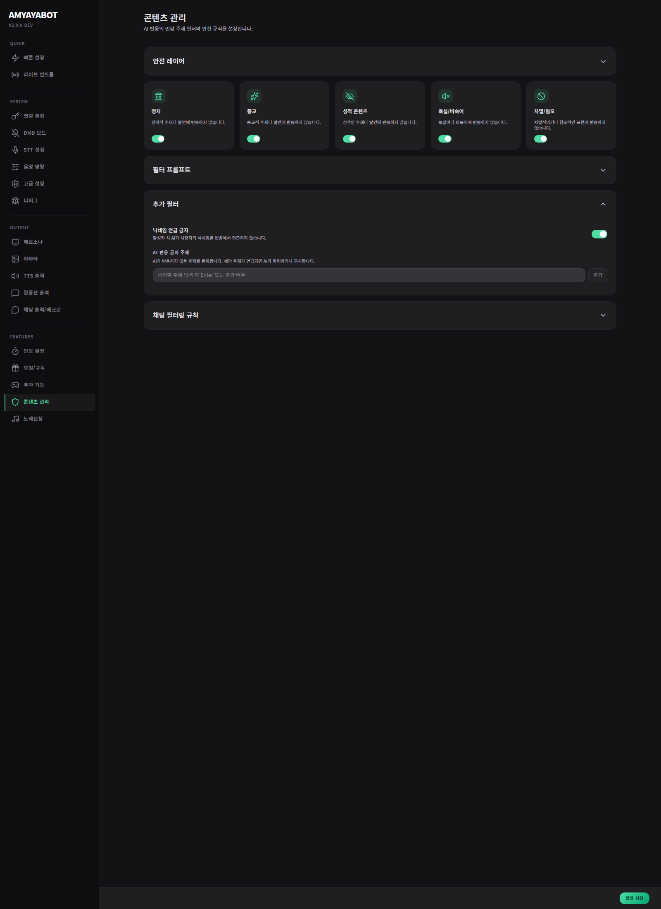

# Operations & Safety

이 페이지는 **방송에서 다루기 조심해야 하는 주제**를 정리하고,
AI가 너무 위험한 방향으로 튀지 않도록 기본 안전선을 잡아두는 곳이야.

## 여기서 하는 일
- 민감 주제 차단
- 채팅 금지어 / 제한 규칙
- AI가 너무 과하게 반응하지 않도록 기본 안전선 조정
- 방송 분위기에 맞는 수위 관리

## 쉽게 생각하면
이 페이지는
**“어디까지는 괜찮고, 어디부터는 막을지”**를 정하는 곳이야.

방송에서는 반응이 재미있는 것도 중요하지만,
한 번 선을 넘으면 수습이 어렵기 때문에 이런 설정이 생각보다 중요해.

## 처음엔 어떻게 보면 되나?
처음에는 아래만 먼저 보면 충분해.

1. 정치 / 종교 / 성적 표현 / 욕설 같은 민감 주제를 어느 정도 막을지
2. 채팅에서 바로 따라 읽으면 곤란한 단어를 제한할지
3. 방송 분위기에 맞게 너무 공격적인 반응이 나오지 않도록 기본형으로 둘지

## 중요한 점
- 이 페이지는 “재미를 줄이는 화면”이 아니라, **사고를 줄이는 화면**에 더 가까워.
- 처음에는 강하게 막아두고, 나중에 방송 분위기를 보면서 천천히 푸는 편이 더 안전해.
- 특히 시청자 참여가 많은 방송일수록 이런 기본 안전선이 더 중요해져.

## 추천
- 처음엔 기본형 또는 조금 보수적인 쪽으로 시작
- 방송 분위기가 안정된 뒤 조금씩 완화
- 혼자 쓰는 테스트 환경과 실방송 환경을 똑같이 생각하지 않기
