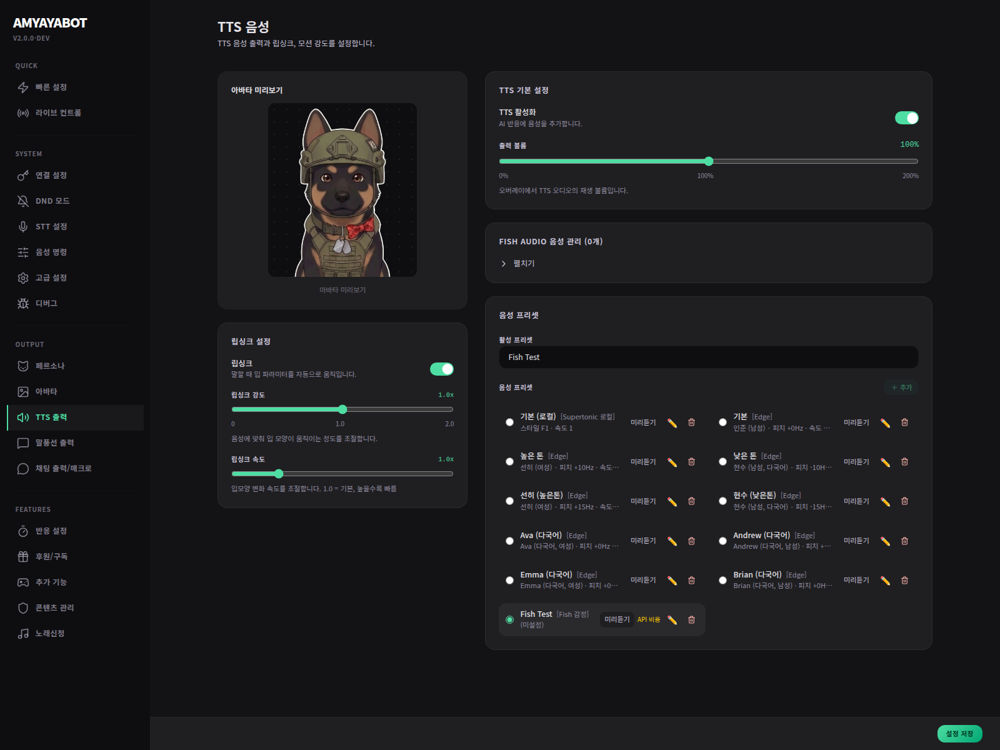

# Output & TTS

이 페이지는 **반응을 어디로 어떻게 보여줄지**를 정하는 곳이야.

## 여기서 하는 일
- TTS
- 말풍선
- 채팅 출력
- 출력 조합

## 가장 쉬운 시작 방법
- 말풍선: 켬
- TTS: 켬
- 채팅 출력: 필요하면 켬

## 왜 중요한가?
아무리 AI가 잘 돌아도,
**출력 채널이 없으면 방송에선 거의 안 보이는 것처럼 느껴져.**

## 체크포인트
- 최소 1개 이상 출력 채널이 켜져 있는가?
- TTS가 너무 시끄럽거나 부담스럽지 않은가?
- 말풍선이 방송 화면을 너무 가리지 않는가?
