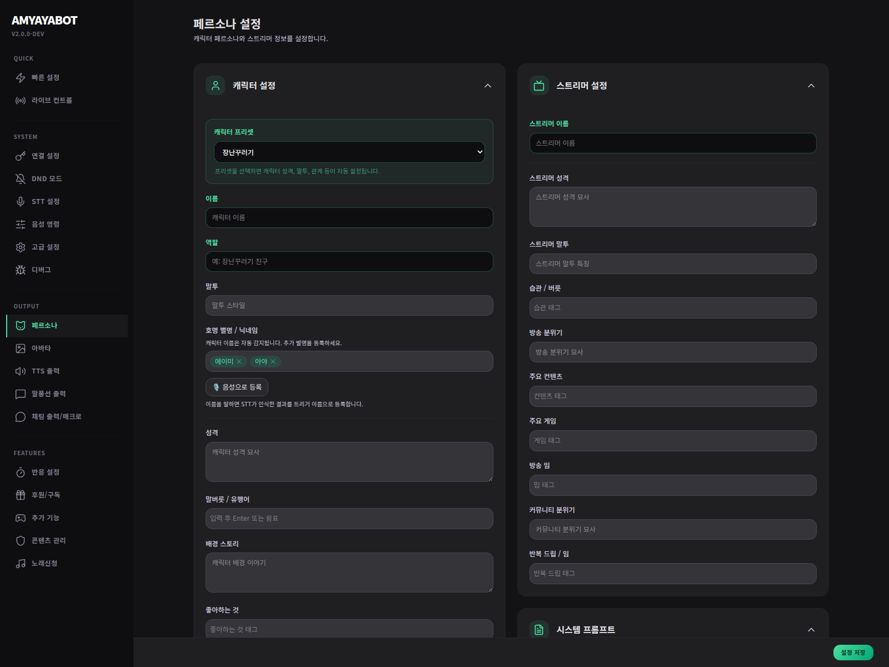

# Persona & Conversation

이 페이지는 **캐릭터가 어떤 말투/성격으로 말할지**를 정하는 가장 중요한 곳이야.

## 여기서 하는 일
- 스트리머 이름
- 캐릭터 이름
- 캐릭터 프리셋
- 주요 콘텐츠 / 방송 분위기
- 대화 진입 감각

## 처음엔 이렇게 두면 좋아
- 스트리머 이름: 실제 방송에서 쓰는 이름
- 캐릭터 이름: 방송에서 부르기 쉬운 이름
- 프리셋: 너무 과격하지 않은 기본형
- 주요 콘텐츠: 실제 방송 주제 위주로 2~4개

## 왜 중요하나?
이 값이 비어 있어도 봇은 움직일 수 있지만,
**캐릭터성 / 대화 일관성 / 반응 분위기**가 크게 떨어져.

## 체크포인트
- 이름이 너무 길지 않은가?
- 캐릭터 프리셋과 방송 분위기가 어울리는가?
- 실제로 방송 중 부르기 쉬운가?
