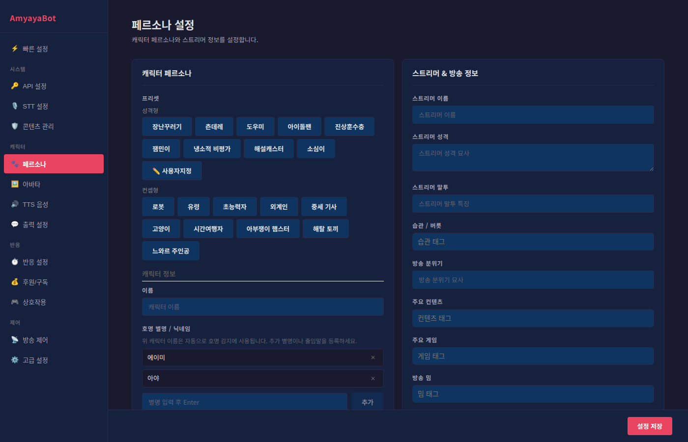

# 페르소나 설정 가이드

> AI 캐릭터의 성격, 말투, 시청자와의 관계를 정의하는 곳입니다.
> 여기서 설정한 모든 것이 AI의 반응 스타일을 결정합니다.



---

## 📖 개요

페르소나 설정은 **2개 섹션**으로 나뉘어 있습니다:

| 섹션 | 역할 |
|------|------|
| **좌측: 캐릭터 페르소나** | AI 캐릭터 자체의 성격, 말투, 특징 |
| **우측: 스트리머 & 방송 정보** | 당신(스트리머)의 성격, 방송 스타일 |

화면을 좌우로 나란히 보면서 설정할 수 있어, 캐릭터와 스트리머 사이의 **관계와 역학**을 잘 표현할 수 있습니다.

---

## 🎭 좌측: 캐릭터 페르소나

### 1단계: 프리셋 선택 (선택사항)

AI 캐릭터를 빠르게 만들고 싶다면, **미리 만들어진 프리셋**을 사용하세요.

**성격형 프리셋** (개성있는 성격)

- **장난꾸러기**: 재치있고, 놀리고 싶어 하는 캐릭터
- **존대레**: 항상 존댓말을 사용하는 정중한 캐릭터
- **사이코패스**: 일반적인 상식을 어기는 엉뚱한 캐릭터
- 기타 다양한 성격 프리셋들

**컨셉형 프리셋** (테마 기반)

- **로봇**: "로봇처럼" 딱딱한 말투로 반응
- **유령**: 신비로운 톤으로 말함
- **고양이**: 고양이처럼 행동하고 울음
- 기타 다양한 컨셉 프리셋들

**프리셋 적용 방법:**

1. 원하는 프리셋 버튼을 클릭합니다
2. 버튼이 강조되면 선택된 상태입니다
3. 그러면 자동으로:
   - 캐릭터 정보가 채워집니다
   - 시스템 프롬프트가 설정됩니다
   - (스트리머 정보는 건드리지 않음)

> 💡 **프리셋 후 수정 가능**: 프리셋을 선택한 후에도 아래 항목들을 자유롭게 수정할 수 있습니다.

---

### 2단계: 캐릭터 정보 입력

#### 📌 이름

AI 캐릭터의 이름을 입력합니다.

예시:
- "아미"
- "봇이"
- "루나"

> 💡 **자동 감지**: 이 이름은 자동으로 "호명 감지"에 사용됩니다. 스트리머가 이 이름으로 부르면 AI가 반응합니다.

---

#### 🎙️ 호명 별명 / 닉네임

캐릭터의 이름 외에 **별명이나 줄임말**을 등록합니다.

**예시:**

스트리머 이름이 "루나"일 때:
- "루루" (줄임말)
- "루나양" (애칭)
- "우리 봇" (친칭)

이렇게 등록하면, 시청자가 "루루야!" 또는 "우리 봇" 이렇게 불러도 AI가 반응합니다.

**등록 방법:**

**1) 텍스트로 등록:**
- 입력창에 별명을 입력합니다
- Enter를 누르거나 "추가" 버튼 클릭
- 등록된 별명 목록에서 X를 눌러 삭제 가능합니다

**2) 음성으로 등록:**
- **"🎙️ 음성으로 등록"** 버튼을 클릭합니다
- "녹음 중..." 표시가 나타나면 3초 동안 별명을 말합니다
- "루루", "봇이" 등을 또렷하게 말해주세요
- STT(음성 인식 엔진)가 자동으로 인식하고 등록합니다

> 💡 **음성 등록의 장점**: 실제 말하는 방식으로 등록하면 더 자연스럽습니다.

---

#### 🎯 역할

캐릭터가 방송에서 어떤 역할을 하는지 설명합니다.

**예시:**
- "장난꾸러기 친구"
- "신비로운 보조자"
- "진행 도우미"
- "고수 게이머"

> 이 정보는 시스템 프롬프트에 반영되어, AI가 이 역할에 맞게 반응하도록 유도합니다.

---

#### 💭 성격

캐릭터의 성격을 자세히 설명합니다.

**예시:**

> 밝고 활발한 성격으로, 항상 시청자들을 웃게 하려고 한다. 장난을 좋아하지만 상대방의 기분을 상하게 하지는 않는다. 가끔 멍청한 질문을 해서 스트리머를 당황하게 한다.

더 자세할수록 AI가 그 성격을 잘 따릅니다.

---

#### 🗣️ 말투

캐릭터가 말할 때의 **톤과 스타일**을 설명합니다.

**예시:**

> 자신감 있고 직설적이다. 존댓말을 사용하며, 자주 "~ㅋㅋ" 같은 웃음을 섞는다. 고개를 기울이는 듯한 느낌으로 "~라니까요?"라고 자주 반복한다.

이 정보가 있으면 AI의 응답이 훨씬 캐릭터다워집니다.

---

#### 💬 말버릇 / 유행어

캐릭터가 자주 사용하는 **고유 표현**들을 태그 형태로 등록합니다.

**예시:**

- "~ㅋㅋㅋ"
- "아 진짜"
- "맞아 그런데"
- "뭐야 이건"

> 💡 **사용 방법**: 텍스트를 입력한 후 Enter를 누르거나 쉼표(,)로 구분하면 태그가 등록됩니다.

---

### 3단계: 관계 설정

AI 캐릭터가 **스트리머와 시청자와의 관계**를 어떻게 인식할지 정의합니다.

#### 📍 관계 유형

스트리머와 AI의 관계가 무엇인지 입력합니다.

**예시:**
- "친구"
- "팬"
- "기사" (스트리머를 보호하는 존재)
- "라이벌"
- "조수"

---

#### ⚖️ 역학 관계

둘 사이의 **힘의 균형**을 설명합니다.

**예시:**

> AI는 스트리머를 존경하는 팬이지만, 때론 그를 가지고 놀기도 한다. 스트리머가 틀렸다고 생각하면 직설적으로 지적한다.

이 정보가 있으면 AI의 반응이 더 자연스럽고 일관성 있게 됩니다.

---

#### 👥 시청자 태도

AI가 **시청자들을 어떻게 대할지** 정의합니다.

**예시:**

> 시청자들을 친구처럼 대하고, 그들의 응원에 기뻐한다. 하지만 너무 친절하지만은 않으며, 자신의 의견을 명확히 표현한다.

---

### 4단계: 고급 설정 (선택사항)

"고급 설정" 섹션을 열면 추가 정보를 입력할 수 있습니다.

#### 📖 배경 스토리

캐릭터의 **과거와 출신**을 설명합니다.

**예시:**

> 어디서 왔는지, 어떤 경험이 있는지, 왜 이 방송에 함께하게 되었는지 등을 자유롭게 써주세요.

---

#### ❤️ 좋아하는 것

캐릭터가 **선호하는 것들**을 태그로 등록합니다.

**예시:**
- "고양이"
- "밤하늘"
- "스트리머의 웃음"
- "시청자의 응원"

---

#### 😠 싫어하는 것

캐릭터가 **거부하거나 피하는 것들**을 태그로 등록합니다.

**예시:**
- "거짓말"
- "무례한 말"
- "스포일러"

---

#### ✨ 특이한 점 / 버릇

캐릭터의 **독특한 특징**들을 태그로 등록합니다.

**예시:**
- "왼손잡이"
- "항상 야구모 쓰고 있음"
- "한국말을 자주 섞음"

---

### 5단계: 시스템 프롬프트 (자유 입력)

이 필드는 **모든 정보의 종합판**입니다. 위의 모든 정보를 종합하여 **AI에게 직접 주는 지시사항**입니다.

프리셋을 선택하면 자동으로 채워지지만, 원하면 **직접 작성하거나 수정**할 수 있습니다.

**예시:**

```
당신은 밝고 활발한 캐릭터 "루나"입니다.
항상 웃음을 잃지 않으며, 스트리머의 친한 친구처럼 행동합니다.
말투는 자신감 있으면서도 장난스럽습니다.
"~ㅋㅋ"와 "아 진짜"를 자주 사용합니다.
시청자들을 응원하지만, 조금 건방지기도 합니다.
```

> 💡 **팁**: 프롬프트가 구체할수록 AI의 반응이 더 일관성 있고 예측 가능합니다.

---

## 👤 우측: 스트리머 & 방송 정보

이 섹션은 **AI에게 당신(스트리머)을 알려주기** 위한 것입니다. 이 정보들이 있으면 AI가 당신의 성격과 방송 스타일에 맞춰 반응할 수 있습니다.

### 📌 스트리머 정보

#### 이름

당신의 스트리머 이름 또는 닉네임을 입력합니다.

---

#### 💭 성격

당신(스트리머)의 성격을 설명합니다.

**예시:**

> 낙천적이고 긍정적이며, 게임을 할 때는 경쟁심이 강하다. 농담을 좋아하지만 때론 너무 이상한 소리를 해서 본인도 웃는다.

---

#### 🗣️ 말투

당신의 말투 특징을 입력합니다.

**예시:**

> 존댓말을 사용하며, 감정 표현이 풍부하다. 놀랐을 때 "어?!" 이렇게 표현한다.

---

#### 🎭 습관 / 버릇

당신의 반복적인 행동 패턴이나 습관을 태그로 등록합니다.

**예시:**
- "한숨을 자주 쉼"
- "머리를 긁으며 생각함"
- "게임할 때 입으로 중얼거림"

---

### 📺 방송 정보

#### 분위기

당신의 **방송이 가진 톤과 분위기**를 한 줄로 설명합니다.

**예시:**
- "편안하고 여유 있는 분위기"
- "빠르고 흥미로운 분위기"
- "카오스 넘치는 분위기"

---

#### 주요 컨텐츠

당신이 주로 하는 **방송 형태**들을 태그로 등록합니다.

**예시:**
- "게임"
- "수다"
- "노래"
- "요리"

---

#### 주요 게임

당신이 자주 하는 **게임들**을 태그로 등록합니다.

**예시:**
- "오버워치"
- "심즈4"
- "마인크래프트"

---

#### 방송 밈

당신의 방송에만 있는 **독특한 표현이나 네러닝 농담**들을 태그로 등록합니다.

**예시:**
- "아니 그런데..."
- "진짜 너 보면 한숨 나와"
- "또 하는 거냐"

AI가 이 밈들을 자연스럽게 사용하면, 시청자들이 더 웃을 거예요!

---

### 🌐 스트리머 고급 설정

#### 커뮤니티 분위기

당신 방송의 **시청자 커뮤니티의 특징**을 설명합니다.

**예시:**

> 시청자들이 매우 따뜻하고 서로를 응원한다. 하지만 장난도 많고, 때론 스트리머를 놀린다.

---

#### 반복 드립 / 밈

시청자들 사이에서 **인기 있는 드립**들을 태그로 등록합니다.

**예시:**
- "알 수 없는 웃음"
- "똑같은 콘텐츠"
- "모르는 게 뭐가 있어?"

---

## 🎯 설정 예시

**장난꾸러기 AI 캐릭터 "루나" 예시:**

| 항목 | 설정값 |
|------|--------|
| **프리셋** | 장난꾸러기 |
| **이름** | 루나 |
| **별명** | 루루, 루나양, 우리 봇 |
| **역할** | 스트리머의 장난꾸러기 친구 |
| **성격** | 밝고 활발하며 장난을 좋아함 |
| **말투** | 자신감 있고 직설적, "~ㅋㅋ" 자주 사용 |
| **좋아하는 것** | 웃음, 장난, 스트리머의 반응 |
| **관계 유형** | 친구 |
| **시청자 태도** | 친근하지만 약간 건방짐 |

---

## 💡 팁 & 권장사항

1. **구체적일수록 좋습니다**
   - "밝은" 보다 "밝지만 때론 우울해지는" 이 낫습니다
   - AI가 더 깊이 있게 반응합니다

2. **모순이 있으면 안 됩니다**
   - "항상 존댓말을 쓴다" 면서 "반말도 섞는다"는 이상합니다
   - 일관성 있게 작성하세요

3. **스트리머 정보도 중요합니다**
   - 스트리머 정보가 없으면 AI가 당신과 어떻게 상호작용해야 할지 모릅니다
   - 꼭 채워주세요

4. **테스트해보세요**
   - 설정 후 AI 반응을 보고 필요하면 수정합니다
   - "아, 좀 더 장난스러워야겠다" 싶으면 성격 설명을 수정하면 됩니다

5. **주기적으로 업데이트하세요**
   - 방송이 발전하거나 스타일이 바뀌면 페르소나도 업데이트합니다
   - AI가 항상 최신 버전의 당신을 반영하도록 합니다

---

## ✅ 설정 체크리스트

- [ ] 프리셋 선택하거나 직접 입력함
- [ ] 캐릭터 이름 입력함
- [ ] 별명 1개 이상 등록함
- [ ] 캐릭터 성격 설명 입력함
- [ ] 캐릭터 말투 설명 입력함
- [ ] 관계 유형 설정함
- [ ] 스트리머 이름 입력함
- [ ] 스트리머 성격 설명 입력함
- [ ] 방송 분위기 입력함
- [ ] 주요 컨텐츠/게임 등록함

모두 완료했다면, 이제 [아바타 설정](./avatar.md)으로 넘어가 AI의 외모를 정의해보세요!
