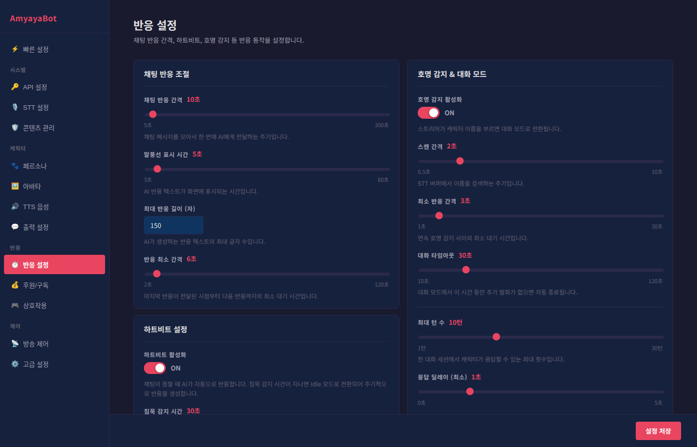

# 반응 설정 가이드

이 페이지에서는 AmyayaBot 캐릭터의 채팅 반응 방식을 세밀하게 조정할 수 있습니다. 방송의 분위기와 리듬에 맞게 설정해보세요.

## 채팅 반응 조절

캐릭터가 채팅을 얼마나 빠르게, 얼마나 자주 반응할지를 결정합니다.

### 채팅 반응 간격 (5초 ~ 300초)
- **설정값**: 기본값 30초
- **의미**: 수집된 여러 채팅 메시지를 한 번에 AI에게 전달하는 주기입니다.
- **짧게 설정하면**: 채팅이 올 때마다 자주 반응합니다 (5초 권장)
- **길게 설정하면**: 채팅을 모아서 한 번에 반응합니다 (느린 채팅 속도에 좋음)
- **추천 설정**: 방송 활동량에 따라 10~30초

### 말풍선 표시 시간 (3초 ~ 60초)
- **설정값**: 기본값 10초
- **의미**: AI 반응 텍스트가 화면에 표시되는 시간입니다.
- **짧게 설정하면**: 반응이 빠르게 지나갑니다 (빠른 방송 리듬)
- **길게 설정하면**: 시청자가 충분히 읽을 수 있습니다 (느린 방송에 좋음)
- **추천 설정**: 5~15초

### 최대 반응 길이 (20 ~ 100자)
- **설정값**: 기본값 50자
- **의미**: 캐릭터가 한 번에 말하는 최대 글자 수입니다.
- **짧게 설정하면**: 간단한 반응만 나옵니다 (빠른 진행)
- **길게 설정하면**: 더 자세한 반응이 나옵니다 (설명이 필요한 상황)
- **추천 설정**: 30~70자

### 반응 최소 간격 (2초 ~ 최대 간격)
- **설정값**: 기본값 5초
- **의미**: 마지막 반응 이후 다음 반응까지의 최소 대기 시간입니다.
- **짧게 설정하면**: 빠르게 연속 반응합니다 (활발한 방송)
- **길게 설정하면**: 반응이 천천히 나옵니다 (진정한 분위기)
- **주의**: 이 값이 "말풍선 표시 시간"보다 짧으면 말풍선이 겹칠 수 있습니다

---

## 하트비트 설정

채팅이 뜸할 때 캐릭터가 자동으로 반응하도록 하는 기능입니다.

### 하트비트 활성화
- **ON**: 침묵 시간이 지나면 캐릭터가 자동으로 반응합니다
- **OFF**: 하트비트 기능을 비활성화합니다

### 침묵 감지 시간 (10초 ~ 600초)
- **설정값**: 기본값 30초
- **의미**: 마지막 채팅 이후 이 시간이 지나면 하트비트 모드로 전환됩니다.
- **짧게 설정하면**: 조용해지자마자 반응합니다 (활발함)
- **길게 설정하면**: 충분히 조용한 후에 반응합니다 (침착함)
- **추천 설정**: 20~40초

### 하트비트 반응 간격 (10초 ~ 60초)
- **설정값**: 기본값 20초
- **의미**: 하트비트 모드에서 반응을 시도하는 주기입니다.
- **짧게 설정하면**: 자주 반응합니다
- **길게 설정하면**: 가끔 반응합니다
- **추천 설정**: 15~30초

### 동적 침묵 감지
- **ON**: 방송 활동량에 따라 침묵 감지 시간이 자동으로 조절됩니다
- **OFF**: 침묵 감지 시간을 고정값으로 사용합니다
- **추천**: 활발한 방송에는 ON (자동 조절), 라이브 수업 같은 정적인 방송에는 OFF

#### 최소/최대 침묵 시간 (동적 침묵 감지 ON일 때만)
- **최소 침묵 시간**: 아무리 활발해도 이 시간은 기다립니다 (권장: 10~20초)
- **최대 침묵 시간**: 아무리 조용해도 이 시간을 초과하지 않습니다 (권장: 60~120초)

---

## Idle 메시지 설정

하트비트 모드에서 채팅 없이 자동으로 반응할 때의 대사를 설정합니다.

### Idle 메시지에 AI 사용
- **ON**: AI가 방송 상황을 참고하여 자동으로 메시지를 생성합니다 (추천)
- **OFF**: 수동으로 설정한 메시지 목록에서만 선택합니다

### Idle 메시지 목록 (AI 사용 OFF일 때만)
- 하트비트 모드에서 자동으로 반응할 메시지들입니다
- 예시: "뭐하고 있어?", "여기 있어요!", "방송 재미있나요?"
- 여러 개를 등록하면 랜덤으로 선택됩니다

---

## 호명 감지 & 대화 모드

캐릭터를 호명했을 때 대화를 나누도록 설정합니다.

### 호명 감지 활성화
- **ON**: 스트리머가 캐릭터 이름을 부르면 대화 모드로 전환됩니다
- **OFF**: 호명 감지 기능을 비활성화합니다
- **현재 감지 이름**: 설정된 캐릭터 이름이 표시됩니다

### 스캔 간격 (0.5초 ~ 10초)
- **설정값**: 기본값 1초
- **의미**: STT(음성 인식) 버퍼에서 이름을 검색하는 주기입니다
- **짧게 설정하면**: 빠르게 반응합니다
- **길게 설정하면**: CPU 부하를 줄입니다
- **추천 설정**: 1~2초

### 최소 반응 간격 (1초 ~ 30초)
- **설정값**: 기본값 3초
- **의미**: 연속으로 호명되는 것을 감지할 때 최소 대기 시간입니다
- **짧게 설정하면**: 자주 호명 반응합니다
- **길게 설정하면**: 중복 호명을 방지합니다
- **추천 설정**: 2~5초

### 대화 타임아웃 (10초 ~ 120초)
- **설정값**: 기본값 30초
- **의미**: 대화 모드에서 이 시간 동안 추가 발화가 없으면 자동 종료됩니다
- **짧게 설정하면**: 대화가 빠르게 끝남 (빠른 진행)
- **길게 설정하면**: 여유 있게 대화를 이어감 (깊은 상호작용)
- **추천 설정**: 20~40초

---

## 대화 모드 설정

호명 감지로 시작된 대화의 상세 설정입니다.

### 최대 턴 수 (1턴 ~ 30턴)
- **설정값**: 기본값 10턴
- **의미**: 한 번의 대화 세션에서 캐릭터가 응답할 수 있는 최대 횟수입니다
- **예시**: 최대 턴 3이면 "질문 → 답변 → 질문 → 답변 → 질문 → 답변" 후 종료
- **낮게 설정하면**: 대화가 빠르게 끝남
- **높게 설정하면**: 깊이 있는 대화
- **추천 설정**: 5~10턴

### 응답 딜레이 (최소 0초 ~ 최대 10초)
- **최소 딜레이**: 최소한 이 시간만큼 기다렸다가 응답합니다
- **최대 딜레이**: 최대 이 시간까지 랜덤하게 기다렸다가 응답합니다
- **예시**: 최소 0.5초, 최대 3초로 설정하면 0.5~3초 사이의 랜덤 시간 대기
- **짧게 설정하면**: 빠른 응답 (활발함)
- **길게 설정하면**: 자연스러운 대화 리듬
- **추천 설정**: 최소 0.5초, 최대 2초

### 최대 응답 길이 (20자 ~ 200자)
- **설정값**: 기본값 100자
- **의미**: 대화 모드에서 캐릭터가 한 번에 말하는 최대 글자 수입니다
- **짧게 설정하면**: 빠른 반응
- **길게 설정하면**: 자세한 설명
- **추천 설정**: 50~120자

### 파트너 모드 프롬프트
- AI에게 대화 모드에서의 행동 지침을 전달합니다
- 예시: "캐릭터는 친근하고 밝은 성격으로 대화한다", "기술 설명을 할 때는 쉽게 풀어서 설명한다"
- 비워두면 기본 성격으로 대화합니다

### 대화 모드 중 동적 후원 합산
- **ON**: 대화 중에 후원이 들어와도 합산하여 한 번에 반응합니다
- **OFF**: 대화가 끝날 때까지 후원 반응을 미룹니다
- **추천**: 후원이 자주 들어오는 방송이면 ON, 대화 몰입도를 중시하면 OFF

---

## 타이밍 프리셋

일반적인 상황에 맞게 미리 설정된 프리셋을 사용할 수 있습니다:

| 프리셋 | 반응 간격 | 말풍선 표시 | 반응 강도 | 추천 상황 |
|--------|---------|-----------|---------|---------|
| **빠른 응답** | 5~10초 | 5초 | 활발 | 게임방송, 높은 에너지 |
| **균형** | 15~20초 | 10초 | 적절 | 일반 채팅방송, 게더 |
| **절전** | 40~60초 | 15초 | 차분 | 장시간 라이브, CPU 절약 |

---

## 빠른 체크리스트

설정 후 다음을 확인하세요:

- [ ] 말풍선 표시 시간 > 반응 최소 간격 (겹침 방지)
- [ ] 응답 딜레이 최소값 < 최대값
- [ ] 침묵 감지 시간 > 하트비트 반응 간격 (자연스러운 대기)
- [ ] AI 사용과 메시지 목록 설정이 맞게 되어 있는지 확인

설정을 변경한 후 실시간으로 반영되므로 편하게 조정하면서 테스트할 수 있습니다.
