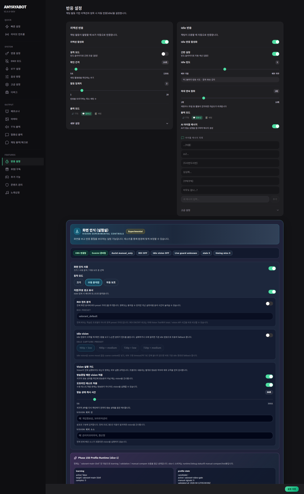

# Reactions & Vision

이 페이지는 **언제 자동으로 반응할지**와 **vision을 보조적으로 쓸지**를 정하는 곳이야.

## 여기서 하는 일
- reactive 반응
- idle 반응
- vision assist
- idle vision
- live guard / excluded scenes / excluded sources

## 먼저 결정할 것
1. reactive를 켤지
2. idle을 켤지
3. vision을 쓸지

## 이해하기 쉽게 말하면
- **reactive**: 채팅이 활발할 때 자동 반응
- **idle**: 조용할 때 먼저 말 걸기
- **vision**: 화면을 보조적으로 읽어서 반응 보강

## 중요한 점
- vision은 아직 **보조 계층**이야. 없어도 기본 방송은 가능해.
- live guard / exclusion 설정을 같이 봐야 진짜 안전하게 동작해.

## 추천
- 처음엔 reactive + idle 먼저
- vision은 나중에 천천히 켜도 충분해
