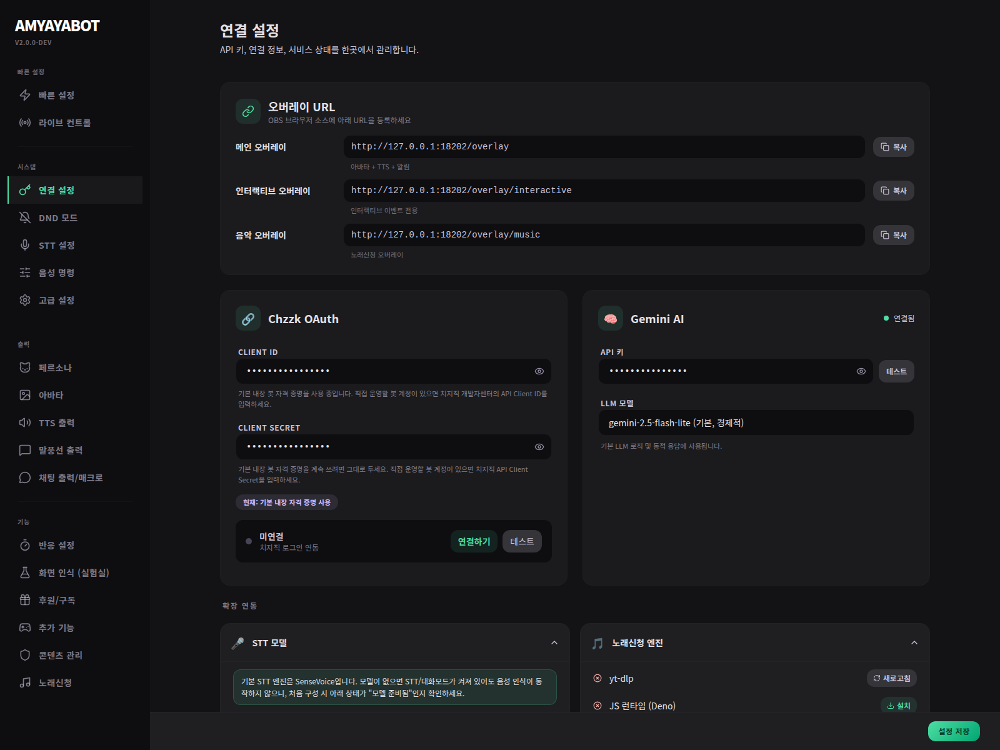
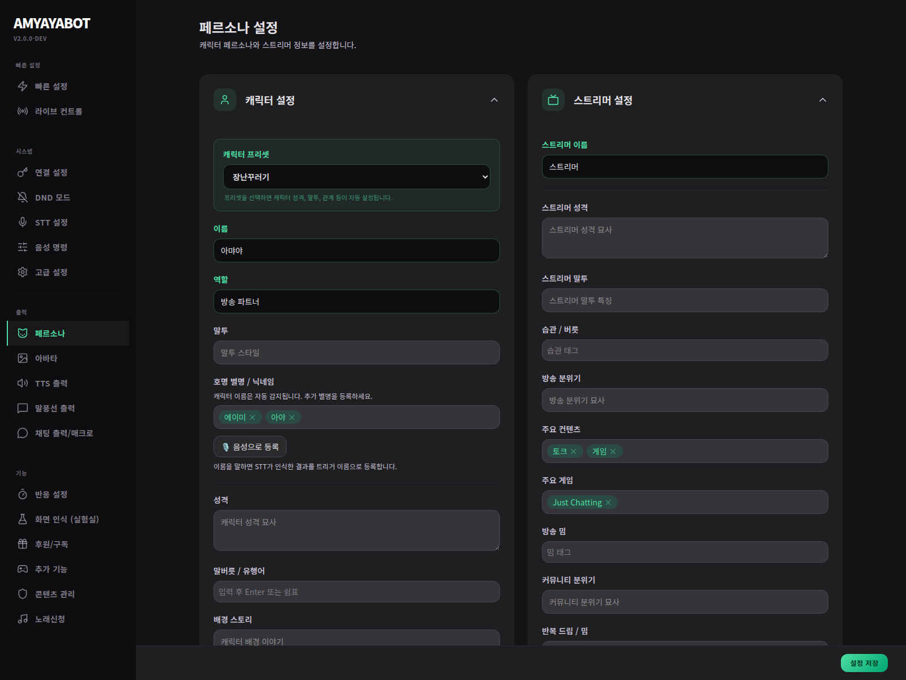
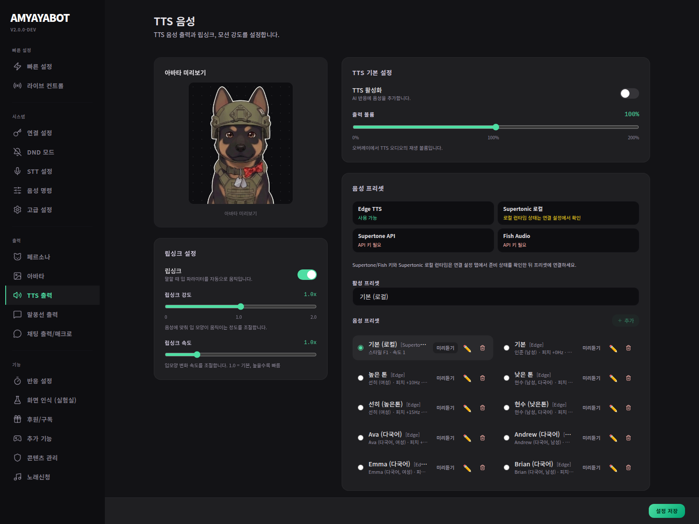
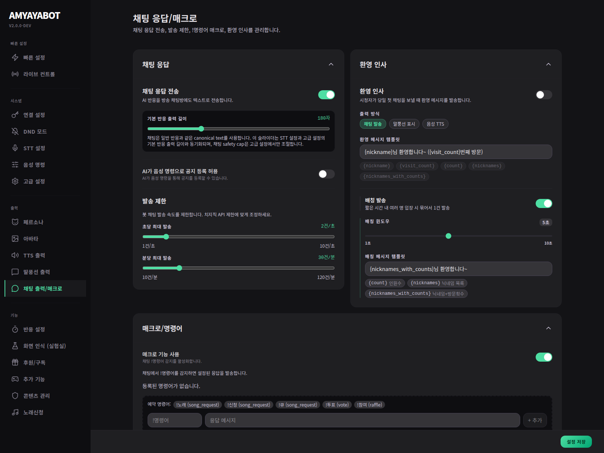
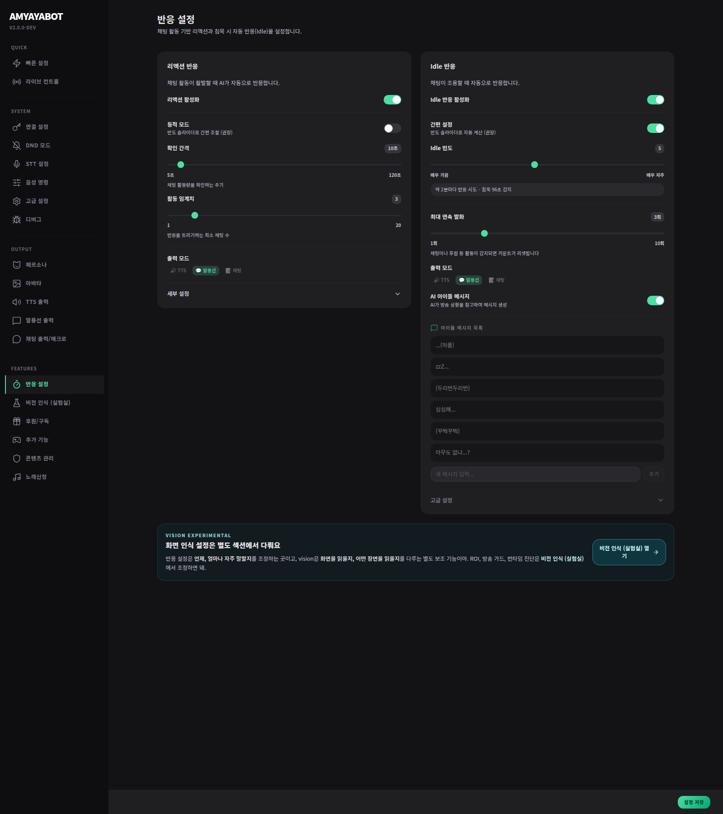
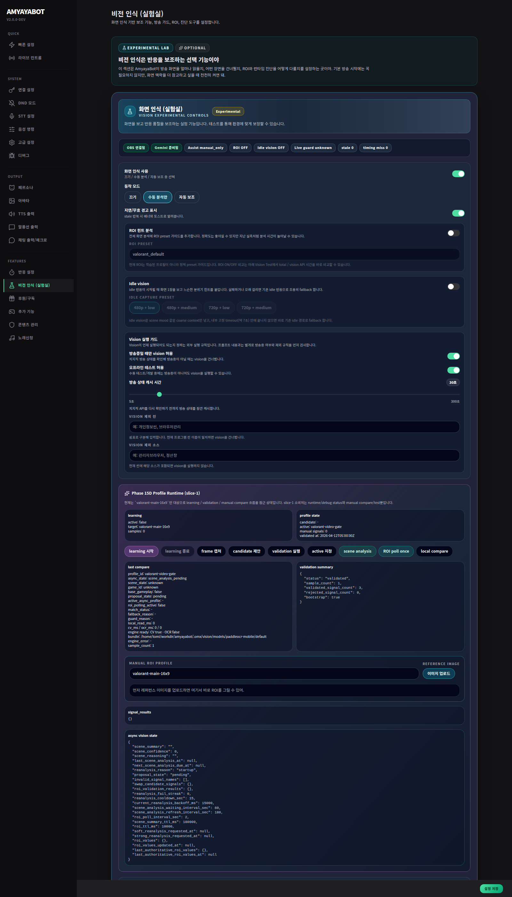

# 설정 탭별 상세 레퍼런스

이 문서는 `/settings` 화면의 실제 탭 구조를 기준으로 작성한 운영 레퍼런스입니다. 각 탭에서 **무엇을 켜는지**, **값을 바꾸면 방송에서 무엇이 달라지는지**, **추가로 무엇을 연결해야 하는지**를 설명합니다.

> 처음 시작만 하고 싶다면 [퀵세팅 / 온보딩](../guides/first-run-onboarding.md)을 먼저 보세요. 외부 API 키 발급은 [외부 연동 설정](external-integrations.md)에 따로 모았습니다.

---

## 탭 빠른 지도

| 그룹 | 탭 | 핵심 역할 |
| --- | --- | --- |
| 빠른 설정 | 빠른 설정 | 주요 기능 ON/OFF와 타이밍 프리셋을 한 화면에서 조정 |
| 빠른 설정 | 라이브 컨트롤 | 투표/추첨/룰렛/노래신청 등 방송 중 조작 패널 |
| 시스템 | 연결 설정 | Gemini, CHZZK, OBS, STT 모델, TTS API, 검색, 메모리 연결 |
| 시스템 | DND 모드 | 게임/BRB/비토크 씬에서 출력 제한 |
| 시스템 | STT 설정 | 마이크, 음성 인식, VAD, 대화 모드 |
| 시스템 | 음성 명령 | 스트리머 음성으로 기능 실행을 허용할지 선택 |
| 시스템 | 고급 설정 | LLM 출력 예산, 버퍼, safety cap, 디버그 탭 표시 |
| 출력 | 페르소나 | 캐릭터 이름, 성격, 스트리머 정보, 방송 맥락 |
| 출력 | 아바타 | PNG/파츠/Live2D 렌더링, 뷰포트, 감정 표현, 모션 |
| 출력 | TTS 출력 | TTS 엔진/프리셋/음성/립싱크/미리듣기 |
| 출력 | 말풍선 출력 | 말풍선 위치, 크기, 색, 폰트, 꼬리, 글자 테두리 |
| 출력 | 채팅 출력/매크로 | AI 채팅 전송, 발송 제한, 환영 인사, `!명령어` |
| 기능 | 반응 설정 | reactive 반응과 idle 반응의 빈도/출력 |
| 기능 | 화면 인식(실험실) | OBS 화면 캡처, Vision 분석, ROI/profile |
| 기능 | 후원/구독 | 후원 금액/구독 티어별 반응, 합산, 패턴 메시지 |
| 기능 | 추가 기능 | 투표/추첨/룰렛/후원 투표 안내와 정책 |
| 기능 | 콘텐츠 관리 | 민감 주제, provider safety, 채팅 컨텍스트 정책 |
| 기능 | 노래신청 | 신청 명령어, 큐 제한, 오버레이, 안내 메시지 |
| 시스템 | 디버그 | 테스트 이벤트 주입, 파이프라인 상태 확인 |

---

## 빠른 설정

빠른 설정은 기능별 상세값을 모두 보여주는 곳이 아니라, 방송 전 “오늘 켤 기능”을 고르는 대시보드입니다.

| 설정 | 켜면 생기는 효과 | 추가 확인 |
| --- | --- | --- |
| TTS 출력 | AI 반응이 음성으로 재생됩니다. | TTS 출력 탭에서 active preset과 미리듣기 확인. |
| 말풍선 출력 | `/overlay`에 텍스트 말풍선이 표시됩니다. | 말풍선 출력 탭에서 위치/색/폰트 조정. |
| 채팅 출력 | AI 반응을 치지직 채팅방에 전송합니다. | Chzzk OAuth 연결과 발송 제한 확인. |
| 대화 모드 | 스트리머가 캐릭터 이름을 부르면 STT 기반 대화로 진입합니다. | STT 설정, trigger names, 마이크 테스트 필요. |
| 리액션 반응 | 채팅 활동이 일정 기준을 넘으면 캐릭터가 분위기에 반응합니다. | 반응 설정의 빈도/threshold와 출력 채널 확인. |
| IDLE 반응 | 채팅/발화가 조용할 때 캐릭터가 자동으로 한마디 합니다. | 방송 분위기에 맞춰 빈도를 낮게 시작. |
| 화면 인식 | OBS 화면 정보를 Gemini/Vision이 보조 맥락으로 사용합니다. | OBS WebSocket, Vision 설정, 비용/지연 주의. |
| 수익 반응 | 후원/구독 이벤트에 캐릭터가 반응합니다. | 후원/구독 탭에서 티어, 출력, 합산 확인. |
| 자동 응대 | 환영 메시지와 매크로 기능을 함께 켭니다. | 채팅으로 실제 발송될 문구를 반드시 확인. |
| 추가 기능 | 투표/추첨/룰렛 기능을 쓸 수 있게 합니다. | `/overlay/interactive` 추가 권장. |
| 노래신청 | 시청자 노래신청 큐와 음악 오버레이를 사용합니다. | `/overlay/music`, 명령어 충돌, yt-dlp 상태 확인. |
| DND 모드 | OBS 씬/카테고리에 따라 출력을 줄입니다. | DND 탭에서 씬 정책을 먼저 잡아야 함. |

### 타이밍 프리셋

타이밍 프리셋은 기능 ON/OFF가 아니라 반응 간격과 버퍼를 한 번에 조정합니다.

| 프리셋 | 의미 | 추천 상황 |
| --- | --- | --- |
| 활발한 반응 | 반응 간격을 짧게 잡아 캐릭터가 자주 반응 | 잡담/소통 방송, 테스트 방송 |
| 균형 반응 | 기본 권장값 | 일반 방송 |
| 여유로운 반응 | 반응 간격을 길게 잡아 말수를 줄임 | 게임 집중, 대회, 공부/작업 방송 |
| 동적 반응 | 채팅 흐름에 따라 자동 조정 | 시청자 수/채팅량 변동이 큰 방송 |

---

## 라이브 컨트롤

라이브 컨트롤은 설정값을 깊게 바꾸는 곳이 아니라, 방송 중 기능을 직접 조작하는 패널입니다.

| 기능 | 용도 | 관련 오버레이 |
| --- | --- | --- |
| 투표 | 선택지를 열고 결과를 집계합니다. | `/overlay/interactive` |
| 추첨 | 참여자를 모아 당첨자를 뽑습니다. | `/overlay/interactive` |
| 룰렛 | 설정한 항목 중 하나를 랜덤 선택합니다. | `/overlay/interactive` |
| 후원 투표 | 후원 금액을 표로 환산해 집계합니다. | `/overlay/interactive` |
| 노래신청 큐 | 현재곡, 대기열, 스킵, 삭제를 관리합니다. | `/overlay/music` |

방송 중 조작 패널이므로 채팅 공지 문구와 명령어는 **추가 기능** / **노래신청** 탭에서 미리 정리해두세요.

---

## 연결 설정

연결 설정은 외부 API 키와 런타임 서비스를 붙이는 탭입니다. 자세한 발급 절차는 [외부 연동 설정](external-integrations.md)을 보세요.

### 오버레이 URL

| URL | 효과 |
| --- | --- |
| `/overlay` | 아바타, 말풍선, TTS, 일반 알림 표시 |
| `/overlay/interactive` | 투표/추첨/룰렛/후원 투표 표시 |
| `/overlay/music` | 노래신청 플레이어와 큐 표시 |

브라우저 소스는 OBS WebSocket 없이도 동작합니다. WebSocket은 OBS 정보를 읽는 별도 연결입니다.

### Chzzk OAuth

| 필드 | 의미 |
| --- | --- |
| Client ID / Client Secret | 직접 발급한 CHZZK 앱을 쓰는 경우 입력하는 OAuth 자격 증명 |
| 연결하기 | 브라우저 로그인/권한 허용 후 access/refresh token을 받아옵니다. |
| 연결 상태 | 채팅/후원/구독/방송 제어 API 사용 가능 여부를 확인합니다. |

주의: redirect URI는 앱 등록값과 실제 로컬 callback이 일치해야 합니다. 현재 로컬 callback은 별도 포트 `18301`을 사용합니다.

### Gemini AI

| 필드 | 의미 |
| --- | --- |
| API 키 | AI 반응 생성과 일부 도구 호출의 기본 키 |
| LLM 모델 | 기본값은 경제적인 flash-lite 계열입니다. 더 고성능 preview 모델을 직접 입력할 수 있습니다. |

모델을 바꾸면 반응 품질, 지연, 비용이 달라질 수 있습니다. 공개 방송 전에는 짧은 문장 테스트와 출력 길이 제한을 함께 확인하세요.

### STT 모델

| 설정 | 효과 |
| --- | --- |
| STT 엔진 | SenseVoice 또는 faster-whisper 경로를 선택합니다. |
| 모델 크기/경로 | 음성 인식 품질, 지연, CPU/GPU 부담에 영향을 줍니다. |
| 모델 관리 | 런타임에서 필요한 모델 준비 상태를 확인합니다. |

STT는 연결 설정에서 모델을 준비하고, 실제 마이크 입력/대화모드는 **STT 설정** 탭에서 조정합니다.

### TTS 모델/API

| 항목 | 용도 |
| --- | --- |
| Supertone API 키 | Supertone API/Play 기반 TTS preset 사용 시 필요 |
| Fish Audio API 키 | Fish Speech preset 사용 시 필요 |
| Supertonic 로컬 엔진 | 로컬 ONNX TTS 런타임 상태 확인/다운로드/삭제 |

API 키만 넣어도 active preset이 해당 엔진이 아니면 사용되지 않습니다. 실제 음성은 **TTS 출력** 탭에서 preset을 선택하고 미리듣기로 확인합니다.

### OBS 연동

| 필드 | 의미 |
| --- | --- |
| 활성화 | AmyayaBot이 OBS WebSocket에 접속할지 결정 |
| Host | OBS가 같은 PC면 `localhost`, 다른 PC면 OBS PC의 LAN IP |
| Port | OBS WebSocket 포트. OBS 28+ 기본은 보통 `4455` |
| Password | OBS WebSocket 인증 비밀번호 |
| 저장 후 연결 적용 | 설정 저장 후 OBS 연결을 시작/재시작 |
| 연결 중지 | OBS 연결을 끊어 DND/Vision의 OBS 의존 기능을 멈춤 |
| 새로고침 | 현재 연결 상태/씬 정보를 다시 조회 |

OBS WebSocket이 쓰이는 기능:

- 현재 씬 확인
- DND 씬 자동 감지
- Vision 스크린샷 캡처
- scene/source catalog 조회
- ROI profile에서 source 선택

### 장기 메모리

| 설정 | 효과 |
| --- | --- |
| 활성화 | 방송 중 축적한 기억/로그를 검색 보조로 사용할 수 있게 합니다. |
| 임베딩 API 키 | 비워두면 Gemini API 키를 fallback으로 사용합니다. |
| 저장된 기억 | 현재 SQLite 기억 항목 수를 보여줍니다. |
| 초기화 | 저장된 장기 기억을 삭제합니다. |

현재 기본 embedding 모델은 설정 파일 기준 `gemini-embedding-2-preview`입니다. 외부 Gemini 문서의 최신 embedding 모델명과 다를 수 있으므로 public release 전 확인이 필요합니다.

### 웹/팬카페 검색

| 설정 | 효과 |
| --- | --- |
| 웹/팬카페 검색 토글 | Gemini 도구가 웹 검색 또는 팬카페 글 조회를 사용할 수 있게 합니다. 꺼두면 `source=naver_cafe` 같은 검색 도구 호출이 결과를 반환하지 않습니다. |
| 팬카페 cafeId / clubid | 숫자 `clubid`/`cafeId` 또는 `https://cafe.naver.com/ca-fe/cafes/{id}` URL을 입력합니다. 해당 팬카페의 최신 공개글 목록을 가져와 제목/요약/게시판명/작성자명에서 로컬 검색합니다. “조회수/댓글/좋아요 많은 글” 요청은 최근 공개글 안에서 `readCount`/`commentCount`/`likeCount`로 정렬합니다. Naver Client ID/Secret이 없어도 동작합니다. |
| 공식 Naver Search API 선택 설정 | Naver Client ID/Secret을 입력하면 일반 웹 검색, 공식 카페글 검색, 팬카페 이름/URL slug 기반 후처리 필터를 사용할 수 있습니다. 팬카페 숫자 ID 조회만 쓸 때는 필수값이 아닙니다. |
| Brave API Keys | Brave 검색을 순차/fallback으로 사용할 수 있게 여러 키를 저장합니다. 일반 웹 검색 보조용이며 팬카페 숫자 ID 조회와는 별개입니다. |
| Max query length | 검색어가 너무 길어져 provider 오류나 불필요한 비용이 생기지 않도록 잘라냅니다. |

주의:

- 팬카페 숫자 ID 조회는 네이버 카페 웹에서 관찰되는 비공식 공개글 목록 API를 사용합니다. 네이버 정책이나 응답 스키마가 바뀌면 동작이 달라질 수 있습니다.
- 비공개/멤버 전용/검색 비허용 글은 가져올 수 없습니다.
- 전체 게시판 구조를 public 경로에서 안정적으로 확인하지 못하므로, 현재는 최신글 목록에 등장한 게시판 정보만 결과에 표시됩니다.
- 이 값은 캐릭터 말투가 아니라 외부 데이터 연결 대상이므로 **페르소나 탭이 아니라 연결 설정**에서 관리합니다.

---

## DND 모드

DND(방해 금지) 모드는 게임/집중/BRB 상황에서 캐릭터 출력을 줄이는 안전장치입니다.

| 설정 | 효과 |
| --- | --- |
| DND 모드 | DND 기능 전체 사용 여부 |
| 수동 DND 적용 | 자동 감지를 끈 상태에서 직접 DND 상태로 고정 |
| 자동 감지 | OBS 씬 정책과 치지직 카테고리를 이용해 자동 전환 |
| DND 활성 시 출력 설정 | 대화/후원/구독/reactive/idle별로 기능과 TTS/말풍선/채팅을 제한 |
| OBS 씬 자동 감지 | 특정 씬을 normal/dnd/ignore로 지정 |
| 치지직 카테고리 fallback | OBS가 없거나 씬 정보가 부족할 때 토크 카테고리 여부로 보조 판단 |

씬 정책:

| 정책 | 의미 |
| --- | --- |
| DND 적용 안 함 | 해당 씬에서는 일반 출력 유지 |
| DND 적용 | 해당 씬에서는 DND output override 적용 |
| 무시 | 해당 씬은 DND 판단에서 제외 |

주의: OBS 씬 정책이 치지직 카테고리보다 우선입니다. OBS WebSocket이 연결되지 않으면 씬 정책은 동작하지 않습니다.

---

## STT 설정

STT 설정은 마이크 입력과 대화 모드를 다룹니다.

| 설정 | 효과 | 권장 |
| --- | --- | --- |
| STT 활성화 | 음성 인식 시스템 전체 ON/OFF | 대화모드 사용 전 ON |
| 오디오 소스 | 기본 장치 또는 특정 마이크 선택 | 방송용 마이크를 명시 선택 |
| 오디오 입력 모니터 | 입력 레벨을 실시간 확인 | 마이크가 잡히는지 먼저 확인 |
| 음성 인식 테스트 | 현재 설정으로 짧은 발화를 전사 | 대화모드 전 필수 테스트 |
| VAD 활성화 | 무음 구간을 자동 필터링 | 일반적으로 ON 권장 |
| VAD threshold | 음성으로 판단하는 입력 민감도 | 잡음이 많으면 높이고, 말이 잘리면 낮춤 |
| 최소 발화 시간 | 이보다 짧은 소리는 무시 | 키보드/클릭 잡음 필터링 |
| 최소 묵음 시간 | 이 시간 이상 조용하면 발화 종료 | 말 끝이 잘리면 늘림 |
| 청크 길이 | VAD OFF일 때 고정 시간 단위로 인식 | VAD를 끌 때만 조정 |

### 대화 모드

| 설정 | 효과 |
| --- | --- |
| 대화모드 활성화 | 캐릭터 이름을 부른 뒤 짧은 대화 세션으로 진입 |
| 대화 타임아웃 | 추가 발화가 없을 때 세션 종료까지의 시간 |
| 최대 응답 횟수 | 한 세션에서 캐릭터가 답할 수 있는 횟수 |
| 반응 길이 | 대화 모드 답변의 목표 길이 |
| 출력 모드 | TTS/말풍선/채팅 중 어디로 답할지 선택 |

블루투스 마이크는 지연과 장치 전환 문제가 생길 수 있습니다. 방송용 고정 장치를 권장합니다.

---

## 음성 명령

음성 명령 탭은 기능 자체의 ON/OFF가 아니라 **스트리머 음성으로 그 기능을 실행할 권한**을 정합니다.

| 명령 권한 | 허용하면 가능한 일 |
| --- | --- |
| 설정 변경 | TTS, 타이밍 등 일부 봇 설정 조정 |
| 투표 | “투표 시작 A B C”, “투표 종료”, “투표 결과” 같은 조작 |
| 추첨 | “추첨 시작”, “추첨 마감”, “추첨 뽑기” |
| 화면 인식 | 현재 화면 분석/설명 요청 |
| 룰렛 | “룰렛 돌려 A B C”, 가중치 조정 |
| 채팅 요약 | 최근 채팅 요약 요청 |
| 방송 제어 | 제목, 카테고리, 라이브 태그 변경 |
| 후원 투표 | 후원 기반 투표 시작/종료 |
| 노래 신청 | 신청 열기/닫기/스킵 같은 운영 명령 |
| 웹 검색 | 웹에서 정보 검색 |
| 기억 검색 | 장기 기억 DB에서 관련 맥락 검색 |

방송 제어와 설정 변경은 실수로 실행되면 영향이 크므로 처음에는 OFF를 권장합니다.

---

## 고급 설정

고급 설정은 LLM 비용/길이/버퍼/디버그 노출을 조정합니다.

| 설정 | 효과 |
| --- | --- |
| LLM 최대 출력 토큰 | 모델이 생성할 수 있는 최대 여유 예산. 너무 낮으면 답이 잘리고, 너무 높으면 비용/지연이 늘 수 있습니다. |
| 세션 최대 이벤트 수 | 최근 맥락을 얼마나 오래 유지할지 결정합니다. 높을수록 메모리와 토큰 사용량이 늘 수 있습니다. |
| 기본 반응 출력 길이 | reactive/일반 반응의 목표 글자 수를 조정합니다. |
| 채팅 전달 safety cap | 채팅으로 보낼 수 있는 하드 캡입니다. 긴 답변이 채팅에 과도하게 나가지 않도록 제한합니다. |
| 채팅 버퍼 플러시 간격 | 채팅 메시지 처리 주기입니다. 짧으면 반응성이 높고, 길면 묶어서 처리합니다. |
| STT 버퍼 플러시 간격 | STT 메시지 처리 주기입니다. |
| 디버그 모드 | 사이드바에 디버그 탭을 표시합니다. |

---

## 페르소나

페르소나는 AI가 “누구처럼 말할지”를 정하는 핵심 입력입니다.

| 항목 | 효과 |
| --- | --- |
| 스트리머 이름 | 방송 주체를 문장 생성에 반영 |
| 캐릭터 이름 | 호명/대화모드/말투 기준 |
| 주 콘텐츠 | 게임/잡담/노래/작업 등 방송 맥락 |
| 캐릭터 프리셋 | 기본 성격과 말투 |
| 추가 설명/규칙 | 특정 말버릇, 금지 표현, 방송 톤을 보강 |

좋은 페르소나는 짧고 구체적입니다. 예: “FPS를 주로 하는 차분한 스트리머. 캐릭터는 장난스럽지만 과한 드립은 피하고, 게임 집중 중에는 짧게 말한다.”

---

## 아바타

아바타 탭은 오버레이에 표시되는 캐릭터 외형을 조정합니다.

| 설정 | 효과 |
| --- | --- |
| 렌더링 모드 | PNG 교체, SVG 파츠 기반, Live2D 중 선택 |
| PNG 모델 | `data/avatars/png/<모델명>/`의 감정별 PNG 세트 선택 |
| SVG 모델 | `data/avatars/svg/<모델명>/`의 파츠 기반 SVG 세트 선택 |
| Live2D 모델 | `data/avatars/live2d/<모델명>/` 모델 목록에서 선택 |
| 뷰포트 가로/세로 | 오버레이 안에서 아바타가 차지하는 박스 크기 |
| 위치 | 화면 어느 쪽에 배치할지 선택 |
| 맞춤 방식 contain | 이미지 전체를 보이게 맞춤 |
| 맞춤 방식 cover | 박스를 꽉 채우되 일부가 잘릴 수 있음 |
| 모델 스케일/오프셋 | Live2D 표시 크기와 위치 미세 조정 |
| 감정 표현식 | AI emotion을 Live2D expression에 매핑 |
| 모션 강도 | 깜빡임/호흡/idle motion 강도 |
| 제스처 속도 | 감정 제스처 애니메이션 속도 |

개발 모드에서는 같은 구조를 `frontend/public/avatars/{png,svg,live2d}/...` 아래에 두면 됩니다. 릴리즈 빌드에서는 사용자가 `data/avatars/png`, `data/avatars/svg`, `data/avatars/live2d` 아래에 모델 폴더를 추가하면 설정 화면의 모델 목록에 표시됩니다.

PNG 모드는 `neutral`, `happy`, `surprised`, `angry`, `love`, `sad`, `excited`, `confused`, `sleepy`, `embarrassed`, `playful`, `smug`, `scared`, `touched`, `bored` 감정 이미지를 사용합니다.

---

## TTS 출력

TTS 출력 탭은 “어떤 엔진으로, 어떤 목소리로, 얼마나 크게, 립싱크를 어떻게 할지”를 정합니다.

### TTS 기본 설정

| 설정 | 효과 |
| --- | --- |
| TTS 활성화 | AI 반응에 음성을 추가합니다. |
| 출력 볼륨 | 오버레이에서 재생되는 TTS 오디오 볼륨입니다. |
| active preset | 실제 방송 반응에 사용되는 음성 프리셋입니다. |
| 미리듣기 | 현재 프리셋으로 음성이 나오는지 확인합니다. |

### 엔진별 차이

| 엔진 | 장점 | 필요한 설정 | 주의 |
| --- | --- | --- | --- |
| Edge TTS | 별도 키 없이 빠르게 테스트 가능, mp3 출력 | voice, pitch, rate, volume | 감정 스타일은 지원하지 않습니다. 네트워크/edge-tts 서비스 상태 영향 가능. |
| Supertonic(로컬) | 로컬 ONNX, 빠름, API 과금 없음 | 로컬 엔진 다운로드, voice style(F1~F5/M1~M5), speed, steps | 감정 미지원. 런타임/모델 준비가 필요하며 현재 한국어 중심 경로입니다. |
| Supertone API | 클라우드 음성, voice ID/style 기반 감정 가능 | API key, voice ID, language, speed | provider 과금/제한 영향. 현재 코드 경로와 공식 API endpoint가 달라질 수 있어 release 전 확인 필요. |
| Fish Speech(Fish Audio) | S2-Pro 기반, emotion tag/streaming 경로, reference voice | Fish API key, reference_id, model `s2-pro`, temperature, top_p | API 과금/제한 영향. reference_id가 없으면 원하는 목소리가 나오지 않을 수 있습니다. |

### Edge TTS preset 값

| 값 | 효과 |
| --- | --- |
| voice | 사용할 음성. 예: `ko-KR-InJoonNeural`, `ko-KR-SunHiNeural` |
| pitch | 음높이. `+10Hz`처럼 높이면 밝고 높게 들립니다. |
| rate | 말 속도. `+5%`는 더 빠르게, `-5%`는 더 느리게 말합니다. |
| volume | 엔진 출력 볼륨 보정입니다. 전체 재생 볼륨과 별개입니다. |

### Supertonic preset 값

| 값 | 효과 |
| --- | --- |
| voice style | `F1~F5`, `M1~M5` 로컬 음색 선택 |
| speed | 말 속도 배율. 1.0이 기본입니다. |
| steps | 합성 단계 수. 높이면 품질이 좋아질 수 있지만 지연이 늘 수 있습니다. |

### Supertone API preset 값

| 값 | 효과 |
| --- | --- |
| Supertone API key | 연결 설정에 저장한 키를 사용합니다. |
| voice ID | Supertone에서 선택한 음성 ID입니다. |
| language | `ko`, `en`, `ja` 등 언어 코드입니다. |
| speed | 말 속도입니다. |
| voice search/관리 | 저장된 음성 목록에 voice ID를 추가해 preset에서 선택하기 쉽게 합니다. |

### Fish Audio preset 값

| 값 | 효과 |
| --- | --- |
| Fish API key | 연결 설정에 저장한 Fish Audio 키를 사용합니다. |
| reference_id | Fish Audio voice/model ID입니다. |
| model | 기본 `s2-pro` 사용을 권장합니다. |
| temperature | 높을수록 표현이 다양해지고, 낮을수록 안정적입니다. |
| top_p | 다양성/샘플링 폭을 조정합니다. |
| voice search/관리 | Fish Audio 음성을 검색해 저장 목록에 추가합니다. |

### 립싱크

| 설정 | 효과 |
| --- | --- |
| 립싱크 | TTS가 재생될 때 입 파라미터/입 이미지가 움직입니다. |
| 립싱크 강도 | 입 모양 변화 폭입니다. 높을수록 크게 움직입니다. |
| 립싱크 속도 | 입 모양 변화 속도입니다. 1.0이 기본입니다. |

---

## 말풍선 출력

말풍선은 캐릭터가 무엇을 말하는지 방송 화면에 보여주는 가장 안전한 출력입니다.

| 설정 | 효과 |
| --- | --- |
| 말풍선 표시 | `/overlay`에서 말풍선을 켜고 끕니다. |
| 최대 너비 | 한 줄이 너무 길어지지 않게 말풍선 폭을 제한합니다. |
| 위치 | 아바타 기준 왼쪽/오른쪽/위/아래 배치 |
| offset_x / offset_y | 위치를 픽셀 단위로 미세 조정 |
| 꼬리 자동 | 말풍선 위치에 맞춰 꼬리를 자동 표시 |
| 모서리 둥글기 | 말풍선 라운드 정도 |
| 테두리 두께/색상 | 방송 배경과 구분되게 테두리 조정 |
| 배경색/투명도 | 말풍선 배경 스타일 |
| 글꼴 | 시스템/번들/직접 입력 폰트 선택 |
| 글자 크기/두께 | 가독성 조정 |
| 글자 테두리 | 밝은 배경/어두운 배경에서 글자를 돋보이게 함 |

처음에는 최대 너비 320px 내외, 글자 크기 15~18px, 반투명 흰색 배경을 권장합니다.

---

## 채팅 출력/매크로

이 탭은 실제 치지직 채팅방에 메시지를 보내는 설정이 많으므로 가장 주의가 필요합니다.

### 채팅 응답

| 설정 | 효과 |
| --- | --- |
| 채팅 응답 전송 | AI 반응을 치지직 채팅방에도 전송합니다. |
| 기본 반응 출력 길이 | 채팅으로 보낼 AI 문장의 목표 길이를 조정합니다. |
| AI가 음성 명령으로 공지 등록 허용 | 음성 명령이 공지/안내 메시지 등록에 관여할 수 있게 합니다. |
| 초당 최대 발송 | 실제 큐 소비 속도에 반영되는 제한입니다. 예: 2면 최소 약 0.5초 간격으로 전송됩니다. |
| 분당 최대 발송 | 설정값으로 보존되지만 현재 핵심 큐에서는 초당 제한이 실제 전송 간격에 직접 쓰입니다. 과신하지 말고 초당 제한을 우선 조정하세요. |

### 환영 인사

환영 인사는 **시청자가 당일 첫 채팅을 보낼 때** 실행됩니다. 방문 횟수는 로컬 DB(`data/macro.db`)에 누적됩니다.

| 설정 | 효과 |
| --- | --- |
| 환영 인사 ON/OFF | 첫 채팅 환영 기능 사용 여부 |
| 출력 방식 | 채팅 발송, 말풍선 표시, TTS 중 선택 |
| 환영 메시지 템플릿 | 개별 환영 문구 |
| 배칭 발송 | 짧은 시간 내 여러 명의 환영 채팅을 묶어 별도 배치 메시지 1건 생성 |
| 배칭 윈도우 | 몇 초 안에 들어온 시청자를 같은 묶음으로 볼지 |
| 배칭 메시지 템플릿 | 묶음 환영 문구 |

#### 개별 환영 템플릿 변수

| 변수 | 의미 | 예시 출력 |
| --- | --- | --- |
| `{nickname}` | 첫 채팅을 보낸 시청자 닉네임 | `아야팬` |
| `{visit_count}` | 해당 시청자의 누적 방문 횟수 | `3` |
| `{count}` | 오늘 환영 처리된 누적 인원 수 | `12` |

예시:

| 템플릿 | 실제 값 | 출력 |
| --- | --- | --- |
| `{nickname}님 환영합니다! ({visit_count}번째 방문)` | nickname=아야팬, visit_count=3 | `아야팬님 환영합니다! (3번째 방문)` |
| `오늘 {count}번째 손님, {nickname}님 어서와요` | count=12, nickname=라떼 | `오늘 12번째 손님, 라떼님 어서와요` |

#### 배칭 메시지 변수

배칭 메시지는 1명만 들어온 경우에는 추가로 발송되지 않습니다. 1명은 이미 개별 환영 메시지로 처리되기 때문입니다. 배칭 윈도우 안에 2명 이상이 들어오면 배칭 메시지를 만듭니다.

| 변수 | 의미 | 예시 |
| --- | --- | --- |
| `{count}` | 현재 배칭 윈도우에 묶인 인원 수 | `3` |
| `{nicknames}` | 닉네임 목록. 최대 5명 표시 후 `외 N명` | `아야팬, 라떼, 토끼` |
| `{nicknames_with_counts}` | 닉네임과 방문 횟수 목록. 최대 5명 표시 후 `외 N명` | `아야팬(3번째 방문), 라떼(1번째 방문)` |

예시:

| 배칭 템플릿 | 상황 | 출력 |
| --- | --- | --- |
| `{nicknames_with_counts}님 환영합니다~` | 아야팬 3회, 라떼 1회 | `아야팬(3번째 방문), 라떼(1번째 방문)님 환영합니다~` |
| `총 {count}명 입장: {nicknames}` | 3명 입장 | `총 3명 입장: 아야팬, 라떼, 토끼` |

배칭 윈도우를 길게 잡으면 채팅 수는 줄지만 환영 메시지가 늦게 나갑니다. 짧게 잡으면 즉각적이지만 여러 명이 몰릴 때 메시지 수가 늘 수 있습니다.

### 매크로 / `!명령어`

| 설정 | 효과 |
| --- | --- |
| 매크로 기능 사용 | 채팅에서 `!명령어`를 감지해 정해진 응답을 보냅니다. |
| 명령어 | `!`를 포함하거나 제외해도 내부에서 정리됩니다. |
| 응답 메시지 | 실행 시 보낼 문구입니다. |
| 출력 방식 | 채팅, 말풍선, TTS 중 선택 |

매크로 응답에서 현재 지원되는 치환 변수는 `{nickname}`입니다.

예시:

| 명령어 | 응답 | 시청자 | 출력 |
| --- | --- | --- | --- |
| `!안녕` | `{nickname}님 안녕하세요!` | 아야팬 | `아야팬님 안녕하세요!` |

주의:

- 투표/추첨/노래신청 등 예약 명령어와 충돌하면 의도한 기능이 실행되지 않을 수 있습니다.
- 채팅 출력 매크로는 실제 채팅방에 나갈 수 있으므로 테스트 방송에서 먼저 확인하세요.

---

## 반응 설정

반응 설정은 크게 **reactive**와 **idle**로 나뉩니다.

### Reactive 반응

Reactive는 채팅 활동이 일정 기준 이상일 때 “지금 채팅 분위기에 한마디” 하는 기능입니다.

| 설정 | 효과 |
| --- | --- |
| 활성화 | reactive 반응 사용 여부 |
| 동적 모드 | 빈도 슬라이더로 interval/threshold를 자동 계산 |
| 반응 빈도 | 1은 매우 드묾, 10은 매우 자주 반응 |
| 수동 check interval | 몇 초마다 채팅 활동을 검사할지 |
| 수동 min activity threshold | 몇 개 이상의 활동이 있어야 반응할지 |
| 출력 방식 | TTS/말풍선/채팅 선택 |
| window size | 최근 채팅을 어느 범위로 볼지 |
| warmup duration | 시작 직후 반응을 유예하는 시간 |

빈도 감각:

| 값 | 대략적인 느낌 |
| --- | --- |
| 1~2 | 7~10분에 한 번 수준의 매우 낮은 반응 |
| 3~5 | 2~5분 단위의 일반 반응 |
| 6~8 | 40~90초 단위의 적극 반응 |
| 9~10 | 10~25초 단위의 매우 잦은 반응 |

### Idle 반응

Idle은 방송이 조용할 때 캐릭터가 혼잣말을 하거나 분위기를 이어가는 기능입니다.

| 설정 | 효과 |
| --- | --- |
| 활성화 | idle 반응 사용 여부 |
| 동적 idle | 빈도 슬라이더로 침묵 기준/반응 간격 자동 계산 |
| idle frequency | 높을수록 더 자주 말함 |
| silence threshold | 이 시간 동안 조용하면 idle 후보 |
| reaction interval | idle 반응 간 최소 간격 |
| max idle repeats | 연속 idle 반응 횟수 제한 |
| use LLM for idle | 켜면 AI가 문장을 생성, 끄면 고정 문구 목록 사용 |
| idle messages | LLM OFF일 때 사용할 고정 문구 |
| 출력 방식 | TTS/말풍선/채팅 선택 |

게임 집중 방송에서는 idle TTS를 끄고 말풍선만 켜거나, 빈도를 낮게 두는 것을 권장합니다.

---

## 화면 인식(실험실)

Vision은 OBS 화면을 캡처해 Gemini 또는 ROI 분석에 활용하는 실험 기능입니다.

| 설정 | 효과 |
| --- | --- |
| enabled / mode | 화면 인식을 끄거나 수동/자동 보조로 사용 |
| capture profile | 캡처 해상도/품질. 720p는 품질↑, 480p는 비용/지연↓ |
| analysis lead | 반응 전에 Vision 결과를 얼마나 먼저 준비할지 |
| stale alert | 오래된 Vision 결과를 경고할지 |
| live guard | 방송중일 때만 캡처할지 |
| excluded scenes/sources | 캡처하지 않을 OBS 씬/소스 |
| ROI profiles | 특정 화면 영역만 잘라 신호를 읽는 프로필 |
| source/profile binding | 특정 OBS source, 프로세스, 카테고리와 ROI 프로필 연결 |

필수 조건:

1. Gemini API 키
2. OBS WebSocket 연결
3. 캡처할 OBS scene/source가 실제 방송 화면을 포함
4. Vision mode가 `off`가 아님
5. live guard가 켜져 있으면 방송 상태가 live 또는 테스트 허용 상태

Vision은 비용과 지연이 생길 수 있습니다. 처음에는 수동 테스트, 낮은 캡처 프로필, 명확한 ROI부터 시작하세요.

---

## 후원/구독

후원/구독 탭은 이벤트별 반응 강도와 출력 채널을 정합니다.

### 후원 반응

| 설정 | 효과 |
| --- | --- |
| 후원 반응 활성화 | 후원 이벤트에 AI가 반응합니다. |
| 후원 합산 | 소액 후원을 일정 시간 모아 한 번에 반응합니다. |
| 합산 주기 | 몇 초 동안 모을지 |
| 합산 최소 건수 | 몇 건 이상일 때 합산 반응할지 |
| 소액 기준 금액 | 이 금액 이하를 합산 후보로 봅니다. |
| 후원 티어 | 금액 구간별 반응 강도/출력/문구를 다르게 설정 |
| intensity | 반응의 감정/강도 힌트입니다. 높을수록 더 크게 반응합니다. |
| reaction duration | 오버레이 효과/반응 표시 시간에 영향을 줍니다. |
| 출력 메시지 | LLM 생성 또는 고정 패턴 메시지 선택 |

패턴 메시지 변수:

| 변수 | 의미 |
| --- | --- |
| `{nickname}` | 후원자 닉네임 |
| `{amount}` | 후원 금액 |

예: `{nickname}님 {amount}원 후원 감사합니다!`

### 구독 반응

| 설정 | 효과 |
| --- | --- |
| 구독 반응 활성화 | 구독 이벤트에 AI가 반응합니다. |
| 동적 구독 합산 | 같은 시간대 구독을 모아 한 번에 반응합니다. |
| 합산 주기/최소 건수 | 구독 묶음 기준 |
| 대상 | 모든 티어 또는 1티어만 반응 |
| tier_no | 1티어/2티어 반응 설정 |
| 출력 메시지 | LLM 생성 또는 고정 패턴 메시지 |

구독 패턴 메시지는 `{nickname}` 변수를 사용할 수 있습니다.

---

## 추가 기능

추가 기능 탭은 투표, 추첨, 룰렛, 후원 투표 시작 시 채팅 안내와 일부 운영 정책을 설정합니다.

### 채팅 안내 메시지

| 기능 | 변수 |
| --- | --- |
| 투표 | `{numbered_options}`, `{vote_command}`, `{options}`, `{duration}` |
| 추첨 | `{join_guide}`, `{command}`, `{duration}` |
| 후원 투표 | `{numbered_options}`, `{min_amount}`, `{options}`, `{duration}` |
| 룰렛 | `{items}` |

전송 방식:

| 방식 | 효과 |
| --- | --- |
| 1회 | 기능 시작 시 한 번만 안내 |
| 반복 | 지정 초마다 반복 안내. 최소 30초 |
| 공지 | 채팅 공지/핀 성격으로 사용되는 모드 |

### 후원 투표

| 설정 | 효과 |
| --- | --- |
| 익명 도네 허용 | 익명 후원도 투표에 반영 |
| 후원 리액션 끄기 | 도네투표 중 일반 후원 리액션을 억제하고 투표만 조용히 진행 |
| 소액 후원 모아서 읽기 | 투표 중 소액 후원을 묶어서 처리 |

### 추첨

| 설정 | 효과 |
| --- | --- |
| 제외 유저 | 특정 닉네임을 당첨 후보에서 제외 |

---

## 콘텐츠 관리

콘텐츠 관리는 AI가 위험하거나 원치 않는 주제에 반응하지 않도록 조정합니다.

| 설정 | 효과 |
| --- | --- |
| Provider 안전 규칙 | Gemini 서버 측 safety 필터 강도. strict/balanced/expressive |
| 채팅 컨텍스트 정책 | lane별로 채팅 원문을 어느 정도 참고할지 결정 |
| 정치/종교/성적/욕설/차별 필터 | 해당 주제에 반응하지 않거나 화제를 돌리도록 지시 |
| 필터 프롬프트 | 주제별 회피 규칙을 직접 작성 |
| 닉네임 언급 금지 | AI가 시청자 닉네임을 직접 부르지 않도록 함 |
| AI 반응 금지 주제 | 특정 주제를 추가로 차단 |
| 채팅 필터링 규칙 | keyword/contains/regex로 특정 채팅을 반응 대상에서 제외 |

채팅 컨텍스트 정책:

| 모드 | 의미 |
| --- | --- |
| 사용 안 함 | 해당 lane에서 채팅을 쓰지 않음 |
| 분위기만 | 원문 직접 답변 금지, 분위기/화제만 참고 |
| 보조 참고 | 직접 답변 대상처럼 다루지 않고 참고만 |
| 기존 방식 | 원문을 자유롭게 참고 |

---

## 노래신청

노래신청은 시청자 채팅 명령어로 YouTube 곡을 큐에 넣고 `/overlay/music`에서 재생하는 기능입니다.

| 설정 | 효과 |
| --- | --- |
| 노래신청 활성화 | 신청 명령어와 큐 기능 사용 |
| 오버레이 표시 | `/overlay/music` 표시 여부 |
| 오버레이 모드 | player, LP, list 중 표시 형태 선택 |
| 자동 재생 | 큐에 곡이 들어오면 자동 재생 |
| 재생 공지 | 곡 재생 시작 시 채팅에 공지 |
| 1인당 최대 신청 곡수 | 한 시청자가 큐에 넣을 수 있는 곡 수 제한 |
| 최대 곡 길이 | 너무 긴 영상 신청 제한 |
| 큐 최대 곡수 | 전체 큐 크기 제한 |
| 큐 표시 제한 | `!큐` 명령어에 보여줄 곡 수 |
| 오픈 안내 메시지 | 신청을 열 때 채팅으로 보낼 문구 |
| 명령어 설정 | `!노래`, `!큐`, `!현재곡`, `!삭제`, `!스킵` 등 이름/별칭/권한 조정 |

오픈 안내 메시지 변수:

| 변수 | 의미 |
| --- | --- |
| `{public_commands}` | `all` 권한 명령어만 모아 안내 문구에 삽입 |

권한:

| 권한 | 의미 |
| --- | --- |
| 모두 | 누구나 사용 |
| 구독자 이상 | 구독자, 매니저, 스트리머 |
| 매니저 이상 | 매니저, 스트리머 |
| 스트리머만 | 스트리머만 사용 |

명령어 변경은 저장 후 봇 재시작이 필요할 수 있습니다. 다른 기능의 예약어와 충돌하지 않게 확인하세요.

---

## 디버그

디버그 탭은 고급 설정에서 디버그 모드를 켜야 보입니다.

| 기능 | 용도 |
| --- | --- |
| inject speech | STT 없이 스트리머 발화를 주입해 파이프라인 테스트 |
| inject chat | 치지직 연결 없이 채팅 이벤트 테스트 |
| inject donation/subscription | 수익 이벤트 반응 테스트 |
| pipeline state | 내부 lane/queue/service 상태 확인 |
| services status | 각 서비스 실행/오류 상태 확인 |

실제 방송 중에는 디버그 탭을 노출하지 않는 것을 권장합니다.
