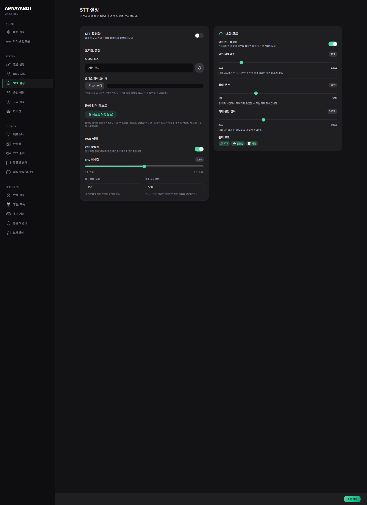

# STT & Voice Control

이 페이지는 **스트리머 음성을 듣고 반응할지**, 그리고 **어떤 기능을 음성으로 조작할지**를 정해.

## 여기서 하는 일
- STT on/off
- 마이크 장치 선택
- namecall(호명) 진입
- voice control 허용 범위

## 처음엔 이렇게 시작하면 쉬워
- STT: 켬
- 마이크 장치: 실제 쓰는 장치인지 확인
- namecall: 켬
- voice control: 꼭 필요한 기능만 허용

## 실수하기 쉬운 점
- STT가 켜져 있어도 마이크 장치가 다르면 안 들려.
- voice control을 너무 많이 열면 방송 중 실수 가능성이 커져.

## 체크포인트
- 내 목소리가 실제로 잘 들어가나?
- namecall이 너무 민감하지 않나?
- 음성으로 위험한 기능까지 열어두진 않았나?
