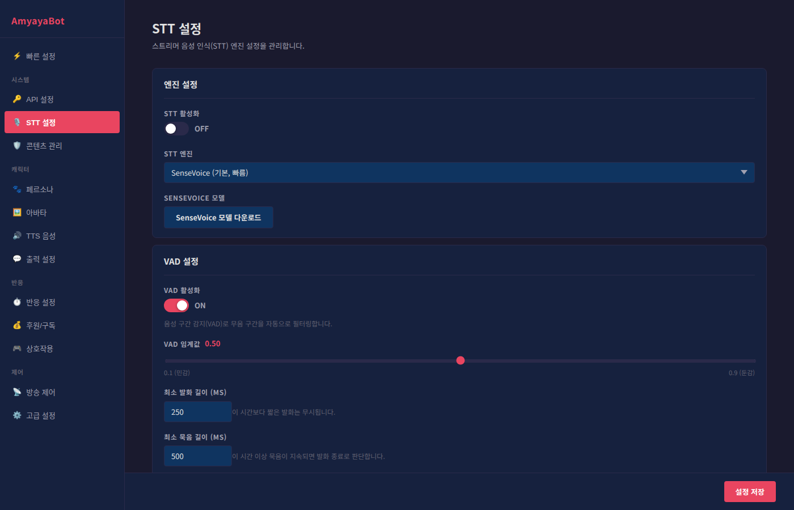

# 음성 인식(STT) 설정 가이드



이 페이지에서는 방송 오디오를 텍스트로 변환하는 음성 인식 기능을 설정합니다. 마이크 입력을 정확하게 인식할 수 있도록 조정해보세요.

---

## 엔진 설정

### STT 활성화
- **ON**: 음성 인식 기능을 활성화합니다 (호명 감지, 채팅 인식 등)
- **OFF**: 음성 인식을 비활성화합니다
- **추천**: 스트리머 음성 입력을 사용하려면 ON으로 설정하세요

### STT 엔진 선택
두 가지 음성 인식 엔진 중 선택할 수 있습니다.

#### SenseVoice (기본, 빠름)
- **특징**: 빠른 처리 속도, 실시간 반응에 최적화
- **CPU 부하**: 낮음
- **정확도**: 좋음 (한국어 최적화)
- **추천**: 대부분의 방송에 권장
- **장점**: 빠른 반응, 낮은 CPU 사용
- **단점**: 복잡한 배경음에 약할 수 있음

#### faster-whisper (정확함)
- **특징**: 높은 정확도, 다양한 언어 지원
- **CPU 부하**: 높음 (모델 크기에 따라 다름)
- **정확도**: 매우 높음 (복잡한 음성도 정확하게 인식)
- **추천**: 정확도가 중요한 경우
- **장점**: 높은 정확도, 다국어 지원
- **단점**: 느린 처리 속도, CPU 자원 많이 필요

### faster-whisper 전용 설정 (선택한 엔진이 faster-whisper일 때만 표시)

#### 모델 크기
- **tiny**: 가장 빠름, CPU 부하 적음, 정확도 낮음 (권장 스레드: 2)
- **base**: 빠름, 정확도 중간 (권장 스레드: 4)
- **small**: 균형잡힘, 정확도 좋음 (권장 스레드: 4)
- **medium**: 가장 정확함, CPU 부하 높음 (권장 스레드: 8)

**선택 가이드**:
- 노트북/낮은 사양: tiny 또는 base
- 중간 사양: small
- 고사양 PC: small 또는 medium

#### 모델 다운로드 및 관리
- **다운로드**: 모델 크기 선택 후 버튼을 클릭하면 자동 다운로드됩니다
- **삭제**: 저장 공간이 필요할 때 다운로드된 모델을 삭제합니다
- **다시 다운로드**: 필요할 때 언제든 다시 받을 수 있습니다
- **상태 표시**:
  - ✓ 준비됨: 바로 사용 가능
  - 다운로드 중: 대기하세요
  - 에러: 네트워크 연결을 확인하세요

#### CPU 스레드 수
- **의미**: 음성 인식에 사용할 CPU 코어 수입니다
- **설정 범위**: 1~16
- **권장값**: 모델 크기별 권장값 참고
- **높게 설정하면**: 더 빠른 처리, 더 높은 CPU 사용
- **낮게 설정하면**: 느린 처리, 낮은 CPU 사용
- **팁**: 다른 프로그램(방송 프로그램, 게임 등)이 실행 중이면 추천값보다 낮게 설정하세요

---

## VAD 설정

VAD(Voice Activity Detection)는 무음 구간을 자동으로 걸러내는 기능입니다.

### VAD 활성화
- **ON**: 배경음이나 침묵을 자동으로 필터링합니다 (권장)
- **OFF**: 모든 오디오를 인식 시도합니다 (느림)
- **추천**: 항상 ON으로 설정하세요 (성능과 정확도 향상)

### VAD 임계값 (0.1 ~ 0.9)
- **설정값**: 기본값 0.5
- **0.1 (민감)**:
  - 작은 소리도 음성으로 인식합니다
  - 배경음이 많이 포함될 수 있습니다
  - 호명 감지 반응이 민감합니다
  - **추천**: 조용한 방송, 작은 목소리 스트리머
- **0.5 (중간)**:
  - 균형잡힌 설정 (기본값)
  - 대부분의 방송에 적합합니다
- **0.9 (둔감)**:
  - 큰 소리만 음성으로 인식합니다
  - 배경음을 잘 걸러냅니다
  - 호명 감지가 느립니다
  - **추천**: 시끄러운 환경, 큰 목소리 스트리머

### 최소 발화 길이 (100ms ~ 2000ms)
- **설정값**: 기본값 250ms (0.25초)
- **의미**: 이 시간보다 짧은 음성은 무시합니다
- **짧게 설정하면**: 짧은 발성도 인식 (기침, 목청음 등 오인식 위험)
- **길게 설정하면**: 확실한 발성만 인식 (짧은 반응 놓칠 수 있음)
- **추천 설정**: 200~300ms

### 최소 묵음 길이 (100ms ~ 2000ms)
- **설정값**: 기본값 500ms (0.5초)
- **의미**: 이 시간 이상 음성이 없으면 발화 종료로 판단합니다
- **짧게 설정하면**: 빠르게 인식 (문장이 끊길 수 있음)
- **길게 설정하면**: 자연스러운 문장 완성 (처리 시간 증가)
- **추천 설정**: 500~800ms

### 청크 길이 (1초 ~ 15초) [VAD OFF일 때만 활성화]
- **설정값**: 기본값 5초
- **의미**: VAD 미사용 시, 마이크 오디오를 지정된 시간 단위로 잘라서 인식합니다
- **짧게 설정하면**: 빠른 반응 (정확도 감소 가능)
- **길게 설정하면**: 높은 정확도 (느린 반응)
- **참고**: VAD를 ON으로 권장하므로 이 설정은 보통 사용하지 않습니다

---

## 오디오 입력

### 오디오 소스 선택
- **기본 장치**: 시스템의 기본 마이크를 사용합니다
- **기타 장치**: 연결된 마이크 목록에서 선택합니다
- **새로고침**: 새로 연결한 마이크를 감지합니다

### 기본 장치 사용 시
- 시스템 설정에서 기본 입력 장치로 설정된 마이크를 자동으로 사용합니다
- 별도의 설정 변경 없이 시스템 설정만으로 마이크 변경 가능합니다

### 특정 마이크 선택 시
- 드롭다운에서 원하는 마이크를 선택합니다
- 여러 마이크가 연결되어 있을 때 특정 마이크만 사용하고 싶을 때 유용합니다

### 블루투스 마이크 경고
- **경고 표시**: 블루투스 이어폰 마이크를 선택하면 경고가 나타납니다
- **이유**: 블루투스 마이크 사용 시 오디오 출력(배경음, TTS)이 일시 중단될 수 있습니다
- **권장**: 별도의 유선 또는 USB 마이크 사용
- **필요한 경우**: 경고에도 불구하고 계속 사용할 수 있습니다

---

## 오디오 입력 모니터

선택한 오디오 소스에서 실시간으로 들어오는 소리 레벨을 확인합니다.

### 모니터링 시작/중지
- **🎤 모니터링** 버튼으로 입력 레벨 확인을 시작합니다
- **⏹ 중지** 버튼으로 모니터링을 중지합니다

### 레벨 확인
- **초록색** (0~40%): 조용한 수준
- **주황색** (40~80%): 적절한 수준 (추천)
- **빨강색** (80~100%): 너무 큰 수준 (왜곡 위험)

### 사용 목적
- 마이크가 제대로 작동하는지 확인
- 마이크 입력 레벨이 적절한지 확인
- 새 마이크 선택 후 레벨 확인
- 다른 오디오 장치로 변경 후 영향도 확인

---

## 음성 인식 테스트

### 테스트 실행
- **🎙️ 테스트 녹음 (5초)** 버튼으로 음성 인식을 직접 테스트합니다
- 버튼 클릭 후 5초 동안 녹음됩니다
- 녹음 중: 버튼이 **🔴 녹음 중...**으로 변경되고 카운트다운 표시

### 테스트 결과 해석

#### 인식 결과
- 녹음된 음성이 텍스트로 변환된 결과입니다
- 호명 감지, 채팅 인식 등의 정확도를 미리 확인할 수 있습니다

#### 오류 메시지
- **"모델이 로드되지 않음"**: 처음 테스트 시 모델 로딩 시간이 소요됩니다 (1~2분 대기)
- **"기타 오류"**: 백엔드 연결 확인, 마이크 설정 재확인

#### 경고 메시지
- **"음성이 너무 조용합니다"**: 마이크 입력 레벨 확인, 마이크 위치 조정
- **"배경음이 많습니다"**: VAD 임계값 조정, 조용한 환경 찾기

### 테스트 팁
- 새 마이크 연결 후 반드시 테스트하세요
- VAD 설정 변경 후 테스트하여 영향도 확인하세요
- 실제 호명 문장으로 테스트하면 정확한 확인이 됩니다
- 예: "에이미야", "[캐릭터 이름]"과 같이 실제 호명 방식으로 테스트

---

## 설정 권장값

### 일반 방송
```
STT 활성화: ON
엔진: SenseVoice
VAD: ON (임계값 0.5)
최소 발화 길이: 250ms
최소 묵음 길이: 500ms
```

### 소음이 많은 환경 (게임방송, 이벤트)
```
STT 활성화: ON
엔진: SenseVoice 또는 faster-whisper (small)
VAD: ON (임계값 0.7)
최소 발화 길이: 300ms
최소 묵음 길이: 800ms
```

### 고정확도 필요 (교육방송, 토크쇼)
```
STT 활성화: ON
엔진: faster-whisper (small 또는 medium)
모델 크기: small (또는 medium)
CPU 스레드: 권장값 사용
VAD: ON (임계값 0.4~0.5)
최소 발화 길이: 250ms
최소 묵음 길이: 500ms
```

### 저사양 PC
```
STT 활성화: ON
엔진: SenseVoice
VAD: ON (임계값 0.5)
최소 발화 길이: 300ms
최소 묵음 길이: 700ms
```

---

## 트러블슈팅

### 음성이 인식되지 않습니다
1. STT가 ON으로 설정되어 있는지 확인
2. 오디오 소스가 올바른 마이크로 설정되어 있는지 확인
3. 오디오 입력 모니터로 실제 입력이 들어오는지 확인
4. 마이크 음소거 설정 확인 (Windows/Mac 시스템 설정)
5. 테스트 녹음으로 문제 범위 좁혀보기

### 호명 감지가 안 됩니다
1. VAD 임계값을 더 낮게 설정해보기 (0.3~0.4)
2. 최소 발화 길이를 줄여보기 (200ms 정도)
3. 실제 호명 이름이 정확한지 다시 확인
4. 더 큰 목소리로 호명해보기
5. faster-whisper 엔진으로 변경해보기

### CPU 사용률이 높습니다
1. SenseVoice 엔진으로 변경
2. faster-whisper 사용 중이면 모델 크기 축소 (medium → small)
3. CPU 스레드 수 감소
4. 다른 프로그램 종료

### 마이크가 감지되지 않습니다
1. 마이크 연결 확인
2. 시스템 설정에서 마이크 권한 확인
3. 새로고침 버튼 클릭
4. 컴퓨터 재시작

### 정확도가 떨어집니다
1. faster-whisper 엔진으로 변경
2. 모델 크기를 크게 변경 (tiny → small → medium)
3. VAD 임계값 조정 (민감도 변경)
4. 마이크를 더 좋은 것으로 교체
5. 배경음 제거 (팬, 에어컨 등 끄기)

---

## 빠른 체크리스트

- [ ] STT 활성화 상태 확인
- [ ] 올바른 엔진 선택 확인
- [ ] 마이크 선택 확인
- [ ] 오디오 입력 모니터로 입력 레벨 확인
- [ ] 음성 인식 테스트로 정확도 확인
- [ ] 호명 감지 테스트 (직접 호명해보기)
- [ ] 배경음 환경 최적화

모든 설정이 완료되었으면 실제 방송을 시작하면서 미세 조정하면 됩니다!
