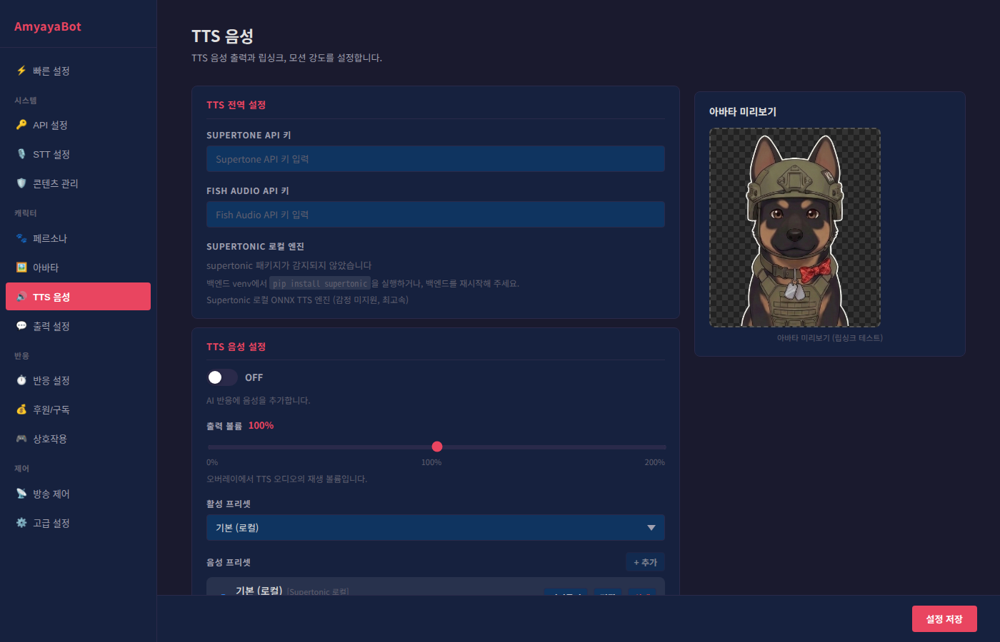

# TTS 음성 설정 가이드



이 페이지에서는 캐릭터의 음성을 설정합니다. 다양한 음성 엔진과 프리셋을 조정하여 원하는 목소리와 표현을 만들어보세요.

---

## TTS 활성화
- **ON**: 캐릭터가 목소리로 반응합니다 (텍스트를 음성으로 변환)
- **OFF**: 말풍선 텍스트만 나오고 음성은 나오지 않습니다

---

## 음성 엔진 선택

각 프리셋마다 다른 엔진을 선택할 수 있습니다. 4가지 엔진 중 선택하세요.

### Edge-TTS [Edge]
- **특징**: Microsoft의 무료 음성 서비스
- **비용**: 무료
- **속도**: 빠름
- **음질**: 자연스러움
- **감정**: 기본 (감정 표현 제한적)
- **언어**: 한국어, 영어, 일본어 등 지원
- **추천**: 기본 음성, 일반적인 반응

**음성 선택** (Edge-TTS 선택 시):
- **한국어**:
  - 인준 (남성): 차분하고 낮은 톤
  - 현수 (남성, 다국어): 자연스러운 남성 목소리, 다국어 가능
  - 선히 (여성): 밝고 명확한 여성 목소리
- **다국어**:
  - Ava (여성): 자연스러운 여성 목소리
  - Andrew (남성): 깊이 있는 남성 목소리
  - Emma (여성): 밝은 여성 목소리
  - Brian (남성): 표준적인 남성 목소리

### Supertonic [Supertonic 로컬]
- **특징**: 감정 표현이 뛰어난 로컬 엔진
- **비용**: 무료 (로컬 실행)
- **속도**: 중간 (로컬 처리)
- **음질**: 좋음
- **감정**: 풍부한 감정 표현 (M/F 음성별 다양한 표현)
- **언어**: 주로 한국어
- **추천**: 감정 표현이 중요한 경우, 개성 있는 음성 원할 때

**음성 선택**:
- **M1~M5**: 남성 음성 (M1: 어린 목소리, M5: 나이 든 목소리)
- **F1~F5**: 여성 음성 (F1: 어린 목소리, F5: 나이 든 목소리)

**세부 설정**:
- **음성 속도** (0.5~2.0): 1.0이 기본 속도, 낮을수록 느림, 높을수록 빠름
- **합성 스텝** (1~50): 단계가 많을수록 자연스러움, 적을수록 빠름 (권장: 20)

### Supertone API [Supertone 감정]
- **특징**: 클라우드 기반 고품질 감정 TTS
- **비용**: 유료 (API 키 필요)
- **속도**: 빠름
- **음질**: 매우 우수
- **감정**: 매우 풍부한 감정 표현
- **언어**: 한국어, 영어, 일본어, 중국어
- **추천**: 프로페셔널한 음성 품질 필요 시

**설정 필요**:
- Supertone API 키 발급 필요
- 음성 ID 선택 (플랫폼에서 선택 가능한 음성들)
- 모델 선택 (sona_speech_2 등)

### Fish Speech [Fish 감정]
- **특징**: Fish Audio의 클라우드 기반 고품질 감정 TTS
- **비용**: 유료 (API 키 필요)
- **속도**: 빠름 (클라우드 처리)
- **음질**: 우수
- **감정**: 매우 자연스러운 감정 표현
- **언어**: 한국어, 영어, 일본어, 중국어 지원
- **추천**: 자연스러운 감정 표현이 필요한 경우

**설정 필요**:
- **Fish Audio API 키**: [fish.audio](https://fish.audio) 에서 발급
- **목소리 모델 등록**: 두 가지 방법으로 등록 가능
  - 설정 UI에서 직접 검색하여 등록
  - [Fish Audio 검색](https://fish.audio/ko/app/discovery/) 에서 마음에 드는 모델의 Ref ID를 복사하여 직접 입력
- 온도 값 (0.1~1.0): 창의성 수준
- Top-p (0~1): 다양성 수준

---

## 음성 프리셋 설정

최대 10개의 음성 프리셋을 만들어 상황에 맞게 사용할 수 있습니다.

### 프리셋 추가/삭제
- **+ 프리셋 추가**: 새로운 음성 조합을 만듭니다
- **삭제**: 불필요한 프리셋을 제거합니다
- **프리셋 활성화**: 각 프리셋 옆 버튼으로 현재 사용할 프리셋을 선택합니다

### 각 프리셋의 설정 항목

#### 프리셋 이름
- 프리셋을 구분하는 이름입니다
- 예: "기본 음성", "감정 풍부한 음성", "빠른 반응" 등

#### 엔진 및 음성
- 선택한 엔진의 음성을 선택합니다
- 엔진 변경 시 해당 엔진의 설정 옵션이 나타납니다

#### 음성 조절 슬라이더

##### 음높이 (Pitch)
- **범위**: -20Hz ~ +20Hz
- **기본값**: +0Hz
- **높이 올리면**: 고음, 어린 목소리 느낌 (+10~15Hz 권장)
- **높이 내리면**: 저음, 나이 든 목소리 느낌 (-10~15Hz 권장)
- **팁**: Edge-TTS 음성은 음높이 조절이 가능합니다

##### 음성 속도 (Rate)
- **범위**: -50% ~ +50%
- **기본값**: +0% (원래 속도)
- **빠르게 설정하면**: 빠른 말하기 (게임방송, 활발함)
- **느리게 설정하면**: 천천한 말하기 (침착함, 차분함)
- **추천 설정**: -10~+10%

##### 음량 (Volume)
- **범위**: -20% ~ +20%
- **기본값**: +0% (원래 크기)
- **높이면**: 더 큰 음량 (시끄러운 환경에 좋음)
- **낮추면**: 작은 음량 (조용한 환경)
- **팁**: 방송 배경음과의 밸런스를 고려하세요

---

## 립싱크 및 모션

### 립싱크 강도
- **범위**: 0 ~ 10
- **의미**: 아바타 입 움직임의 강도입니다
- **0 (없음)**: 입이 움직이지 않음
- **5 (중간)**: 적당한 입 움직임
- **10 (강함)**: 과장된 입 움직임
- **추천 설정**: 5~7

### 모션 강도
- **범위**: 0 ~ 10
- **의미**: 반응할 때 아바타의 전체 모션 강도입니다
- **0 (없음)**: 정적인 반응
- **5 (중간)**: 자연스러운 모션
- **10 (강함)**: 과장되고 큰 모션
- **추천 설정**: 5~8
- **조정 팁**:
  - 게임방송, 활발한 방송: 8~10
  - 교육방송, 차분한 방송: 3~5
  - 일반 방송: 5~7

---

## 아바타 미리보기

우측 상단에 현재 설정된 아바타를 실시간으로 확인할 수 있습니다.

### 립싱크 테스트
- **테스트 문장 입력**: 테스트할 문장을 입력합니다
- **▶ 테스트**: 입력한 문장으로 음성을 생성하고 입 움직임을 확인합니다
- **■ 중지**: 재생 중인 음성을 중지합니다
- **현재 프리셋 표시**: 어떤 프리셋으로 테스트하는지 표시됩니다

### 테스트 팁
- 프리셋 변경 후 반드시 테스트하여 음성과 모션 확인
- 실제 방송에서 자주 사용할 문장으로 테스트
- 음높이, 속도, 모션 강도 등 종합적으로 확인
- 배경음과의 조화 고려

---

## 프리셋 설정 예시

### 예시 1: 다양한 상황 대응 프리셋

**프리셋 1: "기본 음성"** (모든 상황)
```
엔진: Edge-TTS
음성: 선히 (여성)
음높이: +0Hz
속도: +0%
음량: +0%
```

**프리셋 2: "활발한 반응"** (게임, 이벤트)
```
엔진: Supertonic
음성: F3 (밝은 여성)
속도: 1.2
스텝: 20
음성 속도: +15%
모션 강도: 9
```

**프리셋 3: "차분한 반응"** (교육, 토크)
```
엔진: Edge-TTS
음성: 인준 (남성)
음높이: -5Hz
속도: -10%
음량: +0%
모션 강도: 4
```

### 예시 2: 감정별 프리셋

**프리셋 1: "기본/중립"**
```
엔진: Edge-TTS
음성: 선히
음높이: +0Hz
속도: +0%
```

**프리셋 2: "행복/밝음"**
```
엔진: Supertonic
음성: F2
음높이: +10Hz
속도: +15%
모션 강도: 8
```

**프리셋 3: "슬픔/차분함"**
```
엔진: Edge-TTS
음성: 인준
음높이: -5Hz
속도: -10%
모션 강도: 3
```

### 예시 3: 언어별 프리셋

**프리셋 1: "한국어"**
```
엔진: Edge-TTS
음성: 선히 (한국어)
```

**프리셋 2: "영어"**
```
엔진: Edge-TTS
음성: Emma (영어)
음높이: +5Hz
```

**프리셋 3: "일본어"**
```
엔진: Edge-TTS 또는 Supertone
음성: Supertone의 일본어 음성
```

---

## 음성 엔진 비교표

| 항목 | Edge-TTS | Supertonic | Supertone | Fish Speech |
|------|----------|-----------|-----------|------------|
| 비용 | 무료 | 무료 | 유료 | 유료 |
| 속도 | 빠름 | 중간 | 빠름 | 중간 |
| 감정 표현 | 낮음 | 높음 | 매우 높음 | 매우 높음 |
| 음질 | 좋음 | 좋음 | 우수 | 우수 |
| 쉬운 사용 | 높음 | 중간 | 중간 | 중간 |
| 추천 | 기본 사용 | 감정 연기 | 프로 수준 | 자연스러운 감정 |

---

## 설정 권장값

### 게임방송 (활발함)
```
엔진: Supertonic
음성: F2 또는 M2 (어린 목소리)
음높이: +5Hz (Edge 사용 시)
속도: +10~15%
음량: +5%
모션 강도: 8~10
립싱크: 7~8
```

### 교육/정보방송 (차분함)
```
엔진: Edge-TTS
음성: 인준 (남성) 또는 선히 (여성)
음높이: -5Hz~0Hz
속도: -10~0%
음량: +0%
모션 강도: 3~5
립싱크: 5~6
```

### 토크/일상방송 (자연스러움)
```
엔진: Fish Speech 또는 Supertonic
음성: F3/M3 (자연스러운 음성)
음높이: +0Hz
속도: +0~5%
음량: +0%
모션 강도: 5~7
립싱크: 6~7
```

### 저사양 PC (빠른 처리)
```
엔진: Edge-TTS (클라우드 기반, 로컬 부하 낮음)
음성: 제약 없음
모든 설정: 기본값 사용
```

### 고품질 요구 (프로 수준)
```
엔진: Supertone API 또는 Fish Speech
음성: API/모델에서 제공하는 고품질 음성
음높이: 조정
속도: 자연스럽게 조정
모션 강도: 6~8
```

---

## 트러블슈팅

### 음성이 나오지 않습니다
1. TTS 활성화 ON 확인
2. 현재 프리셋이 선택되어 있는지 확인
3. 립싱크 테스트로 음성 생성 확인
4. 엔진별 필요한 설정(API 키 등) 확인

### 음성이 너무 크거나 작습니다
1. 음량 슬라이더 조정 (-20% ~ +20%)
2. 시스템 음량과 애플리케이션 음량 확인
3. 다른 프리셋으로 테스트

### 음성 속도가 이상합니다
1. 속도 슬라이더 조정 (-50% ~ +50%)
2. 엔진이 Supertonic인 경우 음성 속도(speed) 값 확인
3. 다른 음성으로 테스트

### 입 움직임(립싱크)이 어색합니다
1. 립싱크 강도 조정 (0~10)
2. 모션 강도 조정
3. 다른 프리셋으로 테스트
4. 아바타 모델 설정 확인

### 특정 엔진에서 오류가 발생합니다
- **Supertone API**: API 키 확인, 할당량 확인
- **Fish Speech**: API 키 확인, [fish.audio](https://fish.audio) 서비스 상태 확인
- **기타**: 네트워크 연결 확인, 백엔드 상태 확인

### 프리셋이 저장되지 않습니다
1. 프리셋 이름이 비어있지 않은지 확인
2. 프리셋 개수가 10개를 초과하지 않는지 확인
3. 변경 후 설정 저장 버튼 클릭 확인

---

## 빠른 체크리스트

- [ ] TTS 활성화 ON 확인
- [ ] 원하는 엔진 선택 확인
- [ ] 음성 선택 확인
- [ ] 음높이, 속도, 음량 조정 확인
- [ ] 모션 강도 및 립싱크 강도 설정 확인
- [ ] 립싱크 테스트로 음성과 모션 확인
- [ ] 최대 10개 프리셋 생성 (필요시)
- [ ] 상황별 프리셋 구분 (선택사항)

모든 설정이 완료되었으면 실제 방송을 시작하면서 미세 조정하면 됩니다!
