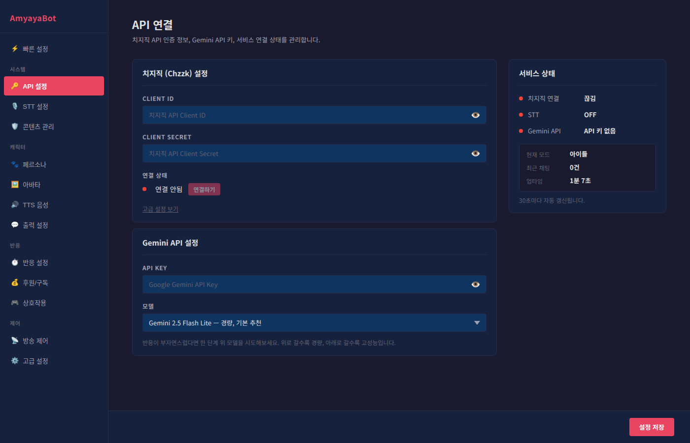

# API 설정 가이드

> AmyayaBot이 치지직(Chzzk) 방송에 연결되고, Google Gemini AI로 똑똑하게 반응하도록 해주는 설정입니다.

---

## 🎯 개요

AmyayaBot을 실행하려면 **2가지 서비스**에 연결해야 합니다:

| 서비스 | 역할 | 필수 여부 |
|--------|------|---------|
| **치지직 (Chzzk)** | 방송 채팅을 읽고 모니터링 | 필수 (채팅 반응 위해) |
| **Google Gemini API** | AI가 지능적으로 반응하게 함 | 필수 (AI 반응 위해) |

---

## 1️⃣ 치지직 (Chzzk) 설정

### 1-1. 연결하기

AmyayaBot은 치지직 공식 API를 통해 방송 채팅에 연결됩니다.
별도의 개발자 등록이나 API 키 발급 없이, **네이버 로그인만으로 바로 연결**할 수 있습니다.

**연결 방법:**

1. AmyayaBot 설정 페이지(`http://localhost:18300/settings`) → "API 설정" 탭
2. **"연결하기" 버튼**을 클릭합니다
3. 웹브라우저가 자동으로 열리면서 **네이버 로그인 화면**이 나타납니다
4. 당신의 네이버 계정으로 로그인합니다 (치지직 스트리머 계정과 동일해야 함)
5. AmyayaBot 접근 권한 동의 화면이 나타나면 **동의**를 클릭합니다
6. "연결 완료" 메시지가 나타나면 성공입니다

> 💡 연결 과정에서 `localhost:8080` 포트를 임시로 사용합니다. 다른 프로그램이 이 포트를 사용 중이면 충돌할 수 있으니 확인하세요.

---

### 1-2. Channel ID 자동 감지

**Channel ID**는 당신의 방송 채널을 식별하는 고유 번호입니다. AmyayaBot이 자동으로 감지하므로, 보통 수동으로 설정할 필요가 없습니다.

**언제 수동으로 설정하나요?**

- 자동 감지가 실패한 경우
- 여러 채널을 관리 중인 경우

**수동으로 설정하려면:**

1. 고급 설정 보기 링크를 클릭합니다
2. **Channel ID** 필드에 당신의 채널 ID를 입력합니다
3. Channel ID는 어디서 얻나요?
   - https://chzzk.naver.com/YOUR_CHANNEL_NAME 에서
   - URL의 "chzzk.naver.com/" 뒤에 있는 숫자 (또는 닉네임)

---

### 1-3. 연결 상태 확인

- 🟢 **초록색 점**: 연결됨 (정상 상태)
- 🔴 **빨간색 점**: 연결 안됨 (연결하기 버튼을 눌러 다시 시도하세요)

**현재 방송 정보:**

연결이 성공하면, 설정 화면에 다음 정보가 표시됩니다:
- 현재 방송 제목
- 방송 카테고리
- 설정된 태그들

---

## 2️⃣ Google Gemini API 설정

### 2-1. API 키 발급받기

**Step 1: Google AI Studio 접속**

1. https://aistudio.google.com/app/apikey 에 접속합니다
2. Google 계정으로 로그인합니다 (개인 Gmail 계정 가능)

**Step 2: API 키 생성**

1. 왼쪽 메뉴에서 **"API 키 생성"** 또는 **"Create API Key"** 클릭
2. 팝업 창에서 "새 프로젝트에서 생성" 선택
3. 자동으로 생성된 API 키가 표시됩니다
4. **복사 버튼** (클립보드 아이콘)을 클릭하여 복사합니다

**Step 3: AmyayaBot에 입력**

1. AmyayaBot 설정 페이지 → "Gemini API 설정"
2. "API 키 수정하기"를 클릭합니다 (이미 설정되어 있으면)
3. **API Key** 필드에 복사한 키를 붙여넣기
4. 자동으로 저장됩니다

> ✅ **설정 완료 표시**: API 키를 입력하면 "설정됨 ✓" 텍스트가 나타납니다.

---

### 2-2. AI 모델 선택

AmyayaBot이 사용할 AI 모델을 선택합니다. 모델마다 특징이 다릅니다:

| 모델 | 특징 | 추천 대상 |
|------|------|---------|
| **Gemini 2.5 Flash Lite** | 매우 빠름, 경량 | 저사양 PC, 빠른 반응 원함 |
| **Gemini 2.5 Flash** | 빠르면서도 정확함 | **일반적으로 가장 추천** |
| **Gemini 3.1 Flash Lite** | 최신 경량 모델 | 최신 기능 원하는 경우 |
| **Gemini 3 Flash** | 가장 똑똑함, 느림 | 고사양 PC, 깊이 있는 반응 원함 |

**어떤 모델을 선택해야 할까요?**

처음에는 **"Gemini 2.5 Flash"** (기본값)를 사용하세요. 만약:

- **반응이 너무 느리면** → 한 단계 위 (Lite 버전)로 변경
- **반응이 어색하거나 부족하면** → 한 단계 아래 (고성능 버전)로 변경

**직접 모델명 입력하기:**

새로운 모델을 사용하고 싶거나, 직접 모델을 지정하고 싶다면:

1. **"직접 입력" 옵션** 선택
2. 모델명을 입력합니다 (예: `gemini-2.0-flash`)
3. Google의 최신 모델은 https://ai.google.dev/models 에서 확인 가능합니다

---

## 3️⃣ 서비스 상태 확인

화면의 오른쪽 상단에 **"서비스 상태"** 패널이 있습니다. 이곳에서 현재 시스템이 정상 작동 중인지 한눈에 확인할 수 있습니다.

### 상태 표시

| 항목 | 상태 | 의미 |
|------|------|------|
| **치지직 연결** | 🟢 연결됨 | 방송 채팅을 정상적으로 모니터링 중 |
| **치지직 연결** | 🔴 끊김 | 채팅을 받을 수 없음 (재연결 필요) |
| **STT** | 🟢 ON | 음성 인식이 활성화됨 |
| **STT** | 🔴 OFF | 음성 인식이 비활성화됨 |
| **Gemini API** | 🟢 연결됨 | AI가 정상 작동 중 |
| **Gemini API** | 🔴 API 키 없음 | API 키를 설정해야 함 |

### 추가 정보

아래에 표시되는 정보들:

- **현재 모드**: 일반 / 하트비트 / 아이들 중 어떤 상태인지
- **최근 채팅**: 최근 몇 건의 채팅을 처리했는지
- **업타임**: AmyayaBot이 얼마나 오래 실행 중인지

> 💡 상태는 **30초마다 자동으로 갱신**됩니다.

---

## 🔧 자주 묻는 질문 (FAQ)

**Q. Gemini API 키를 잃어버렸어요. 다시 발급받을 수 있나요?**

A. 네, 가능합니다. Google AI Studio에서 새로운 키를 생성하면 됩니다.

**Q. 치지직 연결이 끊어졌어요. 어떻게 하나요?**

A. 설정 페이지에서 "연결하기" 버튼을 다시 클릭하세요. 인증 토큰이 만료된 경우 네이버 재로그인이 필요할 수 있습니다.

**Q. "인증 대기중" 상태가 오래 지속됩니다.**

A. 브라우저 팝업이 열렸는지 확인하세요. 팝업이 차단되어 있을 수 있습니다. 브라우저 설정에서 팝업을 허용한 후 다시 시도하세요.

**Q. AI 반응이 너무 느려요.**

A. 모델을 한 단계 위(경량 모델)로 변경해보세요. 또한 인터넷 속도와 PC 사양도 영향을 미칩니다.

---

## ✅ 설정 체크리스트

필수 설정이 모두 완료되었는지 확인하세요:

- [ ] 치지직 "연결하기" 완료 (초록색 점)
- [ ] Google Gemini API 키 입력됨
- [ ] AI 모델 선택됨
- [ ] 서비스 상태에서 치지직과 Gemini 모두 정상 표시됨

모두 완료했다면, 이제 [페르소나 설정](./persona.md)으로 넘어가 AI 캐릭터의 성격을 정의해보세요!
